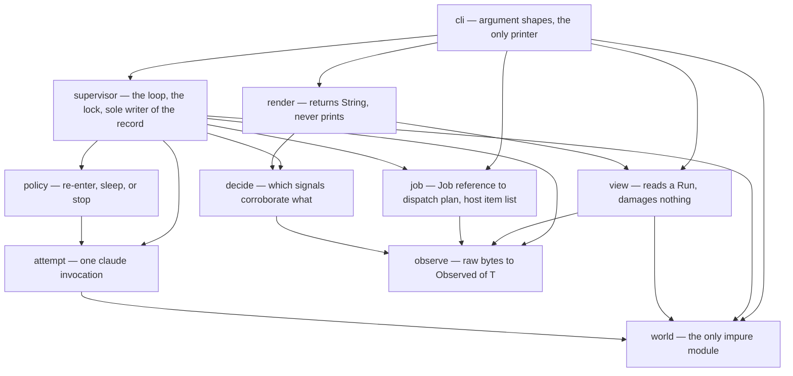
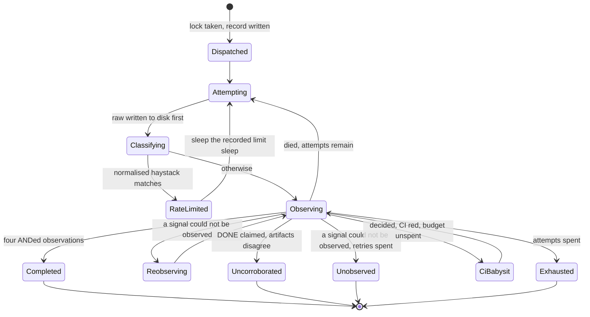

# The Rust Base - Plan

Replace `bin/grind` with a compiled Rust binary — one crate, ten modules, exactly one of them impure — and retire the script in the same PR.

---

## Goal Capsule

- **Objective.** Ship `grind` as a compiled Rust binary carrying every behaviour of the current script plus the seven closed rulings of [#5](https://github.com/FlorianRiquelme/grind/issues/5) and `grind doctor`, with `bin/grind` and `tests/test_grind.py` deleted in the same PR.
- **Authority hierarchy.** `docs/adr/0001`–`0009` outrank this plan. `CONTEXT.md` owns the vocabulary. Issue #50 owns the requirements this plan traces. This plan owns the how. Where this plan and an ADR disagree, the ADR wins and the plan is wrong.
- **`bin/grind` is reference and evidence, never a translation source** (ADR-0005). Read it to learn what happened and what the argv looks like. Do not port its control flow.
- **Execution profile.** One branch, one PR, seventeen units in dependency order. Each unit is an atomic commit that leaves `just verify` green.
- **Stop conditions.** Stop at an open PR. Stop and ask when a change would make a shape ADR-0006 prohibits newly expressible. Stop when a unit cannot land without loosening `DENIED_TOOLS`.
- **Tail ownership.** The executor owns branch, commits, push and PR. Nothing merges.

---

## Product Contract

### Summary

Grind's supervisor cannot tell *I looked and found nothing* from *I could not look*, and two of the four signals that decide completion fail toward `completed`. Run 2 proved the cost: an open, green PR recorded as `exhausted`. The base makes those failure modes unrepresentable rather than merely tested — a three-valued `Observed<T>`, a completion fold that is a compile error when a signal is added and forgotten, a record type private to its only writer — and puts every decision behind a pure function testable from string literals. It also moves Run state out of every checkout, gives the host a declared layout with a checker, and gives the repo one definition of checked.

### Problem Frame

Two Runs have been dispatched. Both reached an open PR. The record says one did.

Every observation in the script goes through a shell call whose failure returns an empty string, so a failed `git rev-list` is an honest zero and a failed `gh pr view` is an honest *no PR* — in exactly the window after a laptop wake, which killed Run 1 four times. Run 2's six rate-limited attempts read *"You've hit your session limit · resets 5pm"*, which matches none of the script's phrases; only a literal `429` in a field a prior measurement called pointless to search classified them. Nothing tells the operator which Runs exist or which are alive, and the read path that would tell them saves what it loaded, which can erase the one field nothing can rebuild. Nothing refuses a second Run onto a branch another Run holds. Nothing checks the host, and the host half-works in ways that look healthy. Run state lives inside a checkout at a path derived from `__file__`, which cannot survive a shipped binary.

Underneath all of it: nobody reads the diff. A wrong change has to fail at build time or in CI with no human present, or it ships.

### Requirements

Each requirement cites the issue #50 user stories it carries.

**Dispatching a Job**

- R1. `grind run <issue>` accepts an issue number or a full GitHub URL, and Dispatch is the only path that starts a Run. (#50 1–2)
- R2. The Job's field table is read from the issue body — `target repo`, `branch`, `handoff sha`, `anchor artifact`, `pinned plugin version`, with `budget ceiling` and `model` optional. (#50 3)
- R3. A Job missing a required row refuses at dispatch and names the row. (#50 4)
- R4. The plugin reference is refused unless it carries both `name@marketplace` and a literal `x.y.z`. (#50 5)
- R5. The plugin resolves to a directory exactly once, at dispatch, and the resolved path goes into the record; every attempt and every `--resume` reads the record. (#50 6)
- R6. Model, attempt budget, limit sleep and hostname are fixed at dispatch and recorded. (#50 7–9)
- R7. A `budget ceiling` row on the Job becomes a spend cap on every `claude` invocation. (#50 10)
- R8. Dispatch removes the queue label from the Job issue and comments the run id and hostname on it. (#50 11)
- R9. Dispatch refuses a dirty worktree. (#50 12)
- R10. Dispatch notes a worktree HEAD differing from the Handoff SHA without refusing. (#50 13)
- R11. Dispatch adopts the branch's existing worktree when the target repo has one. (#50 14)
- R12. Dispatch prints the resolved plugin, model, `claude` binary and run id before the first attempt. (#50 15)

**Refusing a collision**

- R13. A Dispatch onto a branch another Run already holds is refused. (#50 16)
- R14. The refusal comes from a lock the kernel releases when its holder dies, keyed on target repo plus branch, living under the host's declared Grind directory. (#50 17–19)
- R15. A refused Dispatch reads as incoherent input, in the same register as the dirty-worktree refusal. (#50 20)

**Supervising a Run**

- R16. The supervisor dispatches and re-enters until the Run completes, exhausts its attempts, or stops for a stated reason, and never pre-flights a quota check. (#50 21, 24)
- R17. The first attempt opens a session id; every later attempt resumes that same id and carries the re-entry prompt. (#50 22–23)
- R18. A rate-limited attempt sleeps for the recorded limit sleep and then re-enters. (#50 25)
- R19. Rate limits are detected from a normalised haystack that includes the API error status field. (#50 26)
- R20. The attempt budget is bounded and its exhaustion is recorded as its own outcome. (#50 27)
- R21. Every attempt's prompt, stdout and stderr are written to disk before anything parses them. (#50 28)
- R22. Unparseable child output becomes a record that says so and keeps the tail. (#50 29)
- R23. Every `claude` invocation carries the tool denials, and the denials are recorded on the Run. (#50 30–31)
- R24. Supervisor output is line-buffered. (#50 32)

**Observing what a Run did**

- R25. Each observation is present, absent, or could-not-observe with a reason, classified from the raw exit code, stdout and stderr rather than from empty output. (#50 33–34)
- R26. The furthest stage is inferred from durable artifacts on disk and on GitHub. (#50 35)
- R27. An unobservable signal triggers re-observation, never a re-entry. (#50 36)
- R28. A Run still unobservable after retries stops and says so. (#50 37)
- R29. The verify contract is recorded as which contracted steps are present and which are missing, and never blocks anything. (#50 38–39)

**Deciding a Run is done**

- R30. Completion is four ANDed observations — PR open, tree clean, commits ahead, no check pending. (#50 40)
- R31. The DONE promise is recorded as a signal that is neither necessary nor sufficient. (#50 41)
- R32. A Run claiming DONE while its artifacts disagree stops as uncorroborated rather than re-entering. (#50 42)
- R33. Adding a fifth completion signal is a compile error at both the construction site and the fold. (#50 43)
- R34. The verify contract is excluded from the completion test. (#50 44)
- R35. Red CI is recorded on the verdict line rather than holding the verdict open. (#50 45)
- R36. Decided-and-failing CI buys exactly one fresh bounded PR-babysitting invocation, recorded in the attempt list with its own mode. (#50 46)
- R37. Every verdict word describes what happened rather than how good it was. (#50 47)

**Reading a Run**

- R38. Bare `grind status` prints a roster and never resolves to a single Run. (#50 48)
- R39. The roster observes each Run for itself rather than trusting its recorded state. (#50 49)
- R40. The roster says it lists Runs on this host only, and an unknown run id answers *not here* rather than erroring. (#50 50)
- R41. `grind status <run-id>` answers alive, where, stuck and about to cost something, top to bottom, with no follow-up. (#50 51)
- R42. Liveness splits into supervisor presence — pid and identity — and progress. (#50 52)
- R43. Progress is read from the newest write across the parent transcript and every fan-out subagent transcript. (#50 53)
- R44. Furthest stage and current stage print as two separate lines. (#50 54)
- R45. The live view degrades rather than fails when the transcript is unreadable. (#50 55)
- R46. Observed-absent and could-not-observe render as visibly different marks. (#50 56)
- R47. The attempt counter shows *attempt N of M* with M read from the record. (#50 57)
- R48. Spend shows as the API-pricing counterfactual, and remaining quota shows not at all. (#50 58)
- R49. Fan-out shows as a count with descriptions and a freshness. (#50 59)
- R50. Every line prints in a fixed order with the last-words block fixed at exactly three lines. (#50 60)
- R51. Status prints the transcript path and the Run state path. (#50 61)
- R52. Status reads and never writes, never invokes an agent, and is pull-only. (#50 62–63, 65)
- R53. The exit code reports whether status could answer, never how the Run is doing. (#50 64)

**Re-entering by hand**

- R54. `grind resume <run-id>` re-enters a Run that died, reading every condition from the record rather than the environment. (#50 66–67)
- R55. Resume on an already-completed Run says so and prints the Handback instead of re-entering. (#50 68)

**Checking the host**

- R56. `grind doctor` checks the full provisioned-host list, and a presence-only subset runs before every Dispatch from the same item list at a shallower depth. (#50 69–71)
- R57. Doctor verifies the declared clone's `origin` matches the target repo. (#50 72)
- R58. Doctor asserts the declared `claude` binary is not a wrapper shim, loudly rather than by filtering. (#50 73)
- R59. Doctor checks `git`, `gh` and `just` on `PATH`. (#50 74)
- R60. Doctor reports the credential steps it can genuinely check and names the ones it cannot. (#50 75)
- R61. A failed host check reads as incoherent input rather than as a judgement. (#50 76)
- R62. `grind --version` answers which copy of the binary is running. (#50 77)

**Handing back**

- R63. A finished Run prints Job, branch, worktree, session, model, attempts, total spend and denial count. (#50 78)
- R64. The Handback prints furthest stage, commits ahead, plan, PR, residual findings and ledger entries. (#50 79)
- R65. The Handback's verify-contract line reports presence and absence and never a verdict on quality. (#50 80)
- R66. The Handback names where Run state lives. (#50 81)

**Editing Grind**

- R67. `just verify` is the one command that says whether a change is checked, running `cargo fmt --check`, `cargo clippy -- -D warnings`, `cargo test`, and a `cargo zigbuild --release` of `x86_64-unknown-linux-musl` and `aarch64-unknown-linux-musl`. (#50 82, 84–85)
- R68. `cargo test` alone runs every test carrying a safety property, including the compile-fail and source-level carriers. (#50 83)
- R69. CI runs one `ubuntu-latest` job executing `just verify` and nothing else, on push to every branch plus pull request, with in-progress cancellation. (#50 86)
- R70. `permissions: contents: read` is pinned at the workflow's top level. (#50 87)
- R71. Reaching for the writable record type from a read path is a compile error with no fix offered in the diagnostic, asserted by a compile-fail test. (#50 88–89)
- R72. A source-level test asserts that process and filesystem access are named in `world` only, and that environment access is named in exactly one module. (#50 90)
- R73. The ban on nesting the record's writer and its readers under a shared parent is written where an editor will hit it. (#50 91)
- R74. The whole supervisor loop is exercised end to end with no `claude`, no network and no target repo, with fakes substituting raw stdout, stderr and exit code rather than domain values. (#50 92–93)
- R75. The shipped binary is a prebuilt static file; Grind never builds on a host. (#50 94)

**Retiring the script**

- R76. `bin/grind` and `tests/test_grind.py` are deleted in this PR. (#50 95)
- R77. The four `CLAUDE.md` passages describing the script are pruned in the same PR — the Shape section, the two-entrypoint Verify section, the checkout-local Run-state constraint, and the address given for the denial list. (#50 96)
- R78. The two `.gitignore` lines whose comments name the deleted mechanisms are dropped in the same PR. (#50 97)
- R79. `~/.grind/runs/` starts empty, with no migration code. (#50 98)
- R80. One rate-limited attempt's raw triple is checked in as a fixture before the old record is discarded. (#50 99)
- R81. The threshold for the cutover is `just verify` green, with no separate *properly works* gate. (#50 100)

### Scope Boundaries

**Deferred for later**

- #5's ten open tickets. They land in the base after it exists.
- Enqueue's form, the decomposability admission check, learnings across Runs, and whether the four metrics get instrumented. Still fog on #5.
- The three behaviours `docs/findings/0002` routed to #5 and filed as [#45](https://github.com/FlorianRiquelme/grind/issues/45) and [#46](https://github.com/FlorianRiquelme/grind/issues/46): refusing a Handoff SHA row that is not a bare SHA, observing the PR by the Job's branch and noticing when the Run pushed elsewhere, and whether a merge-commit Handoff SHA is adoptable. The base reproduces today's behaviour at those three points. See KTD4.
- [#2](https://github.com/FlorianRiquelme/grind/issues/2), [#3](https://github.com/FlorianRiquelme/grind/issues/3) and [#4](https://github.com/FlorianRiquelme/grind/issues/4) — the Run's blindness to a moving base, the dispatch prompt's blanket *this slice is transcription* assertion, and the reach of the definition of done. The base carries the current prompt text forward unchanged.
- Whether a no-progress re-entry costs an attempt ([#23](https://github.com/FlorianRiquelme/grind/issues/23)), and parsing the reset time out of the rate-limit payload.

**Outside this product's identity**

- Migrating existing Run state. `~/.grind/runs/` starts empty; the two existing records survive as `docs/findings/0001` and `0002` plus the harvested fixture.
- Reimplementing any `lfg` stage (ADR-0001), and making Grind an agent (ADR-0001, ADR-0005).
- TypeScript and every JavaScript runtime, with the single-file-executable options that go with them.
- A resident watcher, a scheduler that selects, any unattended trigger, or a ceiling on Runs in flight — a cap is selection through the back door.
- Push notifications or anything that reaches a human who is not looking.
- Cross-host Run state. The only thing that travels is a pointer, and it travels on the Job issue.
- Adopting the seven-step verify contract for Grind itself; multi-user packaging or distribution.
- Hardening the source-level and compile-fail tests. They guard convention, and aliasing an import to dodge a test is intent. Do not make them cleverer.
- `grind doctor` checking anything whose only available check is a guess.

### Sources

- Issue [#50](https://github.com/FlorianRiquelme/grind/issues/50) — the spec these requirements trace.
- `docs/adr/0005`–`0009` — the accepted decisions that constrain the shape, the types, the module cut, the host and the verify entrypoint.
- `docs/provisioned-host.md` — the item list `grind doctor` and the dispatch checks share.
- `docs/findings/0001-first-run.md`, `docs/findings/0002-second-run.md` — the two Runs every fixture and every death shape derives from.
- `CONTEXT.md` — Job, Dispatch, Run, Handoff SHA, Anchor artifact, Run state, Provisioned host, Handback, Verify entrypoint, Promotion, each with an explicit *Avoid* list.
- Branch `prototype/33-rust-awkward-core` — the spike, in git: `spike/supervise/src/main.rs` and its seven `spike/supervise/fake/*.sh` children, `spike/record/wont-compile/escapes/01_status_picks_the_writable_type.rs`, `spike/observed/`, `spike/runlock/`, `spike/transcript/`, and Run 1's five attempt fixtures at `spike/fixtures/run/`.
- `.grind/runs/20260806-122620-snapper-28/attempt-3.{stdout.json,stderr.log}` — Run 2's rate-limited raw triple. Verified: `api_error_status` 429, `terminal_reason` `api_error`, `subtype` `success`, `is_error` true, `result` *"You've hit your session limit · resets 5pm (Europe/Berlin)"*, stderr 0 bytes.

---

## Planning Contract

### Key Technical Decisions

- KTD1. **Promote the spike from `prototype/33-rust-awkward-core` rather than re-derive it.** (session-settled: user-approved — chosen over re-authoring from the recorded outputs: #50 states the spike is untracked evidence, but the sources are in git on that branch, so the supervisor harness, its seven fake children, the compile-fail escape case and Run 1's fixtures are all recoverable verbatim.) The untracked `spike/` in the working tree is a stale build leftover with its sources deleted; read the branch, not the directory.
- KTD2. **The denial list, the verify contract and both prompt texts cross over as literal strings from `bin/grind`.** (session-settled: user-approved — chosen over re-deriving them: they are data rather than control flow, and re-typing them is where a glob or a contracted step goes missing.) This is the one place the script is copied. Everything else is read as evidence. Governs R23, R29, R17.
- KTD3. **`grind doctor` ships at full depth in the base, live credential checks included.** (session-settled: user-approved — chosen over a presence-only first cut with the live checks following: the dispatch subset and doctor share one item list, and building the shallow half first means writing the list twice.) Governs R56–R60.
- KTD4. **The base reproduces today's behaviour at #45/#46's three points.** (session-settled: user-approved — chosen over fixing them in passing: they are behavioural changes owned by #5's map, and a rewrite that also changes behaviour cannot be diffed against the evidence it was built from.)
- KTD5. **The crate takes the serde family and nothing else** — `serde` with `derive` and `serde_json`. ADR-0005's *serde is the only dependency* is read as the family, because JSON is the reason the dependency exists at all. No regex crate: normalising the haystack detects rate limits more broadly than a pattern does.
- KTD6. **`run.json` is a strict `serde` derive with post-day-one fields `Option` plus `#[serde(default)]`; the Claude Code transcript is read through tolerant `serde_json::Value` lookups, line by line.** ADR-0005 splits these on ownership: a derive against an undocumented format has to track it forever, and `Option` plus `default` still loses every sibling field on a line when one field's type is unexpected. The child's stdout parses strictly: 13/13 recorded stdout files across both Runs parse. Neither Run produced a *killed* child — every recorded death was a closed connection with a normally-exiting child — so *empty, not truncated* rests on the spike's `sigkilled.sh`, not on the Runs.
- KTD7. **`world` returns `Completed { stdout, stderr, code }` for short-lived children, with no trait.** Every caller's logic is a pure parse function over the text. The only seam is the `claude` binary path, which delivers real SIGKILL, real empty-not-truncated stdout, a real separate stderr file and a real exit code the parent did not choose. ADR-0007 declined a runner trait and it stays declined.
- KTD8. **The process exit goes through `world`.** `main.rs` declares modules and calls `cli`; `cli` returns an observability-derived code and `world` performs the exit. Nothing else may name `std::process`, and the source-level test in U4 is what holds it. Governs R53, R72.
- KTD9. **The shared host item list lives in `job`.** `job` already absorbs host resolution — repo path, worktree adoption, plugin directory, `claude` binary — and the dispatch-time presence subset is part of turning a Job reference into a dispatch. `observe` classifies each item's raw triple; `render` composes doctor's report. No new module, and no module named for a noun two others share (ADR-0007). The tension is named rather than hidden: `grind doctor` takes no Job argument, so the list stretches `job`'s stated scope of *how a Job reference becomes a dispatch plan*. The alternatives are worse — an eleventh module breaks the cut, and `world` holds no branching. Revisit if a second Job-independent concern lands in `job` — U7's verification is where that shows up, since it asserts the list is exactly `docs/provisioned-host.md`'s items and nothing else. Governs R56.
- KTD10. **The compile-fail test shells out to `rustc` over a scratch copy of the crate, with the case compiled as a module inside it.** No `trybuild`, no dev-dependency. It cannot be an external file compiled against the built rlib: from outside the crate every non-`pub` item is inaccessible, so `E0603` fires whether the record type is private to `supervisor`, `pub(crate)`, or reached from a nested child — the exact arrangement ADR-0007 says compiles clean. Compiled as a sibling module of `view`, the error is attributable to the sibling wall, and the `pub(crate)` control compiles. Governs R33, R71.
- KTD11. **The end-to-end test spawns the binary via `CARGO_BIN_EXE_grind` with a temp `$HOME`.** An in-process test would need `std::env::set_var`, which is process-global, racy under parallel tests and `unsafe` in Rust 2024. Spawning also covers `cli` and argv rather than only the loop. Governs R74.
- KTD14. **The crate is a library plus a thin binary — `src/lib.rs` holds the ten modules, `src/main.rs` calls `cli`.** In a binary crate `dead_code` is rooted at `main` and `pub` does not exempt an item, so every module landing before its consumer — `world` at U3, `observe` at U5, `decide` at U8, `policy` at U9, `view` at U13, `render` at U14 — would fail `cargo clippy -- -D warnings` as an unreferenced module. The repair an agent reaches for is `#[allow(dead_code)]`, which also silences the unconstructed-variant warning ADR-0009 put clippy in the recipe to catch. A library target makes each module a reachable `pub` item, so a unit can commit green without the attribute. **`#[allow(dead_code)]` is never the repair for an unwired module.** This is also what gives KTD10 a crate to compile a scratch copy of.
- KTD12. **The dispatch lock is `File::try_lock` on `~/.grind/locks/<owner>-<name>-<branch>`, with the branch rendered filename-safe first.** Stable since Rust 1.89, so no dependency, and the kernel releases it when a SIGKILLed supervisor dies. The key is the target repo plus the branch; `git rev-parse --git-common-dir` is not used at all — run verbatim it returns a relative path from a main clone and an absolute one from a linked worktree. Governs R14.
  - **Every branch this project dispatches contains a slash**, so the raw key names a directory that does not exist and the open fails before any lock is attempted. Sanitise `[^A-Za-z0-9.-]` to `_` — the spike's own rule, recorded in its `runlock` findings — so the key is always one file directly under `~/.grind/locks/`. ADR-0008's layout line needs the same clarification; the ADR outranks this plan, so raise it rather than diverging silently.
  - **The lock is three-valued, like every other observation.** `WouldBlock` is a collision and refuses. An `io::Error` is *could not determine* and carries its own stop reason — never folded into the refusal, and never into proceeding. Collapsing the two reproduces the exact bug `Observed<T>` exists to remove, relocated to the lock.
  - **The locked handle is owned by the supervisor loop and lives as long as the process.** `File::try_lock` releases on drop, so a handle owned by the dispatch function evaporates seconds into a Run that lasts hours. R14's guarantee is that the *kernel* releases it when the holder dies, which requires the holder to still be holding it.
- KTD13. **Rate-limit detection lowercases the haystack and strips non-alphanumerics before matching, over `result`, `terminal_reason`, `api_error_status` and `subtype` concatenated.** Normalisation is what makes `rate  limit` with two spaces match; including the status field is what makes a bare `429` with no matching prose match. Governs R19.
- KTD15. **The denial globs bind the `claude` child only, and Grind's own children are read-only against the target repo.** `DENIED_TOOLS` is a set of `claude` tool globs, so `world`'s `run(argv, cwd)` reaches every forbidden operation from Grind's own process with nothing in front of it — and `CLAUDE.md`'s wording reads as covering the whole system. The concrete vector is the dirty-worktree refusal: an agent making a stuck Dispatch go through reaches for `git reset --hard` in `job`, which is idiomatic and invisible to the globs. Grind's own process never spawns `git reset --hard`, `git rebase`, `git push --force`, a branch deletion, or `gh pr merge`. It writes to exactly two places: the dispatch-time label removal and comment on the Job issue. Doctor never performs a write to prove a credential step. Governs R9, R23, R60.
- KTD16. **Host and credential checks render a fixed, item-specific diagnostic and never the raw stdout or stderr of the check.** Doctor's whole purpose is to run on hosts that failed provisioning, and a misprovisioned host is exactly where an HTTPS `origin` embeds a token. The origin mismatch prints the two parsed `owner/name` pairs, never the remote URL. Governs R57, R60.

### High-Level Technical Design

**Module topology.** Ten modules at the crate root, one impure. Types live with their producer. `supervisor` and `view` are siblings and the writable record type is private to `supervisor` — never a shared parent, and never a module named for a noun two others share.

The wall that matters is the absence of an edge: `view` never reaches `supervisor`. Reaching for the writable record type from `view` is `E0603` with no fix offered, and U12 asserts it.

**The supervisor loop.** `policy` returns the next step as a value; the loop is the only thing that blocks.

Seven recorded states and none of them is `running`. A SIGKILLed supervisor would sit in `running` forever, which is why the roster observes liveness for itself.

**The three-valued observation.** `Observed<T>` is `Present(T) | Absent | Unobservable(Reason)`, spelled as a dedicated enum and never as `Result<Option<T>, E>`. The ecosystem supplies `.ok()`, `?` and `unwrap_or_default()` free, and each collapses three states into two silently; a dedicated enum has none of them, so every collapse has to be written where a reader could see it. Classification happens away from the spawn, over `Completed { stdout, stderr, code }`, so a test that *this call site* yields could-not-observe rather than absent is three string literals.

### Assumptions

- The spike sources are recoverable from `prototype/33-rust-awkward-core` and are the promotion source for U16's harness, U12's escape case and U2's Run 1 fixtures.
- ADR-0005's *serde is the only dependency* means the serde family. The crate takes `serde` with `derive` and `serde_json`; nothing else, including no dev-dependency.
- The toolchain a machine editing Grind needs is present on this laptop today — rustc and cargo 1.95.0, `just` 1.57.0, zig 0.16.0, `cargo-zigbuild`, and both musl targets installed. No acquisition work is planned; `just verify` fails loudly on a machine missing them rather than skipping the step.
- `apt`'s `just` version floats and no floor is pinned, because the recipe uses no recent syntax.
- The attempt budget (8) and the limit sleep (1800s) are compiled constants, snapshotted into the record at dispatch. #50 gives them no source and ADR-0008 removes every environment override, so the record is what makes *attempt N of M with M from the record* true and what makes a re-entry under a different environment visible rather than silent.
- Run 2's attempt 3 is the rate-limit fixture. Verified against the raw triple; see Sources.
- [PR #49](https://github.com/FlorianRiquelme/grind/pull/49) carries #48's docs and is open in front of this work. The `CLAUDE.md` passages U17 prunes are the ones on this branch's tip.

### Sequencing

Four phases, seventeen units, dependency-ordered. Two ordering constraints are load-bearing rather than stylistic:

- **The fixtures land before anything can delete their source.** `.grind/runs/20260806-122620-snapper-28/` holds the only copy of the session-limit shape. U2 is second, and no unit may tidy that directory before it.
- **The source-level carrier lands before the modules it guards.** U4 sits immediately after `world`, so every module written afterwards is checked as it arrives rather than audited at the end.
- **`attempt` lands before `policy`.** `policy` takes `&[Attempt]`, so the U-IDs run U8, U10, U9 through Phase B. U-IDs are stable and are not renumbered to close the visual gap.

---

## Implementation Units

### Unit index

| U-ID | Title | Files | Depends on |
|---|---|---|---|
| U1 | Crate scaffold, `just verify`, CI | `Cargo.toml`, `justfile`, `.github/workflows/verify.yml`, `src/lib.rs`, `src/main.rs` | — |
| U2 | Recorded fixtures | `tests/fixtures/**` | U1 |
| U3 | `world` — the impure edge | `src/world.rs` | U1 |
| U4 | Source-level topology carrier | `tests/topology.rs` | U3 |
| U5 | `observe` — three-valued observation | `src/observe.rs` | U2, U4 |
| U6 | `job` — reference to dispatch plan | `src/job.rs` | U5 |
| U7 | The host item list and its checks | `src/job.rs`, `src/observe.rs` | U6 |
| U8 | `decide` — signals, stage, verdict | `src/decide.rs` | U5 |
| U10 | `attempt` — one `claude` invocation | `src/attempt.rs` | U3, U5 |
| U9 | `policy` — re-enter, sleep, stop | `src/policy.rs` | U8, U10 |
| U11 | `supervisor` — the record, the lock, the loop | `src/supervisor.rs`, `tests/lock.rs` | U6, U7, U9, U10 |
| U12 | Compile-fail carrier | `tests/compile_fail.rs`, `tests/compile_fail/*.rs` | U8, U11 |
| U13 | `view` — reading a Run | `src/view.rs`, `tests/transcript.rs` | U5, U11 |
| U14 | `render` — the view, the roster, the Handback | `src/render.rs` | U8, U13 |
| U15 | `cli` — the surface, and doctor's driver | `src/cli.rs`, `src/main.rs` | U7, U11, U13, U14 |
| U16 | Whole-loop end-to-end | `tests/end_to_end.rs`, `tests/fakes/**` | U15 |
| U17 | The cutover | `bin/grind`, `tests/test_grind.py`, `CLAUDE.md`, `.gitignore` | U16 |

### Phase A — Ground

#### U1. Crate scaffold, `just verify`, CI

- **Goal:** A crate that builds, a `justfile` that defines checked, and a CI job that runs it and nothing else.
- **Requirements:** R62, R67, R69, R70, R75
- **Dependencies:** —
- **Files:** `Cargo.toml`, `Cargo.lock`, `justfile`, `.github/workflows/verify.yml`, `src/lib.rs`, `src/main.rs`, `.gitignore`
- **Approach:**
  1. `Cargo.toml` with `serde` (feature `derive`) and `serde_json`, edition 2024. A library target and a binary named `grind`. No dev-dependencies (KTD5, KTD10).
  2. `src/lib.rs` is the crate root and declares the ten modules `pub`; `src/main.rs` is a `fn main()` calling `cli` and nothing else (KTD14). Without the library target every module landing before its consumer is dead code under `-D warnings`, and U12 has no crate to copy.
  3. `--version` answers from `CARGO_PKG_VERSION` — enough to make the recipe meaningful before any module exists.
  4. `justfile` with one `verify` recipe running `cargo fmt --check`, `cargo clippy -- -D warnings`, `cargo test`, and `cargo zigbuild --release --target x86_64-unknown-linux-musl --target aarch64-unknown-linux-musl` (KTD in ADR-0009; the cross-build is the step that makes `verify` more than an alias).
  5. `.github/workflows/verify.yml`: one `ubuntu-latest` job, `permissions: contents: read` at the workflow's top level, push on every branch plus `pull_request`, `concurrency` with `cancel-in-progress`.
  6. The job's setup installs `just` from `apt`, both musl targets via `rustup target add`, and `zig` plus `cargo-zigbuild` — a pinned tarball and `cargo install`, never a marketplace action (ADR-0009: a third-party action is silent trust in the one repo whose thesis is that silent trust is expensive). `ubuntu-latest` ships none of the three, so without this the cross-build step is red on the first push. Setup steps are not verification steps, so R69's *nothing else* is untouched — the job runs exactly one `just verify`.
  7. Add `/target` to `.gitignore`. Leave the two lines U17 removes in place.
- **Patterns to follow:** ADR-0009 fixes every step of the recipe and every property of the workflow. Read it before writing either file.
- **Test scenarios:** `Test expectation: none — scaffolding.` The unit's proof is the recipe running.
- **Verification:** `just verify` exits 0 on this laptop, and its cross-build step produces both musl artifacts. `grind --version` prints a version.

#### U2. Recorded fixtures

- **Goal:** Every raw triple the base's tests classify is checked in, harvested before anything can delete its source.
- **Requirements:** R80
- **Dependencies:** U1
- **Files:** `tests/fixtures/run1/attempt-{1..5}.stdout.json`, `tests/fixtures/run1/attempt-{1..5}.stderr.log`, `tests/fixtures/record/day-one.json`, `tests/fixtures/run2/rate-limited.stdout.json`, `tests/fixtures/run2/rate-limited.stderr.log`, `tests/fixtures/gh/auth-failure.{stdout,stderr,code}`, `tests/fixtures/transcript/*.jsonl`, `tests/fixtures/transcript/fanout/**`
- **Approach:**
  1. Take Run 1's five attempt files from `prototype/33-rust-awkward-core:spike/fixtures/run/`, including the four `degraded-*.stdout.json` shapes. Take the attempt *shapes* only — **not** that directory's `run.json`. It is the script's record and lacks six fields U11 forces at construction (`claude_bin`, `model`, `hostname`, attempt budget, limit sleep, supervisor pid), so a strict day-one derive cannot parse it, and parsing it at all would be the migration read path R79 forbids.
  2. Author `tests/fixtures/record/day-one.json` instead: one fully-populated record in the **base's** shape, holding one attempt of each recorded outcome. This is what the record-drift test and the roster tests parse.
  3. Take Run 2's rate-limited triple from `.grind/runs/20260806-122620-snapper-28/attempt-3.stdout.json` and `attempt-3.stderr.log` — the only copy of the session-limit shape, and a 0-byte stderr that is itself part of the evidence.
  4. Author the `gh` auth-failure triple: empty stdout, non-zero exit, an auth message on stderr. This is the case where absent and could-not-observe must be separable from three values alone.
  5. Take the damaged transcript fixtures that **are** tracked on `prototype/33-rust-awkward-core:spike/transcript/fixtures/` — `empty.jsonl`, `renamed-field.jsonl`, `type-changed.jsonl`. The `real-*` files and `real-fanout-session/` are **not** in git there and must not be promoted: that branch's own `.gitignore` excludes them as verbatim conversation content from unrelated projects. Author the fan-out fixture synthetically instead — a parent `<uuid>.jsonl` beside `<uuid>/subagents/agent-*.jsonl` with fabricated content. Git carries no mtimes, so the freshness test sets both at run time.
  6. A recorded artifact is not the supervisor's live record, so checking these in does not violate *Run state is never committed*. Note that in a `tests/fixtures/README.md` so the distinction survives the next tidy-up.
- **Patterns to follow:** ADR-0005's rule that fakes substitute raw stdout, stderr and exit code, never domain values. Do not normalise or prettify a fixture; a reformatted fixture stops being evidence.
- **Test scenarios:** `Test expectation: none — data.` U5, U10 and U16 are where these fixtures assert something.
- **Verification:** `.grind/runs/20260806-122620-snapper-28/attempt-3.stdout.json` and the checked-in copy are byte-identical. No fixture is the script's `run.json`. `just verify` stays green.

#### U3. `world` — the impure edge

- **Goal:** One module that names `std::process`, `std::fs` and `std::env`, holds no branching, and returns raw values.
- **Requirements:** R21, R24, R75
- **Dependencies:** U1
- **Files:** `src/world.rs`
- **Approach:**
  1. `run(argv, cwd) -> Completed { stdout, stderr, code }` for short-lived children. Concrete, no trait (KTD7).
  2. A long-lived spawn for `claude` that redirects stdout to a file and stderr to a separate file before the parent reads either, returning the exit code the child actually produced.
  3. Filesystem primitives the other modules need: read, write, create-directory, glob, mtime, and the lock acquisition `File::try_lock` (KTD12).
  4. `home()`, `hostname()`, `pid()`, `args() -> Vec<String>`, and `exit(code) -> !` (KTD8). `$HOME` is the only environment variable read, and there is no override. `args()` is here because `std::env` is named in one module and U15 parses argv by hand — without it U15's only route trips U4.
  5. Line-buffered stdout for the supervisor's own progress output. `cli` prints the rendered `String`s that `render` returns; the loop's progress lines are I/O and go through `world`. Those are the only two writers.
  6. Keep it shallow. It is the irreducible I/O edge and the only untested code in the base; shrinking it is the goal.
  7. `world` is unconstrained by construction, so the constraint is stated rather than typed (KTD15): Grind's own process never spawns `git reset --hard`, `git rebase`, `git push --force`, a branch deletion, or `gh pr merge`. The denial globs bind the `claude` child and nothing else.
- **Patterns to follow:** ADR-0007's *effects are returned as values*. `world` decides nothing — every branch belongs to a pure caller.
- **Test scenarios:** `Test expectation: none — untested by construction (ADR-0007).` U4 is what makes that a checked claim.
- **Verification:** `just verify` green. No other module names `std::process`, `std::fs` or `std::env` yet, and U4 locks that in.

#### U4. Source-level topology carrier

- **Goal:** A test that fails when process, filesystem or environment access is named outside `world`, or when `supervisor` and `view` are nested under a shared parent.
- **Requirements:** R68, R72, R73
- **Dependencies:** U3
- **Files:** `tests/topology.rs`, `CLAUDE.md`
- **Approach:**
  1. Glob `src/**/*.rs` and assert `std::process` and `std::fs` appear only in `src/world.rs`.
  2. Assert `std::env` appears in exactly one module, and that the module is `world`.
  3. Assert `src/main.rs` holds nothing but a `fn main()` delegating to `cli`. Under KTD14 it is the one `src/` file owning no module, and a thin `main` is what keeps `cli` the surface rather than a second one.
  4. Assert no `src/` path contains a directory named for a noun two modules share — specifically, that `supervisor.rs` and `view.rs` sit at the crate root as siblings. A child module reaches its ancestor's private items and compiles clean, so the tidy-up that nests them is what withdraws the carrier.
  5. Add the sibling-wall ban to `CLAUDE.md` beside the existing privacy constraint, so an editor hits the prose before the test.
  6. It must be an integration test under `tests/`, not a `#[cfg(test)]` unit. Integration tests are separate crates, so the glob over `src/**` needs no exemption list — and an exemption list is what an agent widens by one entry without deciding anything.
- **Patterns to follow:** ADR-0007's acceptance that this test is string matching and can be fooled by `use std::env as e`. Do not harden it. It guards convention; aliasing to dodge it is intent.
- **Test scenarios:**
  - `src/world.rs` naming `std::process` and `std::fs` passes.
  - A second module naming `std::process` fails, and the failure names the offending file.
  - A second module naming `std::env` fails.
  - `supervisor.rs` and `view.rs` at the crate root passes; either nested under a shared parent fails.
  - A `src/main.rs` that grows a second statement beyond the delegation fails.
- **Verification:** `cargo test` alone runs it. Temporarily adding `use std::fs;` to any non-`world` module makes it red.

### Phase B — The pure core

#### U5. `observe` — three-valued observation

- **Goal:** Raw bytes become present, absent, or could-not-observe with a reason, and the two negatives are never spelled the same way.
- **Requirements:** R25, R46
- **Dependencies:** U2, U4
- **Files:** `src/observe.rs`
- **Approach:**
  1. `Observed<T>` as a dedicated enum — `Present(T) | Absent | Unobservable(Reason)`. Never `Result<Option<T>, E>`: the ecosystem's free combinators collapse three states into two silently, and a dedicated enum has none of them (ADR-0006).
  2. `Observation` holding the signals a Run's state is read from.
  3. One classifier per call site, each taking `Completed { stdout, stderr, code }` and returning an `Observed<T>`. A non-zero exit with an auth message is `Unobservable`; a zero exit with empty output is `Absent`.
  4. A `Display` impl that renders absent and could-not-observe as visibly different marks. This falls out of the enum rather than being a second concept.
  5. Every arm is constructed from a fixture or a literal in this unit's tests. Under KTD14's library target a `pub` enum reachable from the crate root raises no dead-code warning, so clippy no longer carries this — the explicit test does.
- **Patterns to follow:** ADR-0006's rule that the type makes the state unrepresentable and the test pins the classifier. Do not write a test asserting *a failed observation is not a negative one* — it cannot be written, and the type is its only carrier.
- **Test scenarios:**
  - A `gh` auth failure — empty stdout, non-zero exit, auth message on stderr — classifies as could-not-observe, not absent. Uses `tests/fixtures/gh/auth-failure.*`.
  - A killed child leaves stdout empty rather than truncated, and classifies as could-not-observe.
  - A successful `gh pr view` with no PR classifies as absent.
  - A successful `git rev-list --count` returning `0` classifies as present with zero, not absent.
  - Absent and could-not-observe render as different marks.
- **Verification:** `cargo test` green with every arm constructed from a fixture or a literal, and no dead-code warning under `-D warnings`.

#### U6. `job` — reference to dispatch plan

- **Goal:** A Job reference becomes everything a dispatch needs, purely, from output text.
- **Requirements:** R1, R2, R3, R4, R5, R6, R9, R10, R11
- **Dependencies:** U5
- **Files:** `src/job.rs`
- **Approach:**
  1. Parse an issue number or a full GitHub URL into a repo and a number.
  2. Read the field table out of the issue body: `target repo`, `branch`, `handoff sha`, `anchor artifact` and `pinned plugin version` required; `budget ceiling` and `model` optional. A missing required row refuses and names the row. `target repo` becomes a filesystem path under `~/.grind/repos/<owner>/<name>` and the branch becomes a lock filename, so both are validated as `[A-Za-z0-9._-]+` segments before they leave this module — a Job is a private-repo artifact today, but a value that reaches a path deserves a shape either way.
  3. A plugin pin type constructible only from `name@marketplace` plus a literal `x.y.z`, with no `Default` and no `Latest` variant to spell. Refusal is the absence of a spelling, not a rejected case (ADR-0006) — once `Latest` exists, resolve-at-dispatch is one match arm away, and advancing a pin is the act of Promotion.
  4. Resolve the plugin directory under the pin, the repo path under `~/.grind/repos/<owner>/<name>`, the `claude` binary at `~/.grind/bin/claude`, and the worktree by adopting the branch's existing one. All four are one act, and all four are pure over `world`'s output text.
  5. Pure parse functions over porcelain: any output from the dirty check means dirty; branch extraction from `git worktree list --porcelain`.
  6. A HEAD differing from the Handoff SHA produces a note on the dispatch plan, never a refusal.
- **Patterns to follow:** `bin/grind:104-244` as evidence of which rows exist and what the porcelain looks like — read it, do not port it. ADR-0007's rule that the fix for *nothing that touches git is tested* is pure parse functions over output text, not a library.
- **Test scenarios:**
  - `123` and `https://github.com/owner/name/issues/123` both resolve to the same repo and number.
  - A `target repo` row containing a path traversal or a leading slash refuses and names the row.
  - A body missing the `anchor artifact` row refuses and the message names that row.
  - The plugin pin refuses `latest`, refuses a bare `3.21.3` with no marketplace, and accepts `compound-engineering@compound-engineering-plugin` with `3.21.3`.
  - Porcelain dirty check: any output means dirty; empty output means clean.
  - Branch extraction picks the worktree on the Job's branch out of a multi-worktree listing.
  - A HEAD differing from the Handoff SHA yields a plan carrying the note and no refusal.
  - A `budget ceiling` of `$12.50` yields a spend cap of `12.50`; `none` and `-` yield no cap.
- **Verification:** `cargo test` green from string literals only — no `git` invocation in any test in this unit.

#### U7. The host item list and its checks

- **Goal:** One item list, checked at two depths — presence before every Dispatch, the full list by `grind doctor`.
- **Requirements:** R56, R57, R58, R59, R60, R61
- **Dependencies:** U6
- **Files:** `src/job.rs`, `src/observe.rs`
- **Approach:**
  1. The item list as data in `job` (KTD9), one entry per item in `docs/provisioned-host.md`, each carrying its depth mark — dispatch, doctor, or step.
  2. Items marked *step* carry no check. The binary's own location on `PATH`, auto-update for `claude` and the plugin, and the dispatching user's `$HOME` stay deliberately unchecked, because every available check is a guess.
  3. Presence checks are local, free and need no network: the declared clone exists, `bin/claude` is executable, `git` (at the `>= 2.34` floor the list inherits from SSH commit signing) and `gh` resolve on `PATH`, the `lfg` plugin is installed. `just` is **not** among them — `docs/provisioned-host.md` marks it *doctor* because the failure is the Run's, not the Dispatch's.
  4. Doctor adds the live checks: the declared clone's `origin` matches the target repo, and the declared `claude` binary is not a wrapper shim — asserted loudly rather than filtered for, because `ln -s $(which claude)` on this laptop points at cmux's shim.
  5. Credential steps report only what can genuinely be checked, and name the ones that cannot. No check is a guess dressed as a boolean, and no check performs a write to prove a step (KTD15). Every item renders a fixed, item-specific diagnostic and never the raw stdout or stderr of the check (KTD16).
  6. A failed check produces the incoherent-input shape, in the same register as the dirty-worktree refusal. Checking is not gating.
- **Patterns to follow:** `docs/provisioned-host.md` is the operative list and its three marks are the depth model. Read it before adding or removing an item.
- **Test scenarios:**
  - The dispatch subset and doctor's list derive from one item list, and the subset is a strict subset.
  - A declared clone whose `origin` names a different repo fails the origin check and names both repos.
  - A `claude` path resolving to a shim fails loudly rather than being skipped.
  - A host missing `just` fails doctor and passes the dispatch subset.
  - Every item's depth mark equals the mark `docs/provisioned-host.md` gives it; flipping one mark fails the test.
  - A check whose raw output contains a token-shaped string renders without it.
  - Items marked *step* appear in doctor's output as unchecked, with no boolean.
  - A failed check renders as incoherent input and carries no quality language.
- **Verification:** `cargo test` green from literals. Every item in `docs/provisioned-host.md` appears in the list exactly once **and with that document's depth mark** — membership alone cannot catch a mis-marked item, which is the only failure this list has.

#### U8. `decide` — signals, stage, verdict

- **Goal:** Which signals corroborate what, with a fifth signal impossible to add and forget.
- **Requirements:** R26, R30, R31, R32, R34, R35, R37
- **Dependencies:** U5
- **Files:** `src/decide.rs`
- **Approach:**
  1. `RawSignals` as a named struct — PR open, tree clean, commits ahead, no check pending — each an `Observed<_>`. A new signal is `E0063` at every constructor.
  2. Fold the struct by destructuring with no `..` and no `field: _`, so a forgotten signal is `E0027`. rustc's own help text offers both escapes and no clippy lint covers either; the bypass is named here rather than chased, because a reader who believes the fold is airtight is the one who ships the collapse.
  3. `furthest_stage` inferred from durable artifacts — plan file, commits ahead of the Handoff SHA, PR, residual findings.
  4. `Verdict` with variants that each describe what happened. No `Rejected`, no `Blocked`, no `Failed` — every variant describes what happened, never quality, and this is the only place that rule is enforceable.
  5. `Uncorroborated` as its own variant, with no path from the DONE promise to `Completed`.
  6. The verify contract records present and missing steps, with no summary boolean. Add the boolean and `if !vc.ok { return }` is one line away, in the exact place ADR-0003 says *recorded and surfaced, never enforced*.
  7. Red CI lands on the verdict line rather than holding the verdict open.
- **Patterns to follow:** ADR-0006's prohibited-shapes table. Before adding a variant or a field, check it against that table — a careless type makes a forbidden thing newly expressible, and expressible means reachable.
- **Test scenarios:**
  - Four present-and-true signals yield `Completed`.
  - DONE promised with the PR absent is not `Completed`; it is `Uncorroborated`.
  - DONE promised with the PR could-not-observe is not `Completed`.
  - A signal that is could-not-observe never contributes a true to the fold.
  - The verify contract with a step missing does not change the verdict.
  - A trimmed verify step on the target repo is caught and reported as missing — the property inherited from `tests/test_grind.py`.
  - `furthest_stage` reads *reviewed* from a run with a plan, commits and residual findings but no PR.
  - Red CI appears on the verdict line and the verdict is still decided.
- **Verification:** `cargo test` green. Adding a fifth field to `RawSignals` without touching the fold fails to compile — checked by hand during this unit, and locked by U12.

#### U10. `attempt` — one `claude` invocation

- **Goal:** One invocation, with the denials on every argv and the raw written before anything parses it.
- **Requirements:** R7, R17, R19, R21, R22, R23
- **Dependencies:** U3, U5
- **Files:** `src/attempt.rs`
- **Approach:**
  1. A command builder whose output type cannot be constructed without the denial flag. The list itself stays prose in `CLAUDE.md`; what is typeable is the omission-shaped property that every invocation carries it.
  2. The argv shape carried across from `bin/grind:362-384` verbatim (KTD2): `-p --output-format json --permission-mode bypassPermissions`, `--model` when pinned, `--session-id` on the first attempt and `--resume` on every later one, `--plugin-dir` from the record, `--max-budget-usd` when the Job named a ceiling, then `--disallowedTools` with the seven globs.
  3. A raw-attempt type with private fields, obtainable only from the write call, so *parse before write* is uncallable and the escape is `E0603`. This replaces ADR-0004's prose rule with a type.
  4. A pure classifier over the raw triple producing the attempt record: mode, exit code, error flag, subtype, stop reason, API error status, terminal reason, turns, cost, usage, permission denials, DONE promise, rate-limited flag, result tail.
  5. Rate-limit detection lowercases and strips non-alphanumerics from `result`, `terminal_reason`, `api_error_status` and `subtype` concatenated, then matches (KTD13). No regex crate.
  6. Unparseable stdout yields a record saying so and keeping the tail, rather than aborting the supervisor.
  7. `subtype` is not the outcome. It read `success` on all five of Run 1's attempts including the three that died, and on all six of Run 2's rate-limited ones.
  8. The CI-babysit invocation is produced by the **same command builder** as dispatch and resume — there is no second argv path, so the denials ride it by construction. Its prompt is the one KTD2 cannot carry across: `bin/grind` has no CI-babysit path, because that behaviour arrives here from [#21](https://github.com/FlorianRiquelme/grind/issues/21). Write it fresh, bounded to reacting to the PR's failing checks, and name in it the operations the globs will refuse anyway — do not merge the PR, force-push, rebase, hard-reset or delete the branch — alongside the re-entry register: do not redo finished work, do not open a second PR, never weaken a step of `just verify`. Reacting to a red check is the one situation where rebasing onto a moved base and force-pushing an amended fix are the idiomatic repairs, so an unwarned agent spends its single bounded invocation colliding with the barrier.
- **Patterns to follow:** `bin/grind:353-400` for the argv and the parse fallback, as evidence. ADR-0005 as amended by Run 2 for the haystack.
- **Test scenarios:**
  - The built argv always carries `--disallowedTools` with all seven globs, on dispatch, on resume and on CI-babysit.
  - The first attempt carries `--session-id`; every later attempt carries `--resume` with the same session id.
  - A Job with no `budget ceiling` produces no `--max-budget-usd`; `$12.50` produces `12.50`.
  - A Job with no `model` row produces no `--model`.
  - Rate limit detected from `rate  limit` with two spaces.
  - Rate limit detected from a bare `429` in `api_error_status` with no matching prose anywhere — uses `tests/fixtures/run2/rate-limited.stdout.json`.
  - Rate limit detected from *"You've hit your session limit · resets 5pm (Europe/Berlin)"*.
  - A successful attempt with no error flag is not rate-limited even when its text mentions a limit.
  - `subtype` is `success` on Run 1's three dying attempts, so the classifier does not read it as the outcome — uses `tests/fixtures/run1/`.
  - Unparseable stdout yields a record marked as such with the tail preserved.
- **Verification:** `cargo test` green. Every rate-limit case runs from a checked-in fixture or a literal, with no process spawned.

#### U9. `policy` — re-enter, sleep, stop

- **Goal:** The next step is returned as a value, so *a rate limit asks for the recorded sleep* is an equality check rather than a wait.
- **Requirements:** R16, R18, R20, R27, R28, R32, R36
- **Dependencies:** U8, U10 — `policy` takes `&[Attempt]`, and `Attempt` lives with its producer in `attempt` (ADR-0007), so `attempt` lands first
- **Files:** `src/policy.rs`
- **Approach:**
  1. `Next` as an enum returned to the loop — re-enter, sleep-then-re-enter with a `Duration`, re-observe, spend the CI budget, or stop with a stated reason. The loop is the only thing that blocks.
  2. Takes `&[Attempt]` and a budget parameter rather than the record and a constant, so re-entering with a different environment cannot change a Run's conditions mid-pipeline.
  3. An unobservable signal returns re-observe, never re-enter. A fault in Grind's eyes must never cost an attempt or mutate a branch.
  4. Still unobservable after the retries are spent returns stop-as-unobserved.
  5. Budget exhaustion returns stop-as-exhausted — a distinct fact, not a failure.
  6. Decided-and-failing CI returns exactly one bounded PR-babysitting invocation, which the loop records with its own mode.
  7. Never a pre-flight quota check. A perfectly informed supervisor would still be wrong about what a stage costs.
- **Patterns to follow:** ADR-0007's *effects are returned as values*. A `thread::sleep` inside `policy` makes *a rate limit asks for 1800 seconds* an assertion you have to wait 1800 seconds for.
- **Test scenarios:**
  - A rate-limited attempt yields sleep-then-re-enter with the record's limit sleep, not a constant.
  - The same policy with a different recorded limit sleep yields that duration.
  - An attempt list at the budget yields stop-as-exhausted, and exhaustion is not a failure verdict.
  - A could-not-observe signal yields re-observe, and never re-enter.
  - Re-observe exhausted yields stop-as-unobserved.
  - A decided verdict with red CI yields exactly one CI-babysit step, and a second red-CI decision after it yields stop.
  - `Uncorroborated` yields stop, never re-enter.
- **Verification:** `cargo test` green with no test taking longer than the suite's normal runtime — no test sleeps.

### Phase C — The loop, the view, the surface

#### U11. `supervisor` — the record, the lock, the loop

- **Goal:** The only writer of Run state, holding the lock and the loop.
- **Requirements:** R5, R6, R8, R12, R13, R14, R15, R16, R18, R20, R36, R54, R55, R79
- **Dependencies:** U6, U7, U9, U10
- **Files:** `src/supervisor.rs`, `tests/lock.rs`
- **Approach:**
  1. The writable record type is private to this module — not `pub(crate)`, not re-exported. Privacy only bites between siblings, so `supervisor` and `view` stay at the crate root and never share a parent.
  2. Record fields forced at construction (`E0063`): run id, created-at, the Job, resolved plugin directory, resolved repo path, worktree, session id, resolved `claude` binary, model, denied tools, hostname, attempt budget, limit sleep, supervisor pid and identity. Every environment-varying condition lands in the record, so every later path reads the record rather than the environment.
  3. Seven states and none of them is `running`: dispatched, rate-limited, died, completed, uncorroborated, unobserved, exhausted.
  4. Run state at `~/.grind/runs/<run-id>/run.json`, outside any checkout, so *never committed* holds structurally rather than by a `.gitignore` line.
  5. The dispatch lock at `~/.grind/locks/<owner>-<name>-<branch>` via `File::try_lock` (KTD12), with the branch sanitised `[^A-Za-z0-9.-]` to `_` before it becomes a filename, taken before the record is written. The locked handle is owned by the loop and lives as long as the process. `WouldBlock` refuses as a collision; an `io::Error` stops as *could not determine* with its own reason, never as a refusal and never as proceeding.
  6. Dispatch runs the presence subset from U7, refuses a dirty worktree, adopts the branch's worktree, removes the queue label from the Job issue, and comments the run id and hostname on it.
  7. The loop drives `attempt`, `observe`, `decide` and `policy`, blocking only where `policy` returned a sleep, and appends each attempt to the record.
  8. `resume` re-enters from the record alone, and on an already-completed Run prints the Handback rather than re-entering. It takes the same lock under the same rules before its first attempt — a Run being re-entered by hand holds its branch exactly as a dispatched one does, and the original holder's lock died with its supervisor.
- **Patterns to follow:** ADR-0007's sibling-wall rule and `CLAUDE.md`'s constraint that the supervisor is the only writer of `run.json`. `bin/grind:423-462` shows the loop's shape as evidence of what Run 1 and Run 2 actually did.
- **Test scenarios:**
  - Two worktrees of one repo on one branch collide on the lock, and the second Dispatch is refused.
  - A branch named `feat/28-slice-1b-agent-surface-screensource-seam` locks successfully — the slash never becomes a path separator.
  - A lock path that cannot be opened yields could-not-determine, never the collision refusal.
  - A second Dispatch attempted while the first supervisor is still inside the loop is refused, not merely one attempted after dispatch returned.
  - The lock is released when its holder is killed, and a later Dispatch succeeds.
  - A refused Dispatch renders as incoherent input, with no quality language.
  - A record constructed without a hostname does not compile — checked by hand in this unit.
  - Dispatch on a dirty worktree refuses and names the dirt.
  - `resume` on a record whose state is `completed` prints the Handback and starts no attempt.
  - `resume` onto a branch a live Run holds is refused by the same lock, in the same register as a refused Dispatch.
  - A Run's plugin directory is read from the record on every attempt, never re-resolved.
- **Verification:** `cargo test` green. The lock scenarios live in `tests/lock.rs` rather than a `#[cfg(test)]` module — killing a holder needs a second process, which would name `std::process` inside `src/` and trip U4. The end-to-end in U16 exercises the loop as a whole.

#### U12. Compile-fail carrier

- **Goal:** A test that fails when a read path can reach the writable record type, or when a fifth completion signal is added and dropped at the fold.
- **Requirements:** R33, R68, R71
- **Dependencies:** U8, U11
- **Files:** `tests/compile_fail.rs`, `tests/compile_fail/01_read_path_reaches_the_writable_type.rs`, `tests/compile_fail/02_fifth_signal_dropped_at_the_fold.rs`
- **Approach:**
  1. Copy `src/` to a scratch directory, drop the case in as a sibling module of `view`, and shell out to `rustc` on the scratch crate root asserting non-compilation with the expected error code (KTD10). No `trybuild`, no dev-dependency. It cannot be a standalone file compiled against the rlib: from outside the crate every non-`pub` item is inaccessible, so `E0603` fires identically for a private type, a `pub(crate)` type, and a `view` nested as a child — which is the arrangement ADR-0007 says compiles clean.
  2. Case 1: a read path reaching the writable record type fails with `E0603`, and rustc offers no fix in the diagnostic. Write it fresh against the base's sibling arrangement. Do **not** promote the spike's `record/wont-compile/escapes/01_status_picks_the_writable_type.rs` — that file opens *"SNEAK-PAST ATTEMPT — this one COMPILES. It is the hole in the design."* It is the spike's record of what the wall failed to stop, and the hole ADR-0007's sibling rule closed. It is a control, not a carrier.
  3. Case 2: a fifth field added to `RawSignals` in the scratch copy and dropped at the fold fails with `E0027`. Adding the field inside the scratch crate is what makes this expressible at all — from outside, an extra field on a constructor is `E0560` and the fold is unreachable. This closes the gap the spike logged in `FRICTION-fifth-signal.md`.
  4. It must be an integration test. The test spawns `rustc`, so as a `#[cfg(test)]` unit in `src/` it would trip U4's assertion — the test closing the topology hole breaking the test that makes the topology's claim checkable. Integration tests are separate crates, so the conflict dissolves with no exemption list.
  5. Assert the error code, not the message text. Messages move between rustc releases; codes do not.
- **Patterns to follow:** ADR-0009's placement argument. Both carriers sit inside `cargo test`, never as sibling `just` recipes, or `cargo test` is a false green on the two most load-bearing tests in the repo.
- **Test scenarios:**
  - A read path reaching the writable record type fails to compile with `E0603`.
  - The same scratch crate with the type made `pub(crate)` compiles — the control that makes the error attributable to the sibling wall rather than to a syntax error.
  - The same scratch crate with the read-path module nested as a child of the record's owner compiles — the arrangement ADR-0007 measured, asserted so the carrier's own premise stays checked rather than assumed.
  - A `RawSignals` fold missing a field fails to compile with `E0027`.
  - Both cases run under `cargo test` alone.
- **Verification:** `cargo test` runs both cases and both are red when the wall is removed.

#### U13. `view` — reading a Run

- **Goal:** Reading a Run without being able to damage it.
- **Requirements:** R38, R39, R40, R42, R43, R45, R47, R52
- **Dependencies:** U5, U11 — on the record's JSON shape existing, never on a code edge. `view` must not name `supervisor`, and U12 is what asserts it.
- **Files:** `src/view.rs`, `tests/transcript.rs`
- **Approach:**
  1. A read-only record type deserializing the same JSON as the supervisor's writable one, in a module that cannot see it. Field names are duplicated by design; the carrier is a test that both parse the same fixture, not the compiler, which is blind to it precisely because the wall is working.
  2. No save path exists here. Read paths observe fresh and persist nothing.
  3. The roster lists Runs on this host only, observing each for itself rather than trusting its recorded state, so a Run at `dispatched` with a dead supervisor reads as *supervisor gone*. An unknown run id answers *not here*.
  4. Liveness splits into supervisor presence — pid **and** identity, so a reused pid cannot report a dead Run as alive — and progress.
  5. Progress reads the newest write across the parent transcript and every fan-out subagent transcript under `<uuid>/subagents/*.jsonl`. The quietest healthy phase of a pipeline must not read as stuck.
  6. Transcript reading is tolerant `serde_json::Value` lookups line by line (KTD6). An unreadable line costs its own values and nothing else.
  7. Fan-out reads as a count with descriptions and a freshness.
- **Patterns to follow:** `CLAUDE.md`'s constraint that a read path saving what it loaded can erase `attempts[]`, which nothing can rebuild — and it erases it while the human is watching the dashboard to be reassured. Issues #12 and #27 are that bug.
- **Test scenarios:**
  - A fully-populated record serialised from `supervisor`'s writable type deserialises with `view`'s reader under `#[serde(deny_unknown_fields)]`. A field the writer gains and the reader forgets is a failing test; a fixture-only check cannot see it, because a field the reader never declares is not a shared field and serde drops it silently.
  - Both record readers parse the same `tests/fixtures/record/day-one.json`.
  - A record at `dispatched` whose pid is absent reads as *supervisor gone*.
  - The reader refuses the script's record shape rather than half-parsing it — the base has no migration read path (R79).
  - A record at `dispatched` whose pid exists but whose process identity differs reads as *supervisor gone*.
  - Progress takes the newest mtime across the parent transcript and two subagent transcripts, and the subagent wins when it is newer.
  - A transcript with an unparseable line yields values for the parseable ones and no error.
  - A transcript that is entirely unreadable yields could-not-observe for its four values, not a failure.
  - An unknown run id yields *not here*, not an error.
  - `attempt N of M` reads M from the record.
- **Verification:** `cargo test` green. The transcript-mtime scenarios live in `tests/transcript.rs` — setting mtimes names `std::fs`, which inside `src/` would trip U4. No function in this module writes.

#### U14. `render` — the view, the roster, the Handback

- **Goal:** Every human-facing surface composed as a `String`, never printed.
- **Requirements:** R29, R37, R41, R44, R46, R48, R49, R50, R51, R63, R64, R65, R66
- **Dependencies:** U8, U13
- **Files:** `src/render.rs`
- **Approach:**
  1. Every function returns a `String`. `cli` prints. This is what makes *status degrades, never fails* an assertion rather than an intention.
  2. The single-Run view answers alive, where, stuck and about to cost something, top to bottom, in a fixed line order with the last-words block fixed at exactly three lines — so `watch -n 30 grind status <id>` never jitters.
  3. Two separate stage lines: furthest, from artifacts, and now, from the live transcript. Never conflated.
  4. Observed-absent and could-not-observe print as visibly different marks, from `Observed<T>`'s `Display`.
  5. Spend prints as the API-pricing counterfactual. Remaining quota prints not at all — the number nothing can compute is not estimated.
  6. The transcript path and the Run state path print, so the operator can tail what the view is reading.
  7. The Handback prints Job, branch, worktree, session, model, attempts, total spend, denial count, furthest stage, commits ahead, plan, PR, residual findings, ledger entries, the verify-contract line and where Run state lives.
  8. The verify-contract line reports presence and absence only. This is the one place a gate would be one line away.
  9. Doctor's report composes here too, with *step* items shown as unchecked. It renders a fixed, item-specific diagnostic per item and never the raw stdout or stderr of a check (KTD16) — the origin mismatch prints the two parsed `owner/name` pairs, never the remote URL.
- **Patterns to follow:** ADR-0003. Verdict language describes what happened, never quality — check every string this module emits against that rule.
- **Test scenarios:**
  - The single-Run view prints its lines in a fixed order across two different records.
  - The last-words block is exactly three lines when the transcript has one line, three lines, and ten.
  - Observed-absent renders differently from could-not-observe in the same column.
  - A record with a could-not-observe PR does not render as *no PR*.
  - The view prints no remaining-quota figure.
  - The verify-contract line with two steps missing names both and carries no verdict word.
  - The Handback names the Run state path.
  - No rendered string contains a quality word for a verdict.
- **Verification:** `cargo test` green from literals and fixtures. Snapshot-shaped assertions compare full rendered strings so line order is covered.

#### U15. `cli` — the surface, and doctor's driver

- **Goal:** The argument shapes, the only writer to stdout, and an exit code that reports observability.
- **Requirements:** R1, R38, R40, R41, R53, R54, R55, R56, R57, R58, R59, R60, R61, R62
- **Dependencies:** U7, U11, U13, U14
- **Files:** `src/cli.rs`, `src/main.rs`
- **Approach:**
  1. Five surfaces: `grind run <issue>`, `grind resume <run-id>`, `grind status [run-id]`, `grind doctor`, `grind --version`. No `list` — a bare status that resolves to one Run is Grind selecting, and the repair *"pick the one in flight"* would pick a zombie.
  2. Hand-rolled argument parsing. Five shapes do not justify a dependency (KTD5).
  3. The exit code derives from an observability value, with no conversion from a verdict in existence. Status exiting non-zero on an unhealthy Run is the idiom every CLI has ever followed, and it is how Grind grows a gate through the back door.
  4. `main.rs` declares the modules and calls `cli`; `cli` returns the code and `world` performs the exit (KTD8).
  5. The observability code belongs to `status` alone. `run`, `resume` and `doctor` exit non-zero on a refusal, in the incoherent-input register — a refused Dispatch and a failed host check are not health verdicts, and neither is a gate.
  6. `cli` is the doctor driver: it walks `job`'s item list, calls `world` per item, hands the raw triples to `observe`, and passes each item's name and depth mark **alongside** its classified result to `render`. `render` therefore needs no edge to `job` and stays composition-only. `grind doctor` takes no Job, so it never enters `supervisor` — without this wiring R56–R61 have no home, since U7 ships only the pure list and its classifiers.
  7. Nothing here invokes an agent. A view built out of the thing that gets rate-limited is unavailable during exactly the stall it exists to explain.
- **Patterns to follow:** ADR-0006's convention table — *the exit code reports observability, never health* contradicts *non-zero means bad*, and that is the failure mode this surface is most exposed to.
- **Test scenarios:**
  - An unhealthy but fully observed Run exits 0.
  - A Run whose signals could not be observed exits non-zero.
  - Bare `grind status` prints the roster and never a single Run's view.
  - `grind status <unknown-id>` answers *not here* and exits with the observability code, not an error code.
  - `grind --version` prints a version and exits 0.
  - `grind doctor` on a host missing its declared clone reports the failure and exits non-zero in the incoherent-input register.
  - No subcommand named `list` exists.
- **Verification:** `cargo test` green. U16 covers the argv end to end.

### Phase D — Proof and retirement

#### U16. Whole-loop end-to-end

- **Goal:** The complete supervisor loop driven with no `claude`, no network and no target repo.
- **Requirements:** R74
- **Dependencies:** U15
- **Files:** `tests/end_to_end.rs`, `tests/fakes/claude/*.sh`, `tests/fakes/gh/gh`
- **Approach:**
  1. Promote the harness from `prototype/33-rust-awkward-core:spike/supervise/src/main.rs` and its seven `spike/supervise/fake/*.sh` children (KTD1). Do not re-invent it.
  2. Spawn the binary as a subprocess via `CARGO_BIN_EXE_grind` with a temp `$HOME` (KTD11), so the test covers `cli` and argv rather than only the loop.
  3. Fake `claude` at the layout's declared `~/.grind/bin/claude` under the temp `$HOME`. The seam already exists and is the binary path, because only a real process replays real SIGKILL and real empty-not-truncated stdout. A shell script there needs no trait and no injection.
  4. **Replace** `PATH` rather than prepend to it: set it to the fakes directory plus the one directory holding the real `git`, so no real `gh` is reachable at all. The fake `gh` exits non-zero with a diagnostic on any subcommand it does not implement, never silently. Dispatch removes a label and comments on the Job issue, so a fall-through would mutate a real GitHub issue from a routine `just verify`. Real `git` output is the point; `gh` resolving from `PATH` is a seam that changes no production code.
  5. Six scenarios: a real Run shape, a chaotic parse, a SIGKILLed child, a rate limit, exhaustion, and silence. A, B, D and E derive from the recorded Runs. C and F are spike-derived — neither Run produced a killed or silent child, so those two shapes come from `sigkilled.sh` and `silent.sh` rather than from evidence.
  6. The rate-limit scenario replays Run 2's real triple from `tests/fixtures/run2/`, so it stops being derived from a Run that never hit a limit.
  7. The SIGKILL scenario does `kill -9 $$` on itself, and the harness still captures every byte that reached the pipe.
  8. The fake `gh` serves `auth status` too, so a scenario exercising `grind doctor` end to end stays inside the sandbox. The temp `$HOME` isolates `gh`'s own config directory along with everything else — `$HOME` is the only variable, and that is what makes the isolation total rather than partial.
  9. The fakes are checked in executable. A fake copied rather than checked out loses the bit and fails as *could not observe* rather than as a test failure, which is the confusing shape to avoid.
- **Patterns to follow:** The spike's scenario A asserts the literal argv for all five attempts. Keep that assertion — it is what covers the argv on the short-lived side that ADR-0007 named as uncovered.
- **Test scenarios:**
  - Scenario A: five attempts, literal argv asserted for each — first `--session-id`, every later one `--resume`, the same session id throughout, denials on all five.
  - Scenario B: a truncated or malformed stdout yields a record saying so with the tail kept, and the loop continues.
  - Scenario C: a child that kills itself with signal 9 leaves empty stdout, classifies as could-not-observe, and the loop re-observes rather than declaring absence.
  - Scenario D: Run 2's real rate-limit triple makes the supervisor's line-buffered output name the recorded limit sleep, at which point the test terminates the child. The suite never waits out the sleep — nothing can shorten it from outside, since `$HOME` is the only environment variable and the field table has no row for it, so the assertion is on the announced duration rather than on elapsed time.
  - Scenario E: attempts exhausted yields `exhausted` as its own outcome, distinct from `died`.
  - Scenario F: a silent child with no output yields could-not-observe and stops as unobserved after retries.
  - No scenario reaches the network, invokes a real `claude`, or touches a real target repo — enforced by the replaced `PATH`, not asserted as a claim.
  - An unimplemented `gh` subcommand fails the Run loudly rather than escaping to a real `gh`.
- **Verification:** `cargo test` runs all six under a temp `$HOME`, in parallel, with no environment variable set process-globally. Suite runtime stays in seconds.

#### U17. The cutover

- **Goal:** The script and its record location retire in this PR, so no window exists in which two supervisors disagree about where the record is.
- **Requirements:** R76, R77, R78, R79, R81
- **Dependencies:** U16
- **Files:** `bin/grind`, `tests/test_grind.py`, `CLAUDE.md`, `.gitignore`
- **Approach:**
  1. Delete `bin/grind` and `tests/test_grind.py`. Delete `bin/__pycache__/`.
  2. Prune four `CLAUDE.md` passages: the Shape section describing a single Python script being replaced, the Verify section's two-entrypoint framing, the trailing `GRIND_ROOT`-derives-from-`__file__` clause on the Run-state constraint, and the address given for the denial list. That constraint's body already names `~/.grind/runs/` as current — only the clause about the script's old location goes. The denial list itself stays prose in `CLAUDE.md`; only its address changes.
  3. Rewrite the CLI block inside the Shape section. It currently reads `grind status [run-id]   print run state (latest if omitted)` and lists `grind list` — the exact behaviour R38 removes and a command U15 does not build. Replace it with the five surfaces: `run`, `resume`, `status` described as roster-when-bare, `doctor`, and `--version`. U17's `rg` verification does not catch this block, because neither `bin/grind` nor `test_grind` appears in it.
  4. Remove the checkout-local `.grind/` directory from the working tree — U2 has already harvested everything it holds — **before** touching `.gitignore`. It currently holds two real Run records with full prompts and raw `claude` stdout; dropping the ignore line while they are present makes the next `git add -A` stage them into history permanently.
  5. Then drop two `.gitignore` lines: the `.grind/` Run-state line and the `__pycache__/` line, whose comments name the deleted mechanisms. *Never committed* is now carried by the record's location.
  6. No migration code. `~/.grind/runs/` starts empty, and a read path into a record nobody will read is not worth writing.
  7. Do not keep the script runnable. The base takes the lock and the script takes none, leaving only the dirty-worktree refusal, which a clean live worktree walks past — and the two disagree about where the record is, so `grind status` against the wrong one prints *no runs* rather than failing, on the reassurance dashboard.
  8. Update `CLAUDE.md`'s Verify entrypoint section to name `just verify` as the one entrypoint, and record the sibling-wall ban U4 added.
- **Patterns to follow:** `CONTEXT.md`'s vocabulary. The pruned passages must not reintroduce a synonym its *Avoid* lists rule out.
- **Test scenarios:**
  - `just verify` green after the deletion — the threshold, with no separate *properly works* gate.
  - No file in the repo references `bin/grind` or `tests/test_grind.py`.
  - `CLAUDE.md` still carries the seven denial globs verbatim.
  - `CLAUDE.md` names no `grind list`, and describes bare `status` as a roster rather than as *latest if omitted*.
  - `CLAUDE.md`'s CLI block names all five surfaces, `doctor` and `--version` included.
  - `.grind/` is absent from the working tree and from `.gitignore`, and no Run state is tracked.
- **Verification:** `just verify` exits 0. `rg 'bin/grind|test_grind|grind list|latest if omitted' --hidden` returns nothing outside `docs/` history. The fallback if the cutover is wrong is the script's last commit in `git log`.

---

## Verification Contract

| Command | Applies to | What it proves |
|---|---|---|
| `just verify` | Every unit | The one definition of checked. Runs the four steps below in order and fails on the first. |
| `cargo fmt --check` | Every unit | Convention, and free. |
| `cargo clippy -- -D warnings` | Every unit | An unused variant on a type whose purpose is a representable state is a failure, not a note. |
| `cargo test` | Every unit | Every test carrying a safety property, including U4's topology carrier and U12's compile-fail carrier. Reaching for this idiom alone is an incomplete green, never a false one. |
| `cargo zigbuild --release --target x86_64-unknown-linux-musl --target aarch64-unknown-linux-musl` | U1, U17 | The ship check. *Compiles on Linux* and *the shipped artifact builds* are different claims, and the failure #30 reproduced was a binary that refused to start. |
| CI: one `ubuntu-latest` job | Every unit | Runs `just verify` and nothing else, so green CI means `just verify` was green. |

**What a green `just verify` does not mean.** The loop handles the death shapes that have been recorded. Three areas stay uncovered: `world`'s own syscalls, the real `claude` and `gh` contracts, and any failure mode neither Run exhibited. Only a real Run produces new death shapes, and that belongs to [#19](https://github.com/FlorianRiquelme/grind/issues/19).

---

## Definition of Done

**Global**

- `just verify` exits 0 on this laptop, cross-build included.
- CI is green on the branch, running `just verify` and nothing else.
- `bin/grind`, `tests/test_grind.py` and `bin/__pycache__/` are deleted, and no file references them.
- The sixteen named tests from #50's list all exist and pass. Absent tests are the incomplete signal, not absent coverage numbers.
- No shape from ADR-0006's prohibited table exists: no verdict variant meaning rejected, blocked or failed; no summary boolean on the verify contract; no `Latest` on the plugin pin; no type for the Run's GitHub authority; no `Observed<T>` spelled as a result-of-option.
- The seven denial globs are byte-identical to the ones in `CLAUDE.md` today.
- `~/.grind/runs/` starts empty and no migration code exists.
- Dead ends are removed. A long run accumulates abandoned approaches; declaring done means the diff carries none of them.
- The PR is open. Nothing merges.

**Per unit**

Each unit is done when `just verify` is green with its test scenarios present and passing, and its files are the ones its entry names.

---

## Risks & Dependencies

- **Ten modules for 591 lines is a lot of files, and the friction tax across module boundaries is unmeasured.** Three agents reaching green in 0–1 compile cycles is evidence about small additive changes, not about refactors that span modules. ADR-0007 accepts this cost explicitly. If it turns out to be high, or if the `pub(crate)` escape is taken in practice, promoting `supervisor` and `view` to separate crates is the reversible response, and ADR-0007 is where it gets revisited.
- **The fold's bypass is named, not patched.** rustc's own `E0027` help text offers `..` and `field: _`, and no clippy lint covers either. Taking it is a deliberate act, and deliberate acts are not typeable. A reader who believes the fold is airtight is the one who ships the collapse.
- **The source-level and compile-fail tests are string matching and a compiler invocation, defeated by aliasing an import.** Accepted deliberately: they guard convention, and aliasing to dodge a test is intent. Do not make them cleverer.
- **`.grind/runs/20260806-122620-snapper-28/` holds the only copy of the session-limit shape.** Nothing tidying this repo may delete that directory before U2 lands.
- **A rate-limit probe consumes an attempt without doing work.** Run 2 spent six of eight attempts probing a wall at $0. The budget counts attempts, not work, so a long enough wall exhausts a healthy Run. Nothing is built for it here; [#23](https://github.com/FlorianRiquelme/grind/issues/23) owns it.
- **The reset time is in the payload and nothing parses it.** Run 2's six thirty-minute sleeps landed within a minute of the real reset by arithmetic, not by reading. Recorded so nobody mistakes the arithmetic for a design.
- **CI never exercises the literal ship command.** #30's mechanism is cross-compile from Darwin arm64; CI proves cross-compile from Linux. Zig supplies the libc and the linker, so the artifact is host-independent — but the real command is covered only by being run on a laptop.
- **Hermeticity is structural, not policed.** CI holds no secrets, so a job attempting a dispatch dies at step one. No test polices it: wiring secrets in is intent, and no carrier defends against intent.
- **[PR #49](https://github.com/FlorianRiquelme/grind/pull/49) is open in front of this work**, carrying #48's docs. U17's `CLAUDE.md` pruning targets the passages as they stand on this branch.
- **Run records inherit the dispatching user's umask** and hold full prompts and raw `claude` stdout. Multi-user packaging is out of scope, so on a shared host they are readable by every local user. Accepted, not fixed.
- **No unit verifies the real `claude`'s argv contract.** `--max-budget-usd`, `--plugin-dir` and `--disallowedTools` cross over verbatim under KTD2 with nothing checking the pinned version still accepts them. This is one of the three uncovered areas the Verification Contract names, and only a real Run closes it.
- **Grind's own CI gating Grind's own merge is not an ADR-0003 violation.** ADR-0003 bars gating a target repo's PR. Said explicitly because the misreading is cheap and has happened before.

---

## System-Wide Impact

- **`docs/provisioned-host.md` stops being a hand-worked list.** Its three marks become executable in U7 — *dispatch* and *doctor* get code, *step* stays deliberately unchecked. The document remains the operative list; U7 must not diverge from it.
- **Run state leaves every checkout.** `~/.grind/runs/` replaces `<checkout>/.grind/runs/`, so *never committed* holds because the record is outside any git repo rather than because a `.gitignore` line says so. Anything reading the old path stops working, which is the point of retiring the script in the same PR.
- **`CLAUDE.md` becomes the base's document rather than the script's.** Four passages go in U17, and the sibling-wall ban arrives in U4. The denial list keeps its contents and changes its address.
- **The shipped artifact becomes a prebuilt musl static binary.** No host puts a toolchain download and a package registry in its boot path. Where the binary lands on a host is the human's `PATH`, and `grind --version` is what identifies a stale copy.
