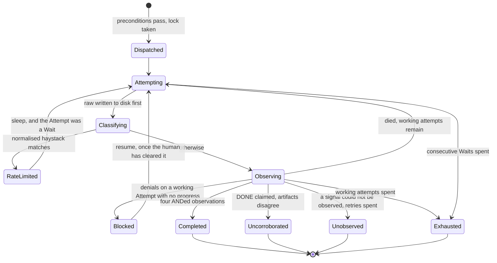
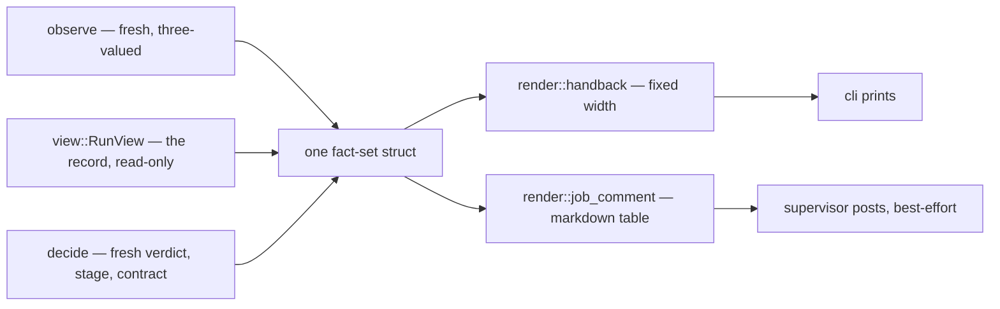
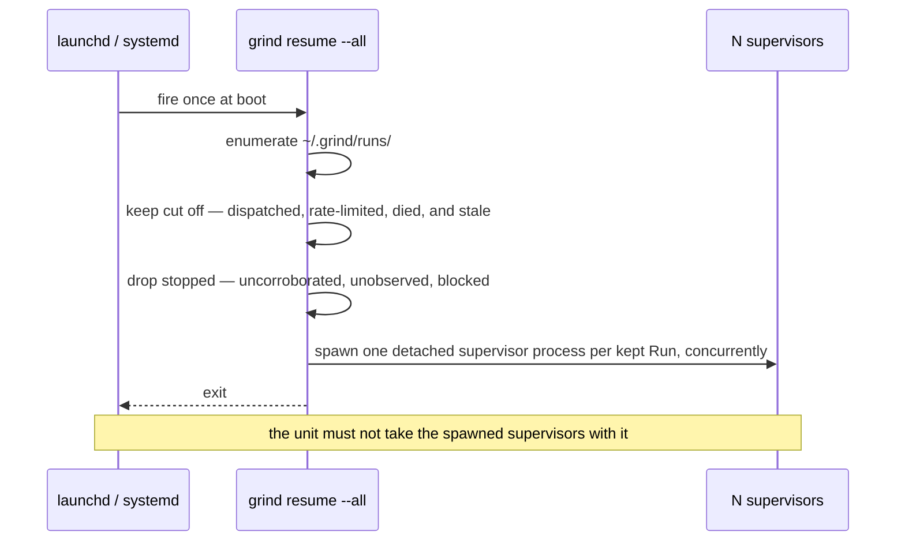

# Leg 1 - Everything the Map Ruled - Plan

Build the twelve rulings [#5](https://github.com/FlorianRiquelme/grind/issues/5)'s map closed after the base, in one PR, in the modules that already exist.

---

## Goal Capsule

- **Objective.** Ship every ruling issue [#76](https://github.com/FlorianRiquelme/grind/issues/76) enumerates — what the Run is told, what Dispatch refuses, what Grind writes on the tracker, what the budget counts, what the record observes, what the morning reads, and what survives a reboot — with the Job table changed on both sides and one test at that seam.
- **Authority hierarchy.** `docs/adr/0001`–`0012` outrank this plan. `CONTEXT.md` owns the vocabulary. Issue #76 owns the requirements this plan traces. This plan owns the how. Where this plan and an ADR disagree, the ADR wins and the plan is wrong.
- **This is an accumulation, not a rewrite.** The base is right and stays. Every change lands in a module that already exists at the right altitude. **No new production seam is proposed** — ADR-0007 declined a runner trait, the base held that line, and nothing here needs one.
- **Execution profile.** One branch, one PR, twenty-one units in dependency order. Each unit is an atomic commit that leaves `just verify` green.
- **Stop conditions.** Stop at an open PR. Stop and ask when a change would make a shape ADR-0006 prohibits newly expressible. Stop when a unit cannot land without loosening `DENIED_TOOLS`. Stop when a unit would add a directory under `src/` or nest `supervisor` and `view`.
- **Tail ownership.** The executor owns branch, commits, push and PR. Nothing merges.

---

## Product Contract

### Summary

Twelve of the map's rulings closed after the base was built and none of them is in the binary. This plan builds all of them in one PR: the Handback renders the fresh verdict and stops re-counting the Record, the supervisor gains one durable surface off the host, the budget starts counting work instead of Attempts, Dispatch asks one answerable question about the worktree and refuses on the answer, observation is scoped to the Run rather than the repo, and a boot one-shot re-enters what a restart cut off. The only new seam is a test one, closing the Enqueue-template/Job-parser gap `CLAUDE.md` names as untested.

### Problem Frame

The gap is concentrated in the four things a human actually touches.

**The Handback is the least reliable thing Grind produces, and it is the thing the morning reads.** It prints the recorded state while the fresh verdict is computed moments later and spent on an exit code, so Run 2's Handback said `[exhausted]` with `PR —` over an open, green, twelve-commit PR. It then re-counts the Record badly: three of its rows are whole-directory listings that count other people's files, every one of which is already in the PR's own diff.

**The supervisor's entire account of a Run dies with the host.** Run 2 narrated its Blocker in full and could say nothing about eight Attempts, $64.32, or three hours of rate-limit sleep. Between the dispatch comment and nothing, the human's only instrument is SSH.

**The budget counts the wrong thing.** Six of Run 2's eight Attempts cost $0 and one turn each, probing a wall. A long enough wall exhausts a healthy Run, and the one obstacle a human could have cleared in a minute spent five hours and recorded `exhausted`. Meanwhile a spend ceiling ADR-0010 withdrew is still appended to every invocation.

**Dispatch adopts a worktree and asks the wrong question about it.** It compares HEAD to the Handoff SHA as strings, which fires identically when the worktree is harmlessly ahead and when it does not contain the Handoff SHA at all. Run 2's worktree was behind and fast-forwardable at second zero; the signer outage, the denied force-push and five hours of `pr: null` are all downstream of a condition that was free to refuse. Dispatch also never fetches, so the same Job produces a different HEAD on the laptop than on a box.

Beneath those, five smaller failures with the same shape. The Handoff SHA row is never parsed to a SHA, so a warning fires on every Job that writes parenthetical context and nobody reads it. The PR lookup resolves by checked-out branch, which is a truthful answer to the wrong question precisely when the Run pushed elsewhere. `furthest stage` reads the repo's history rather than the Run's, so a fresh Run reads `planned` at dispatch on any repo where a previous Run merged a plan. The fan-out line matches a tool named `Task` while the CLI names it `Agent` — 203 to 0 across sixty transcripts — and the fixture that should have caught it is authored, so it asserts the matcher against itself. And the dispatch prompt asserts two constants that are false one paragraph apart.

Underneath all of it, unchanged: **nobody reads the diff**, and the human looks rather than being reached.

### Requirements

Each requirement cites the issue #76 user stories it carries.

**What the Run is told**

- R1. The dispatch prompt says the Run is unsupervised rather than alone, keeps *executing unattended* intact, and implies nobody is watching. (#76 1–2)
- R2. The prompt stops asserting that a slice is transcription rather than design, and keeps *do not re-open decisions the Anchor records* unconditional. (#76 3–4)
- R3. An optional `Intent` row states the work's nature in one line and is interpolated only when present. (#76 5)
- R4. `Intent` is a statement about the work's nature and never a requirement. (#76 6)
- R5. The prompt asks for a narrative — decisions taken, the non-obvious, what surprised the Run — as categories only, with no headings, no order and no required sections. (#76 7)
- R6. The prompt asks for `Closes #<job>` with explicit licence to reference the Job without the keyword. (#76 8)
- R7. Nothing observes, signals on, or keys a verdict to either the narrative or the closing keyword. (#76 9)
- R8. The prompt states that the Handoff SHA bounds the Run's output and not its reading. (#76 10)
- R9. The prompt tells the Run to check the current state of a shared sequential namespace — a numbered ADR, a migration, a changelog entry — before creating a file in one, as a per-Attempt fetch rather than a pinned view. (#76 11–12)
- R10. A test asserts the built prompt carries no per-Job characterisation unless the Job supplied one. (#76 13)

**What Dispatch refuses**

- R11. The `Handoff SHA` row is parsed to a bare SHA by a hex-and-length scan, written without a regex crate. (#76 14, 16)
- R12. A `Handoff SHA` row that yields no SHA refuses the Dispatch and names the row. (#76 15)
- R13. Dispatch fetches in the declared clone before it checks anything about the worktree. (#76 17)
- R14. Dispatch asks whether the Handoff SHA is reachable from the adopted worktree's HEAD. (#76 18)
- R15. A worktree containing the Handoff SHA exactly proceeds silently; one merely ahead proceeds with a note. (#76 19)
- R16. A worktree that does not contain the Handoff SHA is refused. (#76 20)
- R17. The refusal says *fast-forward and re-dispatch* where HEAD is a strict ancestor of the Handoff SHA. (#76 21)
- R18. A failed fetch produces a note, and never a refusal or a clean bill of health. (#76 22)
- R19. Grind never fast-forwards the worktree and never moves it to the declared commit. (#76 23)
- R20. The string-comparison HEAD note is removed rather than kept beside the new check. (#76 24)
- R21. Dispatch refuses a Job whose Anchor artifact does not exist on disk, presence-only and local on the already-resolved worktree. (#76 25–26)
- R22. Every refusal in this build reads in the register of the dirty-worktree refusal — incoherent input, no quality language. (#76 27)
- R23. The Anchor's shape is never checked — no R-IDs, no readiness field. (#76 28)

**What Grind writes on the tracker**

- R24. The queue-label constant and the dispatch-time label removal are deleted. (#76 29)
- R25. The dispatch comment on the Job issue is kept exactly as it is. (#76 30)
- R26. The function that did both is renamed to what it now does. (#76 31)
- R27. Grind applies no label, assignee, project or milestone on any repo. (#76 32)
- R28. The impure module's stated write invariant becomes *one place, two writes* in the same diff. (#76 33)

**The budget, and what an Attempt costs**

- R29. An Attempt that did no work is recorded as a Wait. (#76 34)
- R30. A Wait never spends the attempt budget. (#76 35)
- R31. A run of consecutive Waits is bounded by its own counter. (#76 36)
- R32. A Wait is keyed on work done and never on cause. (#76 37)
- R33. The Wait arithmetic is read from the Attempt list and never from an observation. (#76 38)
- R34. Wall-clock never bounds a Run. (#76 39)
- R35. An obstacle only a human can clear is recorded as a Blocker that stops the Run immediately. (#76 40)
- R36. A Blocked Run is resumable. (#76 41)
- R37. A Blocker is detected by the supervisor from the recorded permission denials, with the Run's own declaration recorded beside it and never deciding alone. (#76 42)
- R38. `attempt N of M` counts working Attempts only, on every surface that prints it. (#76 43)
- R39. The spend ceiling is removed from the Job, the record, the conditions and every invocation. (#76 44)
- R40. The ceiling is removed only alongside or after the Wait work. (#76 45)
- R41. Spend is still recorded and still surfaced. (#76 46)

**Observing the Run rather than the repo**

- R42. The PR is looked up by head commit, with the branch lookup kept as a fallback. (#76 47)
- R43. That lookup is a pure parse over raw output. (#76 48)
- R44. Plan and residual-findings listings are scoped to the Run's own diff. (#76 49)
- R45. The five-rung stage ladder is kept whole rather than trimmed to the Run-scoped rungs. (#76 50)
- R46. Base drift is measured as a count of commits on the default branch since the Handoff SHA plus the paths that overlap the Run's branch. (#76 51)
- R47. Base drift is three-valued, so a failed fetch is never recorded as *no drift*. (#76 52)
- R48. Base drift is surfaced only when non-zero. (#76 53)
- R49. The fan-out matcher accepts both the current and the former tool name. (#76 54)
- R50. A transcript with tool-use blocks and no recognised spawn reads as *could not observe*, with the tool-call count in the reason. (#76 55)
- R51. Fan-out is recorded per Attempt as two integers — spawned and returned. (#76 56)
- R52. No summary, boolean or health word sits over those two integers. (#76 57)
- R53. The live-stage field carries the same *nothing recognised* rule. (#76 58)
- R54. A rough, explicitly-estimated statement says how much of the changed diff sits outside every contracted verify step. (#76 59)
- R55. That estimate carries no boolean and gates nothing. (#76 60)

**The Handback**

- R56. The Handback's verdict is rendered from the fresh observation, in the top position. (#76 61)
- R57. The recorded state stops printing. (#76 62)
- R58. Red CI lands on the verdict line with the repair budget it spent. (#76 63)
- R59. A Blocker lands on that same line with what must be cleared. (#76 64)
- R60. The plan, review-residual and ledger count rows are dropped. (#76 65)
- R61. The observations behind those counts are kept, because the stage ladder reads them. (#76 66)
- R62. The session handle and the worktree path move into a trailing pointer block. (#76 67)
- R63. The model stays a fact. (#76 68)
- R64. The denial count prints unconditionally; the denied invocations list only when the count is non-zero. (#76 69)
- R65. The draft flag surfaces only when true. (#76 70)
- R66. Rows that could not be observed group into their own block, which is empty on a Run where nothing failed to observe. (#76 71–72)
- R67. No *the Run did not declare DONE* line prints on the completed path; it stays where the promise was made and the artifacts disagree. (#76 73–74)
- R68. No summary boolean appears anywhere in the Handback. (#76 75)
- R69. Base drift is carried on the Handback despite the five-claim rule. (#76 76)
- R98. The fan-out arithmetic is carried on the Handback, surfaced only when non-zero. (#76 56, 76)
- R99. The verify-coverage estimate is carried on the Handback as an estimate, surfaced only when it names uncovered paths. (#76 59, 76)

**The account that leaves the host**

- R70. The supervisor comments on the Job issue at every terminal state. (#76 77)
- R71. That comment carries run id and host, the verdict, working Attempts as N of M, spend, the denial count, the four completion observations with their three-valued marks, the fan-out arithmetic, verify-contract presence and absence, the PR link and the run-state path. (#76 78)
- R72. It is appended and never edited. (#76 79)
- R73. It is best-effort, unretried in a loop, never able to change a verdict, and a failure to post is logged rather than raised. (#76 80–81)
- R74. It is rendered by a second renderer over the same fact set. (#76 82)
- R75. No summary boolean appears in it either. (#76 83)
- R76. It is a comment rather than a label, an assignment or a status field. (#76 84)
- R100. The comment's audience is the one already trusted with the dispatch comment, so host and run-state path are published deliberately; it carries each observation's mark and never a reason built from child stderr. (#76 78, 84)

**Surviving a reboot**

- R77. `grind resume --all` re-enters every Run on this host that was cut off. (#76 85)
- R78. *Cut off* means dispatched, rate-limited or died with a stale supervisor. (#76 86)
- R79. *Stopped* Runs — uncorroborated, unobserved, blocked — are never re-entered by that path. (#76 87)
- R80. Re-entry is concurrent rather than serial. (#76 88)
- R81. The surface is `resume --all` rather than a boot verb, a bare `resume`, or anything parsing `grind status`. (#76 89)
- R82. The supervisor's narration is written to a log in the run directory, line-buffered like the existing output. (#76 90–91)
- R83. A launchd plist and a systemd unit ship and are documented. (#76 92)
- R84. The unit is written so that a one-shot exiting does not take the supervisors it spawned with it. (#76 93)
- R85. `grind doctor` checks that the boot one-shot is loaded and not merely present, marked *doctor* and never *dispatch*. (#76 94–95)
- R86. The host document's mark and the check in the code land together. (#76 96)

**The Job table as a contract**

- R87. The `budget ceiling` row is removed from the parser and from the Enqueue template in the same diff. (#76 97)
- R88. The `Intent` row is added to the parser and to the template in the same diff. (#76 98)
- R89. The glossary and the design record are updated where they enumerate what a Job carries. (#76 99)
- R90. A test parses the Enqueue template's own example table through the Job parser, and fails when a required row is renamed on either side. (#76 100–101)

**Editing Grind**

- R91. `just verify` remains the one definition of checked. (#76 102)
- R92. The new terminal state is a supervisor state and a policy stop, never a verdict variant. (#76 103)
- R93. The fan-out counts, the drift measurement and the verify-coverage estimate all arrive without a summary field. (#76 104)
- R94. Every new observation is three-valued. (#76 105)
- R95. The record's writer stays private to the supervisor and the module list stays flat. (#76 106)
- R96. The new dispatch checks are one impure call plus one pure classifier in the module that owns the argv. (#76 107)
- R97. Every prompt change is asserted against the built prompt string. (#76 108)

### Scope Boundaries

**Deferred for later**

- **The eight fog patches on #5.** Each carries a named revisit condition and none is a dependency of this build: whether an in-flight Run needs any off-host surface; whether a Run can recognise a shared sequential namespace it was not told about; whether the transcript reader self-checks against the host's Claude Code version; which Blockers are detectable and what to do about the ones that are not; the decomposability admission check; which Job is Run 3; learnings across Runs; and whether the metrics ever get instrumented.
- **`CLAUDE.md`'s *four metrics* line.** `STRATEGY.md` carries five and has since before this build. Pre-existing drift, unrelated to any ruling here, and correcting it in this diff is scope this build did not ask for.
- **The `denied_tools` count in `tests/fixtures/record/day-one.json`.** The fixture records seven denials because it was authored when the list was seven; the list is now twelve. The safety property — *every invocation carries them* — is asserted against the built argv and is unaffected. See Risks.

**Outside this product's identity**

- **Progress comments on the Job issue, or anything else off-host between dispatch and a terminal state.** Rejected resolving #15 on three grounds: they fight *append, never edit*, they import the status view's jitter onto a public surface, and they publish under the human's own name.
- **Anything that reaches a human who is not looking.** Grind writes only where the human already looks and never initiates a delivery of its own; whether the tracker then sends a notification is the tracker's setting, not Grind's act. The terminal-state comment sits inside that line — a push, a mail, a chat message or a cross-run digest does not.
- **Conversing with an in-flight Run**, and the channel that would carry it.
- **Re-reading the Job issue's comments on re-entry.** Refused resolving #18 — it reaches only a Run that happens to die, which is a channel whose availability is a function of failure.
- **The R-ID accounting line in the dispatch prompt.** Shrunk to *probably nothing* by #17's measurement; the narrative paragraph is what survives of it.
- **Any admission check at Enqueue, mechanised.**
- **Refusing a merge commit as a Handoff SHA.** Ruled legitimate unreservedly resolving #52. The parser is untouched on that axis.
- **Comparing where the Run pushed with where the Job named it to push**, beyond the head-commit lookup that finds the PR.
- **A `Running` state.** There is deliberately none, and R79's exclusion of stopped Runs is what makes it unnecessary.
- **A supervisor killed on a host that stays up** — OOM, a stray kill, a crash. Explicitly out of scope in ADR-0011; closing it needs the daemon that ADR rejected.
- **A ceiling on Runs in flight**, a resident watcher, a schedule, or anything that selects a Job or a host.
- **Gating a PR on any finding** (ADR-0003), and reimplementing any `lfg` stage (ADR-0001).
- **Hardening the source-level or compile-fail carriers.** They guard convention; aliasing to dodge them is intent.
- **Migrating existing Run state.** Records do not travel.

### Sources

- Issue [#76](https://github.com/FlorianRiquelme/grind/issues/76) — the spec these requirements trace, and its index into map [#5](https://github.com/FlorianRiquelme/grind/issues/5).
- `docs/adr/0010`, `0011`, `0012` — the three ADRs this build executes. ADR-0010 orders the ceiling removal after the Wait work; ADR-0011 owns `resume --all`, `supervisor.log` and the process-group caveat; ADR-0012 owns the label deletion and the *one place, two writes* invariant.
- `docs/adr/0003` and `docs/adr/0006` — never gates, and the seven prohibited shapes. The sixth and seventh are the two this build is most tempted by.
- `docs/adr/0007` — ten modules, one impure, no directories under `src/`, siblings never nested.
- `docs/findings/0002-second-run.md` — eight Attempts, $64.32, 4h58m wall clock of which 3h01m was rate-limit sleep, one denial (`git push --force-with-lease`), `model: null`, and a recorded `exhausted` over an open green PR. The evidence for most of this build.
- `CONTEXT.md` — Attempt, Wait, Blocker, Fan-out, Record, Base drift and Supervisor already carry their definitions and their *Avoid* lists.
- `docs/provisioned-host.md` `## Lifetime` — the boot one-shot recorded without a mark, and the two costs it names.
- `STRATEGY.md` — five metrics; **Handback fidelity** is primary and is what most of this build exists to move.
- Code anchors the units depend on: `src/job.rs:196` (`handoff sha` taken verbatim), `src/job.rs:556` (`head_note`), `src/job.rs:573` (`spend_cap`), `src/supervisor.rs:26` (`QUEUE_LABEL`), `src/supervisor.rs:242` (the string-comparison HEAD note), `src/supervisor.rs:421` (the `Stop` → `State` map), `src/supervisor.rs:590` (`dequeue_and_point_at_this_host`), `src/world.rs:17` (the write-invariant doc comment), `src/attempt.rs:178` (`--max-budget-usd`), `src/attempt.rs:188` (`dispatch_prompt`), `src/policy.rs:48` (`Stop`), `src/observe.rs:292` (`gh pr view`), `src/view.rs:50` (`attempt_counter`), `src/view.rs:333` (`Some("Task")`), `src/view.rs:353` (the whole-directory listing closure), `src/render.rs:179` (`handback`), `src/cli.rs:53` (the `resume` arm).

---

## Planning Contract

### Key Technical Decisions

- KTD1. **The Handoff SHA is extracted by a bare function beside the three path validators, not by a newtype.** `PluginPin` earns its type because `Latest` must be unspellable (ADR-0006); a SHA has no forbidden spelling, only a required shape, which is what `validate_repo`, `validate_branch` and `validate_anchor` already are. The scan takes the longest run of `[0-9a-f]` of length 7–40 in the cell and refuses when there is none. No regex crate, so ADR-0005's single dependency holds. Governs R11, R12.
- KTD2. **The reachability classifier lives in `job`, beside `is_dirty` and in place of the deleted `head_note`.** `job` already owns every pure classifier over git's porcelain text, and the impure call sits in `supervisor` beside the dirty check — the same one-impure-call-plus-one-pure-classifier shape the base already uses. No new module, no `git.rs`. Governs R14–R18, R96.
- KTD3. **A Wait is a derived predicate over the recorded Attempt, not a new persisted field.** `Attempt` already carries `parse_ok: bool`, `total_cost_usd: Option<f64>` and `num_turns: Option<u64>`; an Attempt that did no work is one that **parsed**, cost zero or nothing, and ran at most one turn. Deriving it means no record migration and no reader mirror, and — decisively — it cannot be keyed on cause, because the predicate never sees `rate_limited`.
  - **`parse_ok == false` is never a Wait, and this is the load-bearing clause.** A child that dies before emitting parseable JSON leaves both `total_cost_usd` and `num_turns` absent, so a predicate reading absence as *did no work* would make every crash loop free: no budget spent, no rate-limit match, immediate re-entry, forever, with `attempt N of M` reporting the Run as barely started. `Attempt.parse_ok` exists precisely to separate *an unparseable response* from *an aborted supervisor*, and the predicate consults it. Absence of evidence is not evidence of no work. Governs R29, R32, R33, R38.
- KTD4. **The consecutive-Wait count is derived from the tail of the recorded Attempt list, not held loop-local.** `reobservations` is the shape's precedent, but it bounds one observation cycle inside a single process; the Wait bound has to survive a restart. Waits by design never spend the attempt budget, so this counter is the *only* bound on a Run that never does work — and R78 makes `RateLimited` and `Died` Runs re-enterable at boot, so a loop-local count hands a permanently-walled Run a fresh allowance at every reboot and never terminates. Counting the trailing Waits in `attempts[]` on each iteration gives the same policy knob against a compiled constant beside `REOBSERVATIONS`, costs no new record field, and is what R33 already asks for — the arithmetic reads the Attempt list, which is persisted. Governs R31, R33.
- KTD5. **`Blocked` is `policy::Stop::Blocked` plus `supervisor::State::Blocked`, and `decide::Verdict` is untouched.** ADR-0006 prohibits `Verdict::{Rejected, Blocked, Failed}` by name because those words are quality judgements about the *work*. A Blocker is a fact about the *world*, in the same family as the `RateLimited` state the base has carried since day one. The existing test banning those words from every `Verdict` variant's `Debug` output stays and must keep passing. An implementer who adds `Blocked` to the verdict type has introduced the forbidden shape; one who refuses to build it at all has read the prohibition too widely. Governs R35, R36, R92.
- KTD6. **A Blocker fires when the same denied invocation is recorded on two consecutive working Attempts that both failed to advance `commits_ahead`.** #76 settles the source — supervisor-authoritative, from the recorded denials — and leaves the threshold; this is the threshold, and three clauses in it are load-bearing:
  - **Two consecutive working Attempts, not one.** A Run may legitimately probe a denied tool once and route around it, which is exactly what Run 2 did. One denial is a fact about an Attempt; a repeated one is a fact about the world.
  - **Progress means `commits_ahead` observed `Present` and unchanged since the previous working Attempt, and an `Unobservable` reading never fires the Blocker.** U6 rejects progress as a *budget* input because `commits_ahead` read zero for all eight of Run 2's Attempts against twelve real commits — so keying a terminal state on the same observation demands the three-valued guard R94 imposes everywhere else. Blind must not read as blocked.
  - **The Run's own declaration is recorded beside the denial and never fires the stop alone**, which is #9's *observed, never declared* holding here too.

  See Open Questions — #76's named Run 2 replay assertion does not survive contact with the recorded evidence, and this KTD is the plan's answer to that rather than a quotation from the spec. Governs R37.
- KTD7. **`handback` takes a named fact-set struct, and both renderers take the same one.** It takes five positional arguments today and carries no verdict at all; the fresh verdict has to arrive, and R74 requires a second renderer over one fact set. A struct mirroring the existing `SingleRun` is what makes *two independently-chosen lists cannot drift* structural rather than hoped. Governs R56, R74.
- KTD8. **Spawned and returned are both read from the parent transcript.** Spawns are `tool_use` blocks naming the fan-out tool; returns are the `tool_result` blocks that pair to them. The subagent files on disk are the third source, and they are not used — they have zero observed disagreements with the other counts, so they add reading and no information. Whether a returned subagent errored is unproven across 203 observations and is not modelled. Governs R51.
- KTD9. **Per-Attempt fan-out counts are gathered before `push_attempt`.** `RunRecord.attempts` is append-only with no mutating accessor, so the supervisor reads the attempt's transcript through `world`, hands the text to a pure counter, and carries the two integers into the `Attempt` it pushes. This is the one new wire between transcript reading and record building, and it runs in the direction the topology already allows. Governs R51.
- KTD10. **The widened matcher is proved by the negative-recognition test, not by a new fixture.** The existing fan-out fixture is marked *Authored* and spells the old tool name, which is why it asserted the matcher against itself and caught nothing. A second authored fixture spelling the new name repeats that failure exactly. The load-bearing assertion is therefore the one authoring cannot fake: a transcript carrying assistant lines with tool-use blocks and **zero** recognised spawns reads *could not observe* with the tool-call count in the reason. The fixtures carry both spellings as support. Governs R49, R50, R53.
- KTD11. **`world` gains one append primitive, and its stated writer count goes from two to three.** `world::print_line` documents itself and `cli`'s printing as the only two writers of output; `supervisor.log` is a third destination and the doc comment says so rather than becoming quietly false. Line-buffering is unchanged and now has a destination that does not depend on who started the process. Governs R82.
- KTD12. **`resume --all` spawns one detached `grind resume <run-id>` child process per cut-off Run.** Never threads: Rust terminates detached threads when `main` returns, and the boot one-shot's whole shape is *spawn and exit*, so a thread-per-Run boot path re-enters nothing and reports success while doing it. ADR-0011 says the one-shot spawns N **supervisors**, and a supervisor is a process — which is also what makes KTD14's process-group caveat meaningful rather than moot. Each child takes its own dispatch lock independently, so genuinely independent Runs proceed in parallel and a second child on the same branch gets the existing `WouldBlock` refusal for free. `resume --all` reports which Runs it started, never what they concluded, and exits. Serial re-entry would be ordering, and ordering is the human's act. Governs R80.
- KTD13. **`supervisor` reads `view::supervisor_here` for liveness.** After a reboot every recorded pid is stale by construction, so the existing process-identity check answers *cut off* with nothing new. The edge `supervisor → view` is new and legal: they are siblings, `view` is `pub`, and the wall that matters is the one in the other direction — `view` never reaches `supervisor`'s private record, and `tests/compile_fail.rs` still asserts it. Governs R77, R78.
- KTD14. **The boot one-shot ships as two committed template files under a new top-level `dist/`.** A plist and a unit are neither source nor documentation, and `docs/provisioned-host.md` is the list rather than the payload. `dist/` is outside `src/`, so `tests/topology.rs` is untouched. The systemd unit must keep the supervisors alive past the one-shot's own exit — a `Type=oneshot` exiting takes its cgroup with it by default, which would kill every Run seconds after boot, silently. This is the one place this build still has machinery in it. Governs R83, R84.
- KTD15. **The doctor check branches on platform and verifies loaded.** `launchctl print` on darwin against `systemctl --user is-enabled` on linux — the first platform-branching check in a list where every existing check is one command everywhere. A plist on disk that was never bootstrapped is the likeliest way this fails, and it fails one reboot later with a Run stranded. Marked *doctor*, never *dispatch*: a Dispatch works perfectly well without it. Governs R85.
- KTD16. **The verify-coverage estimate is a parallel const keyed to the seven contracted step names.** `VERIFY_CONTRACT` carries tool-invocation substrings and knows nothing about paths, so the step-to-covered-paths mapping is new data rather than a refactor: a coarse extension-and-directory heuristic, authored only for the ecosystems the contract already names. It is stated in the Handback as an estimate, because a precise-looking number derived from a guess is worse than an obviously rough one. Governs R54.
- KTD17. **Base drift's default branch is read from `origin/HEAD` in the declared clone.** It is local after the fetch R13 already performs, needs no network of its own, and needs no new Job row. A missing or unreadable `origin/HEAD` is *could not observe*, never *no drift*. Governs R46, R47.
- KTD18. **`Intent` and the ceiling removal are one Job-table act, landing after the Wait work.** ADR-0010 says dropping the ceiling is safe *only because* Waits close the hole underneath it, so the removal cannot precede U6. Both halves of the table then change in one place with one seam test over them, which is what makes *change either half and check the other* a checked claim. Governs R39, R40, R87, R88, R90.

### High-Level Technical Design

**Reachability, replacing the HEAD note.** One impure call after the dirty check, one pure classifier over `(fetch_ok, ancestor_exit)`. The three-valued reading falls out of the call's exit statuses rather than needing its own apparatus.

| fetch | `merge-base --is-ancestor` exit | meaning | dispatch does |
|---|---|---|---|
| ok | `0`, HEAD equals the Handoff SHA | the clean case | nothing, silently |
| ok | `0`, HEAD differs | the worktree is **ahead** | a **note** |
| ok | `1`, HEAD is a strict ancestor | the branch is merely **behind** | **refuse** — *fast-forward and re-dispatch* |
| ok | `1`, otherwise | the Handoff SHA is **not in this history** | **refuse** |
| ok | `128` | the Handoff SHA is **not an object here** | **refuse** |
| failed | any | **unobservable** | a **note**, never a refusal |

The last row is the one to get right: a failed fetch must not become a clean bill of health *or* a refusal.

**The loop, with Wait and Blocked.** Two additions to a state machine that otherwise stands. A Wait is recorded like any Attempt and spends nothing; a Blocker stops at once and stays resumable, because it never spent the budget.

`Blocked` is the eighth state and the fifth policy stop. It is never a `Verdict` variant (KTD5).

**One fact set, two renderers.** The Handback and the Job-issue comment differ only in where they send the human to look. A terminal wants fixed width; markdown wants a table. Two independently-chosen lists would drift *invisibly*, because nobody ever sees both renderings of one Run.

The wall that matters is the absence of an edge: neither renderer reads the recorded state for its verdict, and neither carries a summary boolean.

**The boot path.** The one-shot fires once, spawns, and exits. Nothing is resident and nothing watches anything.

### Assumptions

- **`Attempt.parse_ok`, `num_turns` and `total_cost_usd` are the whole of the Wait predicate.** All three are on the struct today. An absent cost or turn count reads as *did no work* **only** when the response parsed; see KTD3.
- **Run 2's replay inputs are authored, not recorded.** `tests/fixtures/run2/` holds one attempt's triple — the rate-limited shape — so the other seven shapes in any replay are hand-written from `docs/findings/0002`'s table. The recorded facts that constrain them: eight Attempts, three cost-bearing (attempt 1 at $37.04 and 187 turns, attempt 2 at $7.06, attempt 8 at $20.22), attempts 3–7 at $0 and one turn, and exactly one denial — on **attempt 8**, the Attempt that opened the PR. So the replay leaves five Waits and three working Attempts. It does **not** reach a Blocker; see Open Questions.
- **`gh pr list --search <sha>` resolves a PR by head commit** without needing the branch checked out. The parse is pure over raw output regardless, so a wrong subcommand costs a fixture and not a design.
- **The Claude Code transcript pairs a `tool_use` block to a `tool_result` block by id in the parent file.** KTD8 rests on it. If the format does not carry the pairing, returned falls back to counting subagent transcripts on disk and KTD8 is revisited in the unit rather than in the plan.
- **The toolchain a machine editing Grind needs is present** — rustc and cargo, `just`, zig and `cargo-zigbuild`, and both musl targets. `just verify` fails loudly on a machine missing them.
- **`skills/enqueue/` remains symlinked into `~/.claude/skills/`.** The seam test reads the file from the source tree, so the symlink is irrelevant to the test and relevant only to the skill being loadable at all.

### Sequencing

Eight phases, twenty-one units. Five ordering constraints are load-bearing rather than stylistic, and every one of them comes from the spec or an ADR:

- **The Handoff SHA parse lands first.** U11's diff-scoped listings and U2's reachability check both break the same way on a row that never yields a SHA.
- **The spend-ceiling removal lands after the Wait work.** ADR-0010 says dropping the ceiling is safe only because Waits close the hole underneath it. U8 depends on U6.
- **The label deletion and the Job-issue comment both rewrite `world`'s stated write invariant.** They land in one PR and the line is written once, in U4.
- **The boot one-shot's documentation mark and its doctor check land together.** An existing test binds the document's marks to `job::host_items()`, so U20 is one commit or none.
- **The Job table's two changes land on both sides**, plus the seam test over them. U9 is that act.

U-IDs are stable and are never renumbered. The phase order below is the commit order.

**The cut line, if one is needed.** One PR is the default and #76's own instruction. If the boot one-shot's process-group behaviour cannot be settled — the one thing here with no test seam and no measured example — **Phases A–F stand alone as a shippable PR** and U18–U21 follow as a second. Nothing in Phases A–F depends on Phase G, and Phases E and F carry the primary metric, so the fallback is a deliberate line rather than one improvised under pressure.

---

### Open Questions

- **Deferred (non-blocking) — #76's named Run 2 replay test does not survive its own evidence, and the plan cannot fix that alone.** #76 asserts *"Replaying Run 2's attempt shapes reaches a Blocker at two working Attempts rather than exhaustion at eight."* But `docs/findings/0002` records the Run's single denial on **attempt 8** — the Attempt that opened the PR and pushed twelve commits — so no denial-keyed predicate fires at two working Attempts, and #76 separately concedes that Run 2's real obstacle, a dead signer, "produces neither a denial nor a reliable declaration." The two statements cannot both hold.

  **What this plan does:** KTD6 states the threshold the evidence supports — the same denial repeated across two consecutive working Attempts with no progress — and U7 pins that with scenarios from literals. The Run 2 replay is kept as a Wait-arithmetic test (five Waits, three working Attempts, no exhaustion) and **dropped as a Blocker test**.

  **What it does not do:** decide whether #76's named test should be amended or whether the Blocker wants a second, non-denial trigger. Both are the spec's to settle. Implementation is not blocked — every unit is buildable — but the Definition of Done's *twenty-two named tests* count already reflects the substitution, and #76 should be corrected rather than the test being bent to pass.

- **Deferred (non-blocking) — a Run stopped by the consecutive-Wait bound is recorded `Exhausted`, and `resume <run-id>` refuses `Exhausted`.** So a Run that spent none of its attempt budget becomes permanently un-re-enterable, which relocates the failure ADR-0010 removed rather than removing it. U6 ships the bound as specified; whether that terminal state should instead be resumable is a ruling #23 did not make.

---

## Implementation Units

### Unit index

| U-ID | Title | Files | Depends on |
|---|---|---|---|
| U1 | The Handoff SHA parses to a bare SHA | `src/job.rs` | — |
| U2 | Fetch, then reachability; the HEAD note goes | `src/job.rs`, `src/supervisor.rs`, `tests/end_to_end.rs` | U1 |
| U3 | The Anchor artifact must exist | `src/supervisor.rs`, `tests/end_to_end.rs` | U2 |
| U4 | The queue label goes; one place, two writes | `src/supervisor.rs`, `src/world.rs`, `tests/end_to_end.rs` | — |
| U5 | The prompt stops asserting constants | `src/attempt.rs` | — |
| U6 | A Wait is an Attempt that did no work | `src/attempt.rs`, `src/policy.rs`, `src/supervisor.rs`, `src/view.rs`, `src/render.rs` | — |
| U7 | A Blocker stops at once and is resumable | `src/policy.rs`, `src/supervisor.rs`, `src/cli.rs` | U6 |
| U8 | The spend ceiling goes | `src/job.rs`, `src/attempt.rs`, `src/supervisor.rs`, `skills/enqueue/JOB-TEMPLATE.md`, `tests/end_to_end.rs` | U6 |
| U9 | `Intent` on both sides, and the seam test | `src/job.rs`, `src/attempt.rs`, `skills/enqueue/**`, `CONTEXT.md`, `BRAINSTORM.md`, `tests/enqueue_template.rs` | U1, U5, U8 |
| U10 | The PR is found by head commit | `src/observe.rs`, `src/view.rs` | — |
| U11 | Listings scoped to the Run's own diff | `src/observe.rs`, `src/view.rs` | U1 |
| U12 | Base drift — a count, overlapping paths, three-valued | `src/observe.rs`, `src/view.rs` | U1 |
| U13 | The fan-out matcher, and what unrecognised means | `src/view.rs`, `tests/fixtures/transcript/**`, `tests/fixtures/README.md`, `tests/transcript.rs` | — |
| U14 | Fan-out recorded per Attempt as two integers | `src/attempt.rs`, `src/observe.rs`, `src/view.rs`, `src/supervisor.rs`, `tests/fixtures/record/day-one.json` | U13 |
| U15 | The verify-coverage estimate | `src/decide.rs`, `src/observe.rs`, `src/view.rs` | U12 |
| U16 | The Handback makes five claims | `src/render.rs`, `src/cli.rs` | U6, U7, U10, U11, U12, U14, U15 |
| U17 | A comment on the Job issue at every terminal state | `src/render.rs`, `src/supervisor.rs`, `src/cli.rs`, `src/world.rs`, `tests/end_to_end.rs` | U4, U16 |
| U18 | `supervisor.log` in the run directory | `src/world.rs`, `src/supervisor.rs` | — |
| U19 | `grind resume --all` | `src/cli.rs`, `src/supervisor.rs`, `tests/end_to_end.rs` | U7, U18 |
| U20 | The boot one-shot, its check, and the document's mark | `dist/**`, `docs/provisioned-host.md`, `src/job.rs`, `src/cli.rs`, `src/observe.rs`, `src/world.rs` | U19 |
| U21 | The instructions catch up | `CLAUDE.md` | U20 |

### Phase A — Dispatch's preconditions

#### U1. The Handoff SHA parses to a bare SHA

- **Goal:** The one required row still trusting the human's formatting is parsed, and a row that yields no SHA refuses.
- **Requirements:** R11, R12, R22
- **Dependencies:** —
- **Files:** `src/job.rs`
- **Approach:**
  1. Add a hex-and-length scan beside `validate_repo`, `validate_branch` and `validate_anchor` (KTD1). Take the longest run of `[0-9a-f]` in the cell, accept it at length 7–40, refuse otherwise.
  2. Call it in the slot where `required("handoff sha")?` currently assigns verbatim, so `Job.handoff_sha` holds a bare SHA from this unit onward.
  3. The refusal names the row and carries no quality word, matching the three validators beside it.
  4. No regex crate. No newtype — a SHA has a required shape and no forbidden spelling.
- **Patterns to follow:** `PluginPin::parse`'s two refusals for the message register; `validate_anchor` for the function shape. `job` is pure, so these are `#[cfg(test)]` unit tests.
- **Test scenarios:**
  - A cell reading `` `723ca91…` (`main` after #29) `` yields the bare SHA and nothing else.
  - A cell holding a bare 40-character SHA yields it unchanged.
  - A cell with no hex run refuses, and the refusal names `handoff sha`.
  - A refusal carries none of `bad`, `invalid`, `wrong`, `fail`, `error`, `reject`.
  - A cell whose only hex run is shorter than 7 characters refuses rather than yielding a truncated SHA.
- **Verification:** `just verify` green. `docs/findings/0002`'s recorded row parses to the SHA that Run 2's `git rev-list --count` could not read.

#### U2. Fetch, then reachability; the HEAD note goes

- **Goal:** Dispatch asks one question about the worktree and refuses on the answer, and there is exactly one answer to *is this the right worktree*.
- **Requirements:** R13–R20, R22, R96
- **Dependencies:** U1
- **Files:** `src/job.rs`, `src/supervisor.rs`, `tests/end_to_end.rs`
- **Approach:**
  1. Delete `job::head_note` and its call site. The `git rev-parse HEAD` read **stays** — the classifier needs HEAD to tell the clean case from the ahead case — but nothing compares strings to decide any more.
  2. In `supervisor::dispatch`, after the dirty-worktree refusal, four impure calls through `world` and no branching in any: `git fetch` in the **declared clone**; `git rev-parse HEAD` in the worktree; `git merge-base --is-ancestor <handoff_sha> HEAD`; and the **reverse** `git merge-base --is-ancestor HEAD <handoff_sha>`. The reverse call is what separates *behind* from *diverged* — exit 1 from the forward call says only *not an ancestor*, and the *fast-forward and re-dispatch* refusal depends on the difference.
  3. Add a pure classifier in `job` over `(fetch_ok, ancestor_exit, head_equals_handoff, handoff_contains_head)` returning proceed-silently, note, or refuse-with-reason (KTD2). The six-row table in the High-Level Technical Design is its specification.
  4. The refusal says *fast-forward and re-dispatch* where HEAD is a strict ancestor of the Handoff SHA, and names the two commits. Nothing downstream branches on which refusal it was.
  5. Grind never fast-forwards and never moves the worktree. The declared clone may be a symlink to the human's own (ADR-0008), so a visible refusal is traded for an invisible mutation deliberately.
  6. The fetch is network, so it sits outside the *presence only, local, free, no network* comment that scopes the host-readiness check, and that comment stays true of what it scopes.
- **Patterns to follow:** the dirty-worktree refusal immediately above it — the register, the `Refusal::saying` shape, and the *could not read* branch for a non-zero status.
- **Test scenarios:**
  - The classifier over all six rows of the table, from literals.
  - A failed fetch produces a note and neither a refusal nor a clean bill of health.
  - A worktree whose HEAD equals the Handoff SHA proceeds with no output at all.
  - A worktree ahead of the Handoff SHA proceeds and prints a note.
  - A worktree strictly behind refuses, and the refusal contains *fast-forward*.
  - A Handoff SHA that is not an object in the worktree refuses.
  - End to end: a scratch repo whose branch is behind the recorded Handoff SHA refuses at second zero with exit code 2, and nothing is dispatched onto it.
  - No refusal in this unit carries a quality word.
- **Verification:** `just verify` green. Replaying Run 2's opening condition — behind and fast-forwardable — refuses instead of proceeding.

#### U3. The Anchor artifact must exist

- **Goal:** A Run handed a path to nothing cannot invent requirements, satisfy them, and open a green PR.
- **Requirements:** R21, R22, R23
- **Dependencies:** U2
- **Files:** `src/supervisor.rs`, `tests/end_to_end.rs`
- **Approach:**
  1. After the worktree is resolved, check `world::exists(worktree.join(&job.anchor))` and refuse when it does not. It cannot live in `refuse_unless_host_ready`, which runs before the worktree exists.
  2. Presence only. The Anchor's **shape** is never checked — no R-IDs, no readiness field — because an admission check must not arrive through the back door of an admission rule.
  3. A note is the wrong register: there is no legitimate Job whose Anchor is absent, so it is a refusal, in the dirty-worktree register.
- **Patterns to follow:** the dirty-worktree refusal for the register; `world::exists` for the call.
- **Test scenarios:**
  - End to end: a Job naming an Anchor path that does not exist refuses, names the path, and exits 2.
  - End to end: a Job whose Anchor exists proceeds to the first Attempt.
  - The refusal carries no quality word.
  - An Anchor that exists but is empty proceeds — presence, never shape.
- **Verification:** `just verify` green. The sandbox's scratch repo needs its plan file present for every other scenario to keep passing, which is itself the positive case.

### Phase B — What Grind writes, and what the Run is told

#### U4. The queue label goes; one place, two writes

- **Goal:** Grind stops erasing a triage fact to record a queue fact, and the impure module says what it now does.
- **Requirements:** R24–R28, R76
- **Dependencies:** —
- **Files:** `src/supervisor.rs`, `src/world.rs`, `tests/end_to_end.rs`
- **Approach:**
  1. Delete `QUEUE_LABEL` and the whole `gh issue edit --remove-label` block.
  2. Keep the dispatch comment byte-identical. It is half of the only off-host surface leg 1 has.
  3. Rename `dequeue_and_point_at_this_host` to drop the dequeue it no longer does, and rewrite its doc comment to match.
  4. Rewrite `world`'s module doc: *one place, two writes* — the Job issue, both of them comments. U17 adds the second write; this unit writes the line once and U17 does not rewrite it (KTD18's ordering discipline applied here).
  5. Grind applies no label, assignee, project or milestone on any repo, on any path.
- **Patterns to follow:** ADR-0012 supplies the replacement invariant verbatim. `CONTEXT.md`'s **Queue** entry already says the Queue is the human's; nothing there needs changing.
- **Test scenarios:**
  - End to end: a complete Run issues no `gh issue edit` at all, on any path.
  - End to end: the dispatch comment is still posted, with the run id and hostname in its body.
  - No source file names a label constant.
  - `grep` over `src/` finds no `--add-label`, `--remove-label`, `--add-assignee`, `--milestone` or `--project`.
- **Verification:** `just verify` green. The sandbox's fake `gh` keeps its `issue edit` arm so an accidental reintroduction fails loudly rather than escaping.

#### U5. The prompt stops asserting constants

- **Goal:** The Run is told only what Grind can know, and is asked for the narrative and the closing keyword.
- **Requirements:** R1, R2, R5–R10, R97
- **Dependencies:** —
- **Files:** `src/attempt.rs`
- **Approach:**
  1. *"executing unattended with no human present"* becomes *unsupervised*. Keep *executing unattended*; do not imply anyone is watching, or the Run asks questions and waits for an answer.
  2. Delete *"this slice is transcription, not design"*. Keep *"Do not re-open decisions it records"* unconditional — the half that is true of every Job survives the half that is not.
  3. State that the Handoff SHA bounds the Run's **output** and not its **reading**, replacing the current *context behind it / output in front of it* framing with one that permits reading ahead.
  4. Add the collision-avoidance instruction: check the current state of a shared sequential namespace — a numbered ADR, a migration, a changelog entry — before creating a file in one. It is constant text telling the Run to fetch per Attempt; Grind performs no fetch and pins no view. The enumerated list ships as-is.
  5. Ask for a narrative as **categories only** — decisions taken, the non-obvious, what surprised the Run — with no headings, no order and no required sections. Naming a structure is how a narrative Grind promised not to parse becomes one it parses.
  6. Ask for `Closes #<job>` with explicit licence to reference the Job without the keyword where the Job is wider than its code.
  7. Nothing reads either back. No observer, no signal, no verdict keys on the narrative or the keyword.
- **Patterns to follow:** the existing prompt tests assert `invocation.prompt().contains(...)` against the built string. Every change here gets one.
- **Test scenarios:**
  - The built prompt contains *unsupervised* and does not contain *no human present*.
  - The built prompt does not contain *transcription*.
  - The built prompt still contains *do not re-open decisions*.
  - The built prompt asks for the narrative by all three categories.
  - The built prompt names `Closes #` together with the licence to decline.
  - The built prompt distinguishes output from reading in the Handoff SHA paragraph.
  - The built prompt names a numbered ADR, a migration and a changelog entry.
  - No observer, signal or verdict path reads the narrative or the closing keyword — asserted as an absence in `observe` and `decide`.
- **Verification:** `just verify` green. `tests/end_to_end.rs` scenario A's literal argv is unaffected; only the piped prompt changes.

### Phase C — The budget

#### U6. A Wait is an Attempt that did no work

- **Goal:** Probing a wall stops being the same fact as failing at the work, and a long enough rate limit cannot exhaust a healthy Run.
- **Requirements:** R29–R34, R38, R41
- **Dependencies:** —
- **Files:** `src/attempt.rs`, `src/policy.rs`, `src/supervisor.rs`, `src/view.rs`, `src/render.rs`
- **Approach:**
  1. Add a derived predicate on `Attempt`: `parse_ok` true, `total_cost_usd` zero or absent, and `num_turns` at most one (KTD3). **An Attempt whose stdout did not parse is never a Wait** — otherwise a crash loop costs nothing and never ends. No new persisted field, no record migration, no reader mirror.
  2. `policy::next` counts working Attempts against `budget.attempts`, reading the Attempt list and never an observation. A progress-based cap would have killed Run 2 *faster*, because `commits_ahead` read zero for all eight Attempts while twelve commits existed.
  3. Count the trailing Waits in the recorded Attempt list on each iteration, bounded by a new constant beside `REOBSERVATIONS` (KTD4). Any working Attempt ends the run by construction, and the count survives a restart, which a loop-local counter would not. Exceeding it stops as `Exhausted` — *nothing is happening forever* is still terminal.
  4. Wall-clock is not a bound and does not become one.
  5. `view::RunView::attempt_counter` filters to working Attempts, which fixes the roster and the single-run view together. `render::handback`'s own raw `attempts.len()` is filtered in the same unit.
  6. Keyed on work done, never on cause. The predicate never reads `rate_limited`.
  7. `tests/fixtures/record/day-one.json` needs no edit, but two of its attempts become Waits under the predicate, so the existing `attempt_counter()` assertions in `src/view.rs` change value. Update the expected numbers; do not reshape the fixture.
- **Patterns to follow:** `reobservations` in `supervise` for the constant's placement and the policy-knob framing — but not for its storage, which KTD4 moves to the Attempt list.
- **Test scenarios:**
  - A Wait does not decrement the attempt budget: eight Waits and one working Attempt do not reach `Exhausted` on the attempt count.
  - A run of consecutive Waits terminates on its own bound.
  - A working Attempt ends the run of Waits.
  - The consecutive-Wait bound survives a re-entry: a Run resumed after N trailing Waits does not regain its allowance.
  - An Attempt with real cost and many turns is never a Wait, whatever its `rate_limited` flag says.
  - An Attempt that parsed with absent cost and absent turns is a Wait.
  - An Attempt with `parse_ok: false` is never a Wait and spends the attempt budget, even with both fields absent.
  - A repeated unparseable child reaches `Exhausted` rather than looping forever.
  - `attempt N of M` counts working Attempts only, with M from the record, on the roster and the single-run view.
  - Replaying Run 2's eight attempt shapes leaves five Waits and three working Attempts, and does not reach exhaustion on the attempt count.
  - End to end: the rate-limit scenario announces the recorded sleep and records the Attempt as a Wait.
- **Verification:** `just verify` green. The existing rate-limit end-to-end scenario keeps passing, now with the Attempt classified as a Wait.

#### U7. A Blocker stops at once and is resumable

- **Goal:** A Run refused the same operation twice over stops for the human instead of spending its remaining budget against it.
- **Requirements:** R35–R37, R92
- **Dependencies:** U6
- **Files:** `src/policy.rs`, `src/supervisor.rs`, `src/cli.rs`
- **Approach:**
  1. Add `policy::Stop::Blocked` carrying what must be cleared, and `supervisor::State::Blocked` (KTD5). `decide::Verdict` is untouched; the existing test banning quality words from its variants stays and must keep passing.
  2. The predicate: the same denied invocation recorded on two consecutive working Attempts that both failed to advance `commits_ahead`, with `commits_ahead` observed `Present` on both (KTD6). Supervisor-authoritative, from the recorded denials. An `Unobservable` `commits_ahead` never fires the Blocker — blind must not read as blocked. The Run's own declaration is recorded on the Attempt beside it and never decides alone.
  3. A Blocker stops the loop immediately and **is resumable**, because it never spent the budget — the world changed, not the number.
  4. Map `Stop::Blocked` to `State::Blocked` in the existing match. The seven-state round-trip test becomes eight.
  5. `resume <run-id>` by hand keeps accepting anything not `Completed` or `Exhausted`, so a Blocked Run re-enters by hand. U19's `--all` excludes it.
  6. `cli` gives `Blocked` no verdict-derived exit code. The exit code reports observability, never health, and there is deliberately no conversion from a state in that module.
- **Patterns to follow:** `Stop::Unobserved(Vec<String>)` for the carried reason; the `Stop` → `State` match at the loop's exit.
- **Test scenarios:**
  - A Blocker stops immediately, is recorded as resumable, and did not spend the budget.
  - The same denial on two consecutive working Attempts with no progress fires the Blocker.
  - A single denial on one working Attempt does not fire it — a Run may probe a denied tool once and route around it, which is what Run 2 did.
  - Two denials of *different* invocations do not fire it.
  - A denial on a working Attempt that advanced `commits_ahead` does not fire it.
  - `commits_ahead` reading `Unobservable` on either Attempt does not fire it, whatever the denials say.
  - A declaration from the Run with no recorded denial does not fire the Blocker on its own.
  - No path constructs a verdict variant meaning blocked, rejected or failed — the existing `decide` test still passes unchanged.
  - The eight states round-trip through the record.
  - End to end: a scenario whose child records a denial and makes no progress stops as `blocked`, and `grind resume` on it re-enters.
- **Verification:** `just verify` green. `tests/compile_fail.rs` is untouched and still passes.

#### U8. The spend ceiling goes

- **Goal:** A number someone guessed at Enqueue can no longer kill a Run mid-work for being larger than the guess.
- **Requirements:** R39, R40, R41, R87
- **Dependencies:** U6
- **Files:** `src/job.rs`, `src/attempt.rs`, `src/supervisor.rs`, `skills/enqueue/JOB-TEMPLATE.md`, `tests/end_to_end.rs`
- **Approach:**
  1. Delete `Job.budget`, the `optional("budget ceiling")` read, and `job::spend_cap` with its tests.
  2. Delete `Conditions.spend_cap` and the `--max-budget-usd` push in `attempt::build`. Remove its derivation in `run_one_attempt`. Leave no inert field behind.
  3. Update `tests/end_to_end.rs` scenario A's literal argv assertion, which names `--max-budget-usd 12.50` today, and the two `attempt` tests that assert the flag's presence and absence.
  4. Remove `Budget ceiling` from the Enqueue template's *rows not to write* note, leaving the `Model` clause.
  5. Spend stays recorded and stays surfaced. `Attempt.total_cost_usd` is untouched and is now load-bearing for the Wait predicate.
  6. This unit lands after U6 and never before. ADR-0010 says dropping the ceiling is safe only because Waits close the hole underneath it.
- **Patterns to follow:** ADR-0010's Consequences section enumerates exactly what goes.
- **Test scenarios:**
  - No built argv on any of the three paths carries `--max-budget-usd`.
  - A Job body carrying a `Budget ceiling` row parses without error and the row is ignored, the way any unknown row is.
  - End to end: scenario A's literal argv assertion passes with the flag absent from all five attempts.
  - Spend still prints in the roster, the single-run view and the Handback.
  - `grep` over `src/` finds no `spend_cap` and no `max-budget`.
- **Verification:** `just verify` green. The twelve denial globs are still on every argv.

### Phase D — The Job table as a contract

#### U9. `Intent` on both sides, and the seam test

- **Goal:** The skill can offer a field the binary reads, and *change either half and check the other* becomes a checked claim.
- **Requirements:** R3, R4, R88, R89, R90
- **Dependencies:** U1, U5, U8
- **Files:** `src/job.rs`, `src/attempt.rs`, `skills/enqueue/JOB-TEMPLATE.md`, `skills/enqueue/SKILL.md`, `CONTEXT.md`, `BRAINSTORM.md`, `tests/enqueue_template.rs`
- **Approach:**
  1. Add `Job.intent: Option<String>` read by `optional("intent")`, following `model`'s shape exactly. No validator — it is prose.
  2. Interpolate it into the dispatch prompt **only when present**. Default is silence: saying nothing is honest and a wrong constant is not. This is the first `Option`-gated line in that function.
  3. `Intent` states the work's nature and is never a requirement. A second place stating what the work is can drift from the Anchor, which is the same argument that keeps a declared branch contract out.
  4. Promote `Intent` in the Enqueue template from a row documented as pending to a real optional row with a one-line description.
  5. Add `tests/enqueue_template.rs`: read `skills/enqueue/JOB-TEMPLATE.md`, extract its example table, and parse it through `job::from_issue_json`. Assert the five required rows resolve, that the Handoff SHA row with its parenthetical yields a bare SHA, and that no `budget ceiling` row is read. It must be an integration test — reading a file from a unit test inside `src/` trips the source-level assertion that filesystem access is named in `world` only, and integration tests are separate crates, so the conflict dissolves with **no exemption list**.
  6. Update the three prose claims this test makes false: `CLAUDE.md`'s *nothing tests that seam*, `skills/enqueue/SKILL.md`'s *nothing tests the seam*, and whatever remains of the framing in the template.
  7. Update the carries-list in `CONTEXT.md`'s **Job** entry and in `BRAINSTORM.md` — `Intent` in, the budget ceiling out.
  8. The skill's own steps are otherwise unchanged. Enqueue still resolves the plugin fresh, refuses a Job on the default branch, confirms the Handoff SHA with both candidates on screen, runs three advisory checks, drafts the whole body, files with no label, and closes by offering a detached Dispatch.
- **Patterns to follow:** `optional("model")` for the parse; the template's existing five-row example for the table shape.
- **Test scenarios:**
  - The template's own example table parses, and all five required rows resolve.
  - The template's Handoff SHA row, parenthetical included, yields a bare SHA.
  - The template's table carries no `budget ceiling` row.
  - Renaming a required row on either side fails the seam test and names the row.
  - A Job with an `Intent` row puts that line in the built prompt.
  - A Job with no `Intent` row puts no characterisation of the work in the built prompt at all.
  - A Job whose `Intent` row reads `none`, `-`, `n/a` or empty is the same as no row.
- **Verification:** `just verify` green. No file in the repo still claims the seam is untested.

### Phase E — Observing the Run rather than the repo

#### U10. The PR is found by head commit

- **Goal:** A Run's identity on GitHub is the commit it pushed, not the branch its Job named.
- **Requirements:** R42, R43, R94
- **Dependencies:** —
- **Files:** `src/observe.rs`, `src/view.rs`
- **Approach:**
  1. Look the PR up by the worktree's HEAD commit first, keeping the existing branch-resolved lookup as a fallback when the head-commit lookup finds nothing.
  2. Both stay pure parses over raw output, so the test needs three strings rather than a network. The existing three-valued classification is correct and useless here: it is the question that was wrong, not the parse.
  3. Thread the change through **both** `gh pr view` call sites in `observe_run` — the PR itself and the check rollup — or the two can disagree about whether a PR exists.
- **Patterns to follow:** `observe::pr`'s three-valued classification and `says_no_pr`; the argv-beside-classifier pairing the module already keeps.
- **Test scenarios:**
  - A PR on a branch the Job did not name is found by head commit.
  - The branch fallback still finds a PR when the head-commit lookup returns nothing.
  - A `gh` auth failure is could-not-observe on both paths, never absent.
  - Unreadable JSON from either lookup is could-not-observe.
  - The check rollup resolves against the same PR the lookup found.
- **Verification:** `just verify` green. Run 2's shape — pushed to `…-run`, Job named `…-seam` — finds the PR.

#### U11. Listings scoped to the Run's own diff

- **Goal:** `furthest stage` reads the Run's history rather than the repo's.
- **Requirements:** R44, R45
- **Dependencies:** U1
- **Files:** `src/observe.rs`, `src/view.rs`
- **Approach:**
  1. Replace the whole-directory listing closure with one filtered to the Run's own diff — the files `handoff..HEAD` touches, narrowed to the plan and residual-findings directories. The Handoff SHA is already in hand at every observation, so this costs one command and no new state.
  2. `furthest_stage` is untouched: it reads whichever `Vec<String>` it is given.
  3. **Keep all five rungs.** Trimming to the Run-scoped three throws away the distinction between a Run that died before planning and one that died after, which is why the stage exists.
  4. A failed diff is could-not-observe, never an empty listing.
- **Patterns to follow:** `observe::listing`'s three-valued wrapper, which needs no change; `commits_ahead`'s `handoff..HEAD` argv.
- **Test scenarios:**
  - Plan and residual listings from outside the Run's diff do not advance the stage ladder.
  - A fresh Run on a repo where a previous Run merged a plan reads `dispatched` at dispatch, not `planned`.
  - A plan file the Run itself added advances the ladder to `planned`.
  - A failed diff yields could-not-observe rather than an empty listing read as absence.
  - All five rungs are still reachable.
- **Verification:** `just verify` green. The existing stage-ladder tests keep passing with diff-scoped inputs.

#### U12. Base drift — a count, overlapping paths, three-valued

- **Goal:** *`main` moved and it touched a directory you also touched* is available before the human opens the diff.
- **Requirements:** R46, R47, R48, R93, R94
- **Dependencies:** U1
- **Files:** `src/observe.rs`, `src/view.rs`
- **Approach:**
  1. Measure two things against the target repo's default branch since the Handoff SHA: a count of commits, and the paths that overlap the Run's own diff.
  2. The default branch comes from `origin/HEAD` in the declared clone, local after U2's fetch (KTD17).
  3. Three-valued, mandatory. A fetch that failed, or an unreadable `origin/HEAD`, is *could not observe* — never *no drift*.
  4. **No boolean, no `Diverged` variant, no summary field.** ADR-0006's seventh prohibited shape, and the tempting argument for it — *"`main` moved, so don't open the PR"* — reads as caution rather than as the quality judgement ADR-0003 refuses.
- **Patterns to follow:** `Observed<T>` and `Reason::of`; `commits_ahead` for the count's argv and classifier.
- **Test scenarios:**
  - Drift with a failed fetch is could-not-observe, never zero.
  - Drift with an unreadable `origin/HEAD` is could-not-observe.
  - A default branch that has not moved yields a present count of zero and no overlapping paths.
  - A default branch that moved into a directory the Run also touched yields the count and that path.
  - A default branch that moved elsewhere yields the count and no overlap.
  - No type in this unit carries a boolean or a summary variant over the count.
- **Verification:** `just verify` green. `grep` finds no `base_drifted`, no `Diverged`.

#### U13. The fan-out matcher, and what unrecognised means

- **Goal:** The line stops printing `none` on every Run that fanned out, and the next rename is diagnosed rather than silent.
- **Requirements:** R49, R50, R53, R94
- **Dependencies:** —
- **Files:** `src/view.rs`, `tests/fixtures/transcript/fanout/**`, `tests/fixtures/README.md`, `tests/transcript.rs`
- **Approach:**
  1. Widen the matcher to accept both the current and the former tool name.
  2. Widening alone is not enough. A transcript carrying assistant lines with tool-use blocks and **zero** recognised spawns must read *could not observe*, with the count of tool calls in the reason (KTD10). Today that case reads `Absent`, indistinguishable from an empty transcript.
  3. Record the same rule for the live-stage field, which derives from `attributionSkill` and today collapses *nothing recognised* and *nothing there* into one `Absent`. It is not currently broken; the rule is what keeps it from breaking silently.
  4. Carry a fixture spelling each tool name, and mark both **Authored** in `tests/fixtures/README.md`. They are support. The load-bearing assertion is the negative-recognition test, because that one authoring cannot fake.
- **Patterns to follow:** `Reason::saying` with an interpolated count; the fixture provenance table's two-value vocabulary and its rule against normalising a recorded fixture.
- **Test scenarios:**
  - A transcript spelling the current tool name is recognised.
  - A transcript spelling the former tool name is still recognised.
  - A transcript with tool-use blocks and no recognised spawn is could-not-observe, not absent, and its reason carries the tool-call count.
  - An empty transcript is absent, and is distinguishable from the case above.
  - A transcript with no `attributionSkill` but parseable tool-use lines reads could-not-observe for the live stage.
  - A transcript with a recognised `attributionSkill` still reads present.
- **Verification:** `just verify` green. Removing the widened arm makes the current-name test red, and removing the negative-recognition arm makes the zero-spawn test red — neither is satisfied by the fixtures alone.

#### U14. Fan-out recorded per Attempt as two integers

- **Goal:** A fan-out degrading on attempt 3 of a Run that finishes on attempt 8 leaves something durable.
- **Requirements:** R51, R52, R93
- **Dependencies:** U13
- **Files:** `src/attempt.rs`, `src/observe.rs`, `src/view.rs`, `src/supervisor.rs`, `tests/fixtures/record/day-one.json`
- **Approach:**
  1. Add one three-valued field to `Attempt` — `Observed<(u64, u64)>`, spawned and returned — populated before `push_attempt`, since the attempt list is append-only with no mutating accessor (KTD9). `Attempt` derives `Serialize`/`Deserialize` and `observe::Observed`/`observe::Reason` derive neither today, so this unit adds those derives in `src/observe.rs`. Two bare `Option<u64>` fields are the shortcut to refuse: they collapse absent and unobservable, which is R94's whole point.
  2. Both come from the parent transcript: spawns are tool-use blocks naming the fan-out tool, returns are the tool results that pair to them (KTD8). The subagent files on disk are the third source and stay unused.
  3. The counter is pure over the transcript text; the supervisor reads the file through `world` and hands it the text.
  4. **No summary, boolean or health word** over the two integers. A count of processes must never become an assertion about a review — ADR-0006's sixth prohibited shape. Whether a returned subagent errored is unproven across 203 observations and is not modelled.
  5. The field lands once, on the shared `attempt::Attempt`. `view::RunView.attempts` is `Vec<Attempt>` reusing that same type, so there is no reader mirror to update and none should be authored — a duplicate attempt type inside `view` would manufacture exactly the writer/reader drift the base avoided by sharing one type, and the `deny_unknown_fields` parity test binds only the record's top-level fields, so it would not catch it. Update `tests/fixtures/record/day-one.json` for the new field.
- **Patterns to follow:** `Observed<T>` and `Reason` as they already exist — this unit widens their derives and changes nothing about their shape.
- **Test scenarios:**
  - An attempt whose transcript spawns three and returns three records `(3, 3)`.
  - An attempt whose transcript spawns three and returns two records `(3, 2)` and says nothing else about it.
  - An attempt with no transcript records could-not-observe rather than `(0, 0)`.
  - No type introduced here carries a boolean or a health word over the two counts.
  - The record round-trips both fields through `RunView`.
- **Verification:** `just verify` green. The writer/reader parity test passes without relaxation.

#### U15. The verify-coverage estimate

- **Goal:** A green tick arrives with a scope rather than as a claim about the whole Job.
- **Requirements:** R54, R55, R93, R99
- **Dependencies:** U12
- **Files:** `src/decide.rs`, `src/observe.rs`, `src/view.rs`
- **Approach:**
  1. Expose the Run's changed-file list as a new three-valued field on `observe::Observation`, fed by the `git diff --name-only <handoff>..HEAD` U12 already runs. `Observation` carries no file list today — only `commits_ahead` and the three directory listings — so without this the unit has no input and U16 depends on a value nothing produced.
  2. Add a const mapping each of the seven contracted step names to the file extensions and directory prefixes it plausibly covers (KTD16). New data — `VERIFY_CONTRACT` carries tool-invocation substrings and knows nothing about paths.
  3. Return **the list of changed paths no present step covers**, with the rough proportion alongside it and labelled an estimate. The list is the primary value: a bare number is the shape ADR-0006's sixth and seventh entries warn about, and naming the paths is what makes the estimate checkable instead of authoritative-looking.
  4. It carries no boolean and gates nothing. ADR-0006 already prohibits a summary flag on the verify contract, and this is the same shape one field over.
- **Patterns to follow:** `VerifyContract { present, missing }` — two honest lists and no fold.
- **Test scenarios:**
  - A diff entirely inside a present step's coverage estimates zero uncovered.
  - A diff touching an extension no present step covers estimates that portion uncovered and names the paths.
  - A contract with a step missing does not count that step's extensions as covered.
  - An empty diff estimates zero and says so without a boolean.
  - No type in this unit carries an `ok`, a health word, or a summary flag.
- **Verification:** `just verify` green. The existing `VerifyContract` shape is unchanged.

### Phase F — The Handback and the account that leaves the host

#### U16. The Handback makes five claims

- **Goal:** The line the human reads and the verdict the process exits on are one computation, and the projection stops re-counting the Record.
- **Requirements:** R56–R69, R98, R99
- **Dependencies:** U6, U7, U10, U11, U12, U14, U15
- **Files:** `src/render.rs`, `src/cli.rs`
- **Approach:**
  1. Replace `handback`'s five positional arguments with a named fact-set struct carrying the fresh verdict (KTD7). `cli::finish` already computes that verdict moments later and spends it on an exit code; it is passed in instead.
  2. Render the fresh verdict in the **top position**, and stop printing the recorded state. Where the two disagree the fresh one is right by construction, and printing both asks the human to adjudicate between two things Grind produced.
  3. The verdict line carries a parenthetical: red CI names its spent repair budget, a Blocker names what must be cleared. Same line, same renderer, no second surface.
  4. Drop the plan, review-residual and ledger **count rows**. Keep the three observations — the stage ladder reads them.
  5. Move the session handle and the worktree path into a trailing pointer block beside the run-state path. They are things you type at something, not claims about the world, and the session handle is worthless off its host. **The model stays a fact** where it is.
  6. Print the denial count unconditionally; list the denied invocations only when it is non-zero. Surface the draft flag only when true, base drift only when non-zero, the fan-out arithmetic only when non-zero, and the verify-coverage estimate only when it names uncovered paths. Same rule five times: surface the surprise, never the permanent negative. These last two are the rows R98 and R99 add — U15 and the Risks section both assume the Handback carries them, so the requirement says so rather than leaving it to the implementer.
  7. Group rows that could not be observed into their own block, so the three-valued distinction is legible rather than sitting as marks down a column the eye reads as uniform. On a Run where nothing failed to observe, the block is empty and the Handback is flat. Partition at the `cli` call site, which is where composition already lives.
  8. No *"the Run did not declare DONE"* line on the completed path. Two Runs, two finished pipelines, no promise from either completing Attempt — its absence carries no information. Its presence against disagreeing observations still does, and that is where it already prints.
  9. **No summary boolean, anywhere.**
- **Patterns to follow:** the existing `verdict_line`'s red-CI parenthetical; `SingleRun` for the fact-set struct's shape; the standing test banning quality words from every rendered surface.
- **Test scenarios:**
  - The Handback renders the fresh verdict and never the recorded state.
  - Where the recorded state and the fresh verdict disagree, only the fresh one appears.
  - Red CI puts the spent repair budget on the verdict line.
  - A Blocker puts what must be cleared on the verdict line.
  - The Handback carries no plan, residual or ledger count.
  - The three observations behind those counts still feed the stage ladder.
  - The session handle and the worktree path appear only in the trailing pointer block.
  - The model is still a top-level fact.
  - A zero denial count prints; a zero-length denied-invocation list does not.
  - A non-zero denial count lists the denied invocations.
  - A draft PR surfaces the flag; a non-draft PR prints no draft row.
  - Non-zero base drift surfaces; zero drift prints no row.
  - Non-zero fan-out arithmetic surfaces as two integers with no summary word; a Run that spawned nothing prints no row.
  - The verify-coverage estimate surfaces the uncovered paths and is labelled an estimate; full coverage prints no row.
  - The could-not-observe block is empty on a fully-observed Run, and the Handback is flat.
  - A Run with one unobservable signal puts that row in the block and nowhere else.
  - No *did not declare DONE* line appears on the completed path; it still appears where the promise was made and the artifacts disagree.
  - No rendered string carries a summary boolean or a quality word.
- **Verification:** `just verify` green. Rendering Run 2's recorded facts produces a Handback whose verdict matches the PR that actually existed.

#### U17. A comment on the Job issue at every terminal state

- **Goal:** Everything only the supervisor knows survives the host.
- **Requirements:** R70–R76, R100
- **Dependencies:** U4, U16
- **Files:** `src/render.rs`, `src/supervisor.rs`, `src/cli.rs`, `src/world.rs`, `tests/end_to_end.rs`
- **Approach:**
  1. Name where the fact set is built, because the supervisor cannot reach U16's. `supervise` drops the fresh observation and verdict at `break Some(stop)`, holds a private `RunRecord` rather than a `RunView`, and the verify contract is built by `cli::contract_of`. So: hoist the terminal observation and verdict out of the inner loop, load the `RunView` through `view::load`, and move `contract_of` into `decide` where both call sites reach it. Without this step the supervisor assembles a second, differently-sourced fact set and KTD7's whole point is lost.
  2. Add a second renderer over that fact set producing a markdown table (KTD7). A terminal wants fixed width, markdown wants a table; two independently-chosen lists would drift *invisibly*, because nobody ever sees both renderings of one Run.
  2. Post it as a comment on the **Job issue** at every terminal state — completed, uncorroborated, unobserved, exhausted, and blocked. Not the PR: the PR body is entirely the Run's, and supervisor prose beside the Run's narrative reads as a verdict on the work.
  3. It carries run id and host, the verdict, working Attempts as N of M, spend as the API-pricing counterfactual, the denial count, the four completion observations with their three-valued marks, the fan-out arithmetic, verify-contract presence **and** absence, the PR link, and the run-state path.
  4. **Append, never edit.** A Blocked Run a human clears and resumes reaches a terminal state twice, and two comments are the honest account.
  5. Best-effort. On failure, log and move on — no retry loop, and **never a verdict change**. A Run that finished must not become `unobserved` because GitHub was down at 04:00.
  6. **No summary boolean.** A public surface is bound at least as hard as a private one.
  7. **The comment carries each observation's three-valued mark and never its `Reason` string.** `Reason::of` composes `<call site>: exit N: <first stderr line>`, so a reason is raw child stderr — and `src/observe.rs` already forbids rendering that for host checks on the grounds that a misprovisioned host is exactly where an HTTPS `origin` embeds a token. The Handback prints reasons on the host, where the human already has them; a GitHub comment that is appended and never edited must not. State the rule in the renderer's doc comment.
  8. `world`'s invariant line was already rewritten in U4 and is not rewritten again.
- **Patterns to follow:** the dispatch comment's `gh issue comment` call and its best-effort note-on-failure shape; the standing banned-word test, which gains this surface.
- **Test scenarios:**
  - The comment renders at every one of the five terminal states.
  - Both renderers, given one fact set, make the same five claims.
  - No rendered comment contains a reason built by `Reason::of` — an observation that could not be made shows its mark and nothing else.
  - The supervisor's fact set and the Handback's are the same construction, not two.
  - A failure to post leaves the verdict unchanged and the Run's outcome intact.
  - A failure to post is logged and not raised.
  - Nothing in the comment is a summary boolean or a quality word.
  - The comment names verify-contract presence and absence, not one of them.
  - End to end: a completed Run posts exactly one terminal comment, and a Blocked Run resumed to completion posts two.
  - End to end: a `gh` that fails on `issue comment` still exits on the Run's real verdict.
- **Verification:** `just verify` green. The sandbox's fake `gh` records its `issue comment` invocations so the assertion is on what was posted, not on the absence of an error.

### Phase G — Surviving a reboot

#### U18. `supervisor.log` in the run directory

- **Goal:** What the supervisor said survives the terminal it said it to.
- **Requirements:** R82
- **Dependencies:** —
- **Files:** `src/world.rs`, `src/supervisor.rs`
- **Approach:**
  1. Add one append primitive to `world` and call it beside every existing `world::print_line` in the supervisor's narration path (KTD11). Line-buffered and flushed per line, exactly as stdout already is, so a working Run reaching a file never looks dead.
  2. The destination is `supervisor.log` in the run directory, beside the record and the raw attempt files. Leaving it to the service manager makes it a per-platform question, which is how you get two internally-consistent wrong answers.
  3. Update `world::print_line`'s doc comment, which currently names two writers of output.
  4. Run state is never committed and this file is Run state — it lives under `~/.grind/runs/`, outside any checkout, so that holds structurally.
- **Patterns to follow:** `world::write_atomic` for the fs edge; the existing line-buffering discipline, which is unchanged.
- **Test scenarios:**
  - End to end: a completed Run leaves a `supervisor.log` in its run directory carrying the lines that reached stdout.
  - The log is appended across a resume rather than truncated.
  - A Run whose log cannot be written still runs and still exits on its real verdict.
  - No module outside `world` names the filesystem for this — `tests/topology.rs` passes unchanged.
- **Verification:** `just verify` green. `tests/topology.rs` is untouched and still passes.

#### U19. `grind resume --all`

- **Goal:** A restart does not leave perfectly re-enterable Runs sitting at `died` until a human looks.
- **Requirements:** R77–R81
- **Dependencies:** U7, U18
- **Files:** `src/cli.rs`, `src/supervisor.rs`, `tests/end_to_end.rs`
- **Approach:**
  1. Add `["resume", "--all"]` as its own match arm **before** `["resume", run_id]`. Slice patterns match by position, so the generic arm would otherwise bind `run_id = "--all"` and dispatch it as a run id. Add the shape to `USAGE` and extend the surface-count test.
  2. Enumerate the run directories, load each record, and keep only the **cut off**: `Dispatched`, `RateLimited` or `Died`, **and** a stale supervisor. Liveness needs nothing new — after a reboot every recorded pid is stale by construction, so the existing process-identity check answers it (KTD13).
  3. Re-enter **none** of the stopped: `Uncorroborated`, `Unobserved`, `Blocked`. Re-entering a stopped Run overrides a deliberate decision at the one moment nobody is watching. `Unobserved` is the arguable one and is excluded deliberately — re-entering it means a blind Run mutating a branch.
  4. Before re-entering a kept Run, run the dirty-worktree check on it and **silently skip** — never refuse — any Run whose worktree is dirty or unreadable, recording the skip in `supervisor.log`. `supervisor::resume` runs no precondition checks today, and U2's and U3's new refusals live in `dispatch`, so boot re-entry inherits none of them. A machine that just rebooted is exactly where someone was mid-edit, and this is the one path that starts an agent with nobody present. A skip rather than a refusal, because one unre-enterable Run must not stop the others.
  5. Concurrent, never serial (KTD12). One detached `grind resume <run-id>` child per kept Run, spawned through `world`, each taking its own dispatch lock. Threads would die with the one-shot. Serial is ordering, and ordering is the human's act.
  6. `resume --all` prints which Runs it started and which it skipped, and exits on that — not on any Run's verdict. `cli::finish` is built around one `Outcome` and one Handback; N detached children have neither a single outcome nor a single verdict-derived exit code, and inventing one would be a summary over N Runs.
  7. Not a boot verb — that names a command after its caller. Not bare `resume` — a typo would mutate every branch on the host. Not a shell loop over `grind status`, whose format is deliberately undocumented and degrades rather than fails.
  8. The edge — a fast reboot plus a pid collision plus a colliding start stamp — fails toward *declining to re-enter*, which is the safe direction.
- **Patterns to follow:** `view::roster`'s enumeration and its fresh liveness observation; `supervisor::resume`'s load-lock-update-supervise sequence.
- **Test scenarios:**
  - `resume --all` re-enters a `died` Run with a stale supervisor.
  - It re-enters `dispatched` and `rate_limited` Runs with stale supervisors.
  - It re-enters no `uncorroborated`, `unobserved` or `blocked` Run, whatever their liveness.
  - It re-enters no Run whose recorded supervisor is alive.
  - Two cut-off Runs on different branches re-enter concurrently, and neither waits on the other.
  - A cut-off Run whose worktree is dirty is skipped, and the skip is recorded.
  - A skipped Run does not stop the other Runs from re-entering.
  - The spawned supervisors outlive the `resume --all` process.
  - `resume --all` exits on what it started, never on a Run's verdict.
  - `resume --all` is not parsed as a run id named `--all`.
  - `USAGE` names the shape.
  - End to end: two records staged as cut off and two as stopped re-enter exactly two Runs.
- **Verification:** `just verify` green. The single-run `resume <run-id>` path is unchanged. A record written before this build lacks U14's Attempt field, so confirm what `resume --all` does with one — it must skip or load it cleanly, never panic.

#### U20. The boot one-shot, its check, and the document's mark

- **Goal:** The laptop meets the same definition of provisioned as a box, and a plist that was never bootstrapped is caught now rather than one reboot later.
- **Requirements:** R83–R86
- **Dependencies:** U19
- **Files:** `dist/launchd/*.plist`, `dist/systemd/*.service`, `docs/provisioned-host.md`, `src/job.rs`, `src/cli.rs`, `src/observe.rs`, `src/world.rs`
- **Approach:**
  1. Ship a launchd plist with `RunAtLoad` and a systemd unit with `Type=oneshot`, both calling `grind resume --all` (KTD14). New top-level `dist/`, outside `src/`, so the topology carrier is untouched.
  2. **The unit must not take its spawned supervisors with it.** A `Type=oneshot` exiting takes its cgroup with it by default, which would kill every Run seconds after boot, silently. This is the one place this build still has machinery in it, and the unit says so in a comment.
  3. Add the boot one-shot to `job::host_items()` with a new `Check` variant, `Depth::Doctor`, and a `doc_anchor` matching the document's prose.
  4. The check branches on platform — `launchctl print` against `systemctl --user is-enabled` — and verifies **loaded**, not present (KTD15). It is the first platform-branching check in a list where every existing check is one command everywhere. Spell the branch `cfg!(target_os = "macos")` / `cfg!(target_os = "linux")`: the idiomatic runtime spelling is `std::env::consts::OS`, and `tests/topology.rs` string-matches the literal `std::env` and asserts only `world.rs` names it, so the idiom turns `just verify` red on a carrier the Definition of Done requires to pass unrelaxed.
  5. Marked *doctor*, never *dispatch*. A Dispatch works perfectly well without it, so refusing one would gate a Job on something unrelated to it.
  6. Give the document's Lifetime item its `— *doctor*` mark in the same commit, and remove the *decided, not yet on the list above* framing. The existing test binds the document's marks to the code's item list; both halves land together or neither does.
  7. Doctor never performs a write to prove a credential step, and this check is read-only on both platforms.
- **Patterns to follow:** the existing `Check` variants and their `cli::check` arms; `docs/provisioned-host.md`'s three-mark vocabulary.
- **Test scenarios:**
  - A loaded one-shot is satisfied on the host's platform.
  - A plist present on disk but never bootstrapped is unsatisfied, not satisfied.
  - A `launchctl`/`systemctl` that cannot be reached is could-not-observe, never unsatisfied.
  - The item carries the mark the document gives it — the existing binding test passes without relaxation.
  - `grind doctor` reports the item; no dispatch path consults it.
  - A Dispatch succeeds on a host where the one-shot is absent.
- **Verification:** `just verify` green. `grind doctor` on this laptop names the item, and `grind run` on the same laptop is unaffected by its state.

### Phase H — The record of the build

#### U21. The instructions catch up

- **Goal:** `CLAUDE.md` describes the binary this build ships rather than the one it started from.
- **Requirements:** R91, R95
- **Dependencies:** U20
- **Files:** `CLAUDE.md`
- **Approach:**
  1. Add `grind resume --all` to the CLI block in the Shape section.
  2. Record the three constraints this build creates in the *Constraints that are easy to violate* list: a Wait never spends the budget and is keyed on work done; `Blocked` is a supervisor state and a policy stop and never a `Verdict` variant; and Grind writes comments on the Job issue and nothing else.
  3. Note that `docs/adr/0006`'s prohibited shapes are now seven, and that the two this build was most tempted by — a fan-out health summary and a base-drift summary — are both in it.
  4. The `skills/enqueue/` paragraph's *nothing tests that seam* was already corrected in U9 and is not touched again.
  5. `CONTEXT.md` needs no change beyond U9's carries-list — Attempt, Wait, Blocker, Fan-out, Record, Base drift and Supervisor already carry their definitions.
- **Patterns to follow:** `CONTEXT.md`'s vocabulary and its *Avoid* lists. An Attempt that did no work is a **Wait**, never a probe; the default branch moving is **Base drift**, never divergence.
- **Test scenarios:** `Test expectation: none — documentation.` The claims it records are asserted by the units that built them.
- **Verification:** `just verify` green. `CLAUDE.md`'s CLI block names all six surfaces, and no passage in it contradicts the shipped binary.

---

## Verification Contract

| Command | Applies to | What it proves |
|---|---|---|
| `just verify` | Every unit | The one definition of checked. Runs the four steps below in order and fails on the first. |
| `cargo fmt --check` | Every unit | Convention, and free. |
| `cargo clippy -- -D warnings` | Every unit | An unused variant on a type whose purpose is a representable state is a failure, not a note. It is also what catches the inert `spend_cap` field if U8 removes the flag and leaves the plumbing. |
| `cargo test` | Every unit | Every test carrying a safety property, including `tests/topology.rs`, `tests/compile_fail.rs`, `tests/lock.rs` and the new `tests/enqueue_template.rs`. Reaching for this idiom alone is an incomplete green, never a false one. |
| `cargo zigbuild --release --target x86_64-unknown-linux-musl --target aarch64-unknown-linux-musl` | Every unit | The ship check, and a step of `just verify` rather than a separate act. U19–U21 stress it hardest — `resume --all` re-enters Runs concurrently and the doctor check branches on platform — but a unit that skips it defers a cross-build break to the end. |
| CI: one `ubuntu-latest` job | Every unit | Runs `just verify` and nothing else, so green CI means `just verify` was green. |

**What a green `just verify` will not mean.** Unchanged in kind from the base. Green means the loop handles the death shapes that have been **recorded**. The uncovered areas are the same three — `world`'s own syscalls, the real `claude` and `gh` contracts, and any failure mode neither Run exhibited — plus two this build adds by construction: the **boot one-shot**, whose failure mode is a reboot nobody has had, and the **Blocker classifier's coverage of Blockers that produce no denial**, which is held as fog on #5 precisely because the one observed member — a dead signer — produces neither a denial nor a reliable declaration.

---

## Definition of Done

**Global**

- `just verify` exits 0 on this laptop, cross-build included.
- CI is green on the branch, running `just verify` and nothing else.
- All twenty-two tests from #76's named list exist and pass. Absent tests are the incomplete signal, not absent coverage numbers. The Enqueue-template seam test is the list's last entry, not an addition to it.
- No shape from ADR-0006's seven prohibited shapes exists: no verdict variant meaning rejected, blocked or failed; no summary boolean on the verify contract; no fan-out health summary; no base-drift summary; no `Latest` on the plugin pin; no type for the Run's GitHub authority; no `Observed<T>` spelled as a result-of-option.
- `tests/topology.rs` and `tests/compile_fail.rs` pass unchanged and unrelaxed. No directory exists under `src/`, and `supervisor` and `view` are still siblings.
- The twelve denial globs in `src/attempt.rs` are byte-identical to `CLAUDE.md`'s, and every built argv carries all of them.
- No path in `src/` applies a label, assignee, project or milestone.
- Every new refusal reads in the incoherent-input register and carries no quality word.
- Both halves of the Job table changed, and one test spans them.
- `docs/provisioned-host.md`'s boot-one-shot item carries its mark, and the code carries its check.
- No file in the repo still claims the Enqueue seam is untested.
- A ticket exists that re-scores **Handback fidelity** against the first Run dispatched after this build. Most of Phases E and F exist to move that number, and *which Job is Run 3* is deferred — without the ticket the claim exits unfalsified with no owner.
- A ticket exists against #76 recording that its Run 2 Blocker replay test was substituted, and why (see Open Questions).
- Dead ends are removed. A long run accumulates abandoned approaches; declaring done means the diff carries none of them.
- The PR is open. Nothing merges.

**Per unit**

Each unit is done when `just verify` is green with its test scenarios present and passing, and its files are the ones its index entry names.

---

## Risks & Dependencies

- **The Blocker's threshold is a reading, not a quotation, and it has no observed instance it can catch.** #76 settles the source and leaves the trigger; KTD6 supplies it. Run 2's only denial sits on the Attempt that succeeded, and the Run's real obstacle produced no denial at all — so U7 ships a detector against a shape neither Run exhibited. That is the honest coverage claim, and Run 3 is the instrument. See Open Questions.
- **`resume --all` re-enters records written before this build**, which lack U14's Attempt field. The plan defers record migration deliberately, so the first boot after the upgrade is where a missing-field load path either works or strands a Run. U19's verification names it.
- **Concurrent re-entry shares one stdout.** `world::print_line` flushes per line, but nothing orders lines across Runs. U18's per-run `supervisor.log` makes the durable record legible; the boot-time terminal stays interleaved and that is accepted.
- **The transcript's spawn-to-return pairing is assumed, not verified.** KTD8 rests on `tool_result` blocks pairing to `tool_use` blocks by id in the parent file. If the format does not carry the pairing, returned falls back to counting subagent transcripts on disk, and the *no summary over the two integers* rule is unaffected either way.
- **The widened fan-out matcher is still tested against authored fixtures.** The real fan-out session is verbatim conversation content from unrelated projects and is not in git anywhere, so a captured fixture is not available. KTD10 moves the load-bearing assertion to the negative-recognition case for exactly this reason, but the positive case remains self-asserted. The next rename is diagnosed by the negative test, not by the positive one.
- **`tests/fixtures/record/day-one.json` records seven denials against a list of twelve.** Pre-existing, and deferred. The safety property is asserted against the built argv, so the fixture's count is a snapshot of the record's shape rather than a claim about the list. U14 edits that fixture for the fan-out fields and must not silently "fix" the count while it is in there.
- **`--max-budget-usd 12.50` is asserted in the end-to-end scenario A's literal argv.** U8 breaks it by design. That assertion is the base's proof that the argv is what two real Runs used; updating it is part of the unit, not collateral.
- **`resume --all` is the first place Grind spawns Grind.** One detached `grind resume <run-id>` child per Run, each holding its own lock — but nothing else in the codebase has ever run concurrently, the end-to-end harness has never had two supervisors alive at once, and a detached child that outlives its parent is the exact behaviour the sandbox has no scenario for.
- **The boot one-shot has zero measured examples.** ADR-0011 says so plainly: the decision is made against no evidence, and two platform files are maintained forever against a gap nobody has hit. The failure it prevents is a Run sitting at `died` until a human looks.
- **The systemd process-group behaviour is the one piece of real machinery here.** A `Type=oneshot` that exits takes its cgroup with it by default, and getting it wrong kills every Run seconds after boot, silently. It is also the hardest thing in this build to test — no scenario in `tests/end_to_end.rs` reaches a service manager.
- **The verify-coverage heuristic is authored data with no source of truth.** The contract knows which recipes exist, not which paths they read. It is stated as an estimate for that reason, and a reader who treats it as a measurement has read it wrong.
- **This build adds four things to the Handback that appear only when non-zero** — drift, fan-out arithmetic, verify coverage and a Blocker. #16 ruled exactly five claims and everything else a cost, a pointer, or a fact that decides nothing. If the good-path Handback stops being flat, the third category is doing too much work, and that is worth a ticket rather than a quiet trim.
- **Fifteen build items close with this PR** — #2, #3, #4, #45, #46, #53, #55, #56, #60, #61, #63, #65, #68, #70, #72 — and #63 carries a `wayfinder:task` label it should lose. #3 is absorbed by #63 rather than built separately: they are the same sentence in the same function.

---

## System-Wide Impact

- **The Job table changes shape on both sides in one diff, and gains a test.** `budget ceiling` goes, `Intent` arrives, and `tests/enqueue_template.rs` closes the seam `CLAUDE.md` names as the one nothing tests. *One repo means one diff* stops being the whole of the mitigation.
- **`world`'s write invariant becomes one place, two writes.** Grind writes comments on the Job issue and nothing else, on any repo. The tracker's taxonomy stays its owner's asset, and the pull trigger is foreclosed permanently rather than deferred.
- **`~/.grind/runs/<run-id>/` gains a file.** `supervisor.log` sits beside the record and the raw attempt files. Still Run state, still never committed, still outside every checkout.
- **The repo gains a top-level `dist/`.** Two template files a human installs, which is the first thing Grind ships that is neither the binary nor documentation. `tests/topology.rs` guards `src/` only and is unaffected.
- **`grind doctor` gains its first platform-branching check**, and `docs/provisioned-host.md`'s Lifetime item stops being decided-but-unmarked. The document remains the operative list.
- **The primary metric is what this build aims at.** **Handback fidelity** scored 0 of 5 on Run 1 and 3 of 5 on Run 2 — the one number that went *up* when Grind got worse. Almost everything in Phases E and F exists to move it. **Morning decisions per run** is secondary and is measured from the Record, never from the Handback. Both stay hand-counted by ruling.
- **Run 3 is the instrument for everything this build cannot test.** The boot one-shot, the Blocker classifier's coverage of Blockers that produce no denial, and whether the good-path Handback stays flat are all answered by a Run, not by a suite.
