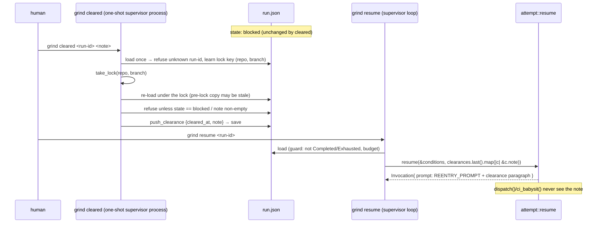

# Blocker clearance notes — implementation plan

**Product Contract preservation:** the origin document's Requirements (R1–R6), its
"Settled here" rulings and its Non-goals are carried unchanged. This plan adds HOW only.

## Summary

Add the missing half of the Blocker loop: `grind cleared <run-id> <note>` appends a dated
clearance row to a Blocked Run's state, and every later Resume-mode invocation composes the
latest note into the re-entry prompt after `REENTRY_PROMPT`. The note surfaces on
`grind status <run-id>`, the Handback and the Job-issue comment — only when one exists —
and the Blocked stop now names the two-step repair. No new module; the verb parses in
`cli`, the row writes through `supervisor`, the composition lives in `attempt`, the new
surface strings in `render`.

---

## Problem Frame

Detection (`policy::blocker`), the stop (`State::Blocked`), the rendering (*a Blocker: X
must be cleared*) and hand `resume` all exist — but re-entry composes the fixed
`REENTRY_PROMPT` (`src/attempt.rs`), so the resumed Attempt learns nothing about what
changed in the world. Only the human who cleared the wall knows what they did. Serves
*unattended completion rate* (a resumed Attempt that knows the wall moved stops re-probing
it) and *morning decisions per run* (the Record carries what was cleared, not merely that
something was).

---

## Requirements (carried from origin — the contract to satisfy)

- **R1** — `grind cleared <run-id> <note>` appends a dated clearance row to the named
  Run's state. Unknown run-id, empty note, or a Run whose state is not `Blocked` refuse in
  the incoherent-input register (exit 2) naming the actual state — never a health verdict.
- **R2** — A Resume-mode invocation whose Run carries a clearance note composes it into
  the prompt after `REENTRY_PROMPT`'s text. Dispatch and CiBabysit prompts are unchanged.
- **R3** — Clearances accumulate; the latest note rides every later Resume invocation, and
  all rows stay in the record.
- **R4** — Surfaces: `grind status <run-id>` shows the latest note; the Handback and the
  Job-issue comment carry it in the trailing block only when one exists (#16 discipline).
  The blocked verdict line may name the two-step repair (`grind cleared`, then
  `grind resume`) beside what must be cleared.
- **R5** — `grind cleared` writes run state as a one-shot supervisor process, exactly as
  `grind resume` already does.
- **R6** — `just verify` green. New tests only where a safety property exists: the
  composed prompt reaches Resume invocations only, never Dispatch or CiBabysit; the
  non-Blocked refusal; render prints nothing when no note exists.

---

## Key Technical Decisions

1. **KTD1** *(session-settled: user-directed — chosen over a single `resume --cleared <note>`
   verb: Grind never chooses to spend an Attempt, so recording and spending stay separate
   acts)* — Two verbs: `cleared` records, `resume` spends.
2. **KTD2** *(session-settled: user-directed — chosen over a general human→Run messaging
   facility: scope discipline; the note exists because a Blocker stopped the Run)* — The
   note is tied to a Blocker stop. `supervisor::cleared` refuses any Run whose recorded
   state is not `blocked`.
3. **KTD3** *(session-settled: user-directed — chosen over `Verdict::Blocked` or gating:
   ADR-0006 prohibits the variant by name, ADR-0003 forbids gating)* — `Blocked` stays a
   supervisor state; nothing in this change touches `Verdict` or blocks a PR.
4. **KTD4** *(session-settled: user-directed — chosen over auto-resuming cleared Runs: only
   the hand clears and only the hand re-enters)* — `resume --all` keeps excluding Blocked
   Runs; `cleared` does not change `state`, so a cleared-but-not-resumed Run still reads
   `blocked` and stays excluded.
5. **KTD5** *(session-settled: user-directed — chosen over a new `clearance` module:
   ADR-0007 topology; `tests/topology.rs` carries "no directories under src/")* — No new
   module. Verb in `cli`, write in `supervisor`, composition in `attempt`, surface strings
   in `render`.
6. **KTD6** — The `Clearance` type (`{ cleared_at: String, note: String }`, ISO date from
   `world::now_iso()` at write) lives in `src/attempt.rs` beside `Attempt`. Rationale:
   `attempt` is already the shared vocabulary between the private writer (`RunRecord`) and
   the read-only reader (`RunView`) — `Attempt` crosses that seam the same way — and the
   re-entry composition consumes the note there. A shared-noun module (`record`, `types`)
   is banned by `tests/topology.rs`.
7. **KTD7** — `clearances: Vec<Clearance>` is added to both `RunRecord` (supervisor) and
   `RunView` (view) with `#[serde(default)]`. Absent genuinely means empty: a record
   written before this build could not have recorded a clearance, so this is the same fact
   and not a migration read path (the no-migration stance covers the forced dispatch-time
   conditions, which this is not). Practically decisive: a Blocked Run recorded by the
   previous build is exactly the Run `grind cleared` targets. `RunView` must declare the
   field anyway — `deny_unknown_fields` plus the writer/reader parity test in
   `src/supervisor.rs` force it.
8. **KTD8** — `clearances` is private inside `RunRecord` with an appending mutator only
   (`push_clearance`), mirroring `attempts` — *load a stale copy, then overwrite the list*
   stays inexpressible.
9. **KTD9** — `supervisor::cleared` takes the same dispatch lock (`take_lock` on target
   repo + branch) before writing. It is a second supervisor process touching `run.json`;
   the lock is what keeps "the supervisor is the only writer" true when a `resume` is
   already in flight on that branch (that resume's record may still read `blocked`
   mid-loop). The write-side order is **load-for-key → lock → re-load → validate → append
   → save**: the lock key (target repo + branch) only exists on the loaded record, and
   `RunRecord::save` writes the whole record, so the copy that reaches `save` must have
   been read while no other writer could run — a pre-lock copy could erase an in-flight
   resume's appended `attempts[]`, exactly the loss KTD8 makes inexpressible in-process.
   A held lock refuses in the incoherent-input register; the existing `WouldBlock` message
   says "another Run holds…", which reads wrong when the holder is the named Run's own
   in-flight resume, so the implementer may add a cleared-specific wording.
10. **KTD10** — `cleared` posts nothing to the Job issue. ADR-0012's stated invariant is
    *one place, two writes* (the dispatch comment and the terminal comment); the clearance
    leaves the host inside the **next** terminal comment, which `view::gather` composes
    from the record.
11. **KTD11** — The CLI arm binds the note as the rest of argv joined with single spaces
    (`["cleared", run_id, rest @ ..]`), so an unquoted multi-word note works; a
    whitespace-only or absent note refuses. Validation of emptiness and state lives in
    `supervisor::cleared`, keeping `cli` a parser.
12. **KTD12** — `cleared` does not touch `supervisor_pid` / `supervisor_identity` (it is
    not re-entering; a one-shot pid recorded there would only churn the roster's liveness
    reading) and appends one line to `supervisor.log` via the existing `say` shape so the
    on-host account carries the clearance.

---

## High-Level Technical Design

Directional guidance, not implementation specification.



Prompt composition (wording is the implementer's per origin; directional shape):

```
<REENTRY_PROMPT text, unchanged>

Since you stopped, the human reports: <note>

That is what changed in the world since your last observation. Trust it over what you
last saw of the obstacle, and do not spend turns re-probing what it says is cleared.
```

Surface flow: `RunView.clearances` → `Facts` gains `cleared: Option<Clearance>` (latest,
read unconditionally — a fact about the world does not expire) → `render::handback` /
`render::job_comment` show it only when present; `render::run_view` adds a conditional
line; `render::handback_verdict`'s Blocker parenthetical grows the two-step repair naming
`grind cleared <run-id> "<what changed>"` then `grind resume <run-id>`.

---

## Implementation Units

### U1. Clearance rows in the record and its reader

**Goal:** the record can hold dated clearance rows, append-only, readable by `view`.
**Requirements:** R1 (row shape), R3 (accumulation); KTD6, KTD7, KTD8.
**Dependencies:** none.
**Files:** `src/attempt.rs`, `src/supervisor.rs`, `src/view.rs`.
**Approach:**
- `Clearance { cleared_at: String, note: String }` in `src/attempt.rs`, deriving the same
  serde traits `Attempt` does.
- `RunRecord` gains private `#[serde(default)] clearances: Vec<Clearance>`, a
  `clearances()` accessor and `push_clearance` (mirror `attempts`/`push_attempt`);
  `dispatch` constructs it as `Vec::new()` (E0063 forces the site).
- `RunView` gains `#[serde(default)] pub clearances: Vec<Clearance>`.
**Patterns to follow:** `Attempt`'s home and derives; `attempts`' privacy-and-append shape
in `src/supervisor.rs`.
**Test scenarios:**
- The day-one fixture (`tests/fixtures/record/day-one.json`, no `clearances` key) still
  parses through both `RunRecord` and `RunView`, reading an empty list.
- Writer→reader parity: a record carrying one clearance serialises and the `RunView`
  reader accepts and returns the same row (the existing
  `what_the_writer_serialises_is_what_the_reader_deserialises` test extends naturally —
  assert the clearance survives).
- Append-only: `push_clearance` grows the list; two pushes leave both rows, newest last.
**Verification:** `cargo test` green; no existing record-shape test relaxed.

### U2. The `cleared` verb

**Goal:** `grind cleared <run-id> <note>` records a clearance or refuses coherently.
**Requirements:** R1, R5; KTD1, KTD2, KTD9, KTD11, KTD12.
**Dependencies:** U1.
**Files:** `src/cli.rs`, `src/supervisor.rs`.
**Approach:**
- `cli::run` arm `["cleared", run_id, rest @ ..]` before the generic fallthrough; join
  `rest` with spaces; call `supervisor::cleared(run_id, &note)`; `Ok` prints a short
  confirmation naming the next step (`grind resume <run-id>`), exit 0; `Err(Refusal)`
  prints through `render::refusal`, exit `INCOHERENT_INPUT`.
- `USAGE` gains `grind cleared <run-id> <note>` with a one-line description tying it to a
  Blocked Run; the *six shapes* test becomes seven.
- `supervisor::cleared(run_id, note) -> Result<(), Refusal>`, in KTD9's order: resolve
  home; refuse an unknown run-id with the existing "no Run `<id>` on this host" message;
  load the record once to learn the lock key; take the dispatch lock; **re-load the record
  under the lock** (the pre-lock copy may be stale — an in-flight resume may have appended
  attempts); then, on the re-loaded copy: refuse a whitespace-only note; refuse a state
  other than `blocked`, **naming the actual state** (e.g. ``Run `<id>` is <state>, not
  blocked — a clearance records what changed for a Run a Blocker stopped``);
  `push_clearance` with `world::now_iso()`; `save`; `say` one log line.
- Factor the decision as a pure core over the loaded record (e.g. a private
  `fn record_clearance(record: &mut RunRecord, note: &str, at: String) -> Result<(), Refusal>`)
  so the refusal logic is testable from the day-one fixture without a filesystem.
**Patterns to follow:** `resume`'s shape in `src/supervisor.rs` (home → path → exists →
load → lock → save); `cli::finish`'s refusal register.
**Test scenarios (src-level, off the pure core + fixture):**
- Day-one record (state `completed`) → `Err`, message contains `completed` and the run id;
  no row appended.
- Same record with state set to `blocked` → `Ok`, one row with the given note and date.
- Empty and whitespace-only note → `Err`, nothing appended.
- Clear, then clear again while still `blocked` → two rows, newest last (R3's
  accumulation at the write end).
- `cli`: the usage test asserts all seven shapes, still refuses `grind list`.
**Verification:** `cargo test`; manual shape check that a refusal exits 2 comes via the
end-to-end extension in U5.

### U3. Composition into the Resume prompt

**Goal:** the latest note rides every Resume-mode invocation and nothing else.
**Requirements:** R2, R3, R6 (the argv/prompt safety property).
**Dependencies:** U1.
**Files:** `src/attempt.rs`, `src/supervisor.rs`.
**Approach:**
- `attempt::resume(conditions: &Conditions, cleared: Option<&str>) -> Invocation`; when
  `Some`, the prompt is `REENTRY_PROMPT` followed by the clearance paragraphs (final
  wording the implementer's; keep "since you stopped, the human reports:" as the anchor
  phrase). `dispatch` and `ci_babysit` signatures unchanged — they cannot carry a note by
  construction.
- `supervisor::run_one_attempt`'s `Mode::Resume` arm passes
  `record.clearances().last().map(|c| c.note.as_str())`.
- The one builder (`build`) stays the only argv path; denials are untouched.
**Patterns to follow:** `intent_line`'s Option-gated composition and its *default is
silence* comment; the existing `no_built_argv_on_any_of_the_three_paths…` test shape.
**Test scenarios (in `src/attempt.rs` tests):**
- With a note, the built Resume prompt contains `REENTRY_PROMPT`'s text first and the note
  after it; the built Dispatch and CiBabysit prompts do not contain the note (build all
  three, assert on `Invocation::prompt()` — the safety property R6 names).
- With `None`, the Resume prompt equals `REENTRY_PROMPT` exactly — render/compose nothing
  when no note exists.
- `every_built_argv_carries_all…_globs_on_all_three_paths` still passes with the new
  signature (denials unaffected by composition).
**Verification:** `cargo test`.

### U4. Surfaces: status, Handback, Job-issue comment, the stop line

**Goal:** the latest note is visible everywhere a human reads a Run, only when one exists;
the Blocked stop names the two-step repair.
**Requirements:** R4; KTD10.
**Dependencies:** U1.
**Files:** `src/view.rs`, `src/render.rs`, `src/supervisor.rs`, `src/cli.rs`.
**Approach:**
- `view::Facts` gains `cleared: Option<Clearance>` (latest row, read unconditionally in
  `gather`).
- `render::handback`: when present, a `cleared` row (note as-is, `cleared_at` beside it)
  in the conditional-row family (`denied`, `draft`, `base drift`); absent → nothing.
- `render::job_comment`: a `cleared` table cell only when present (the note is human-typed
  prose intended for the Run; render as-is, add no new fields beyond it and the date).
- `render::run_view`: one conditional line (e.g. `  cleared           <note>`) near the
  verdict block; `SingleRun` gains the field (E0063 surfaces the `cli::status_one` call
  site, which reads `found.clearances.last()`).
- `render::handback_verdict`: extend the Blocker parenthetical to name the repair:
  `(a Blocker: <what> must be cleared — \`grind cleared <run-id> "<what changed>"\`, then
  \`grind resume <run-id>\`)`. `found.run_id` is already in scope.
- `supervisor`'s `Stop::Blocked` `say` line: name both verbs in order instead of only
  `grind resume`.
- Wording discipline: no new string contains a verdict-quality word
  (`no_rendered_string_carries_a_quality_word_for_a_verdict` bans `blocked`, `failed`,
  `rejected` on rendered surfaces — say *cleared*, *clearance*, *stopped for a human*).
**Patterns to follow:** the `blocker: Option<String>` thread through `Facts` →
`handback_verdict`; the `surprising`/conditional-row idiom in `render::handback` (#16:
appears only when non-zero).
**Test scenarios (in `src/render.rs` tests):**
- Handback, comment and single-Run view over a record with no clearances contain no
  `cleared` label (R6's render-silence property).
- The same three surfaces over a record with two clearances show the **latest** note (and
  not the older one), on both renderers from one `Facts` — extend `facts_of`.
- The Blocked comment/Handback verdict line names `grind cleared` and `grind resume` in
  that order beside *what must be cleared*.
- The existing ADR-0003 language tests stay green unmodified.
**Verification:** `cargo test`.

### U5. End-to-end pin and docs

**Goal:** the whole loop — blocked → cleared → resumed-with-note — is pinned against the
real binary, and the documented surface stays true.
**Requirements:** R1 (exit codes), R2, R3, R6.
**Dependencies:** U2, U3, U4.
**Files:** `tests/end_to_end.rs`, `CLAUDE.md`.
**Approach:** extend `scenario_g_a_repeated_denial_with_no_progress_stops_for_a_human_and_resumes`
(or add a sibling scenario beside it) — after the Run stops `blocked`:
- `grind cleared <run-id>` with a multi-word unquoted note → exit 0; record carries the
  dated row; state still `blocked`.
- `grind cleared` on the wrong state (after completion) and with an empty note → exit 2,
  stderr names the actual state / the empty note.
- `grind resume <run-id>` → the **resumed** attempt's `attempt-N.prompt.txt` under the run
  dir contains the note; attempt 1's prompt file does not (the on-disk pin of R6's
  Resume-only property).
- The Handback printed by resume and the terminal Job-issue comment
  (`comments_on_the_job_issue`) carry the note.
- `CLAUDE.md`'s command list gains the `grind cleared <run-id> <note>` line so the
  documented surface matches `USAGE`.
**Patterns to follow:** scenario_g's sandbox choreography; `comments_on_the_job_issue`.
**Test scenarios:** as listed in Approach (this unit is the tests).
**Verification:** `just verify` — fmt, clippy `-D warnings`, full test suite, both musl
cross-builds.

---

## Scope Boundaries

**In scope:** everything above.

**Non-goals (carried from origin):** no new module, no directories under `src/`; no change
to `DENIED_TOOLS`; no scheduling, no auto-resume-after-clearance; not a general human→Run
messaging channel; no `Verdict` variant, no gate; Blocked Runs stay excluded from
`resume --all`; no third Job-issue comment class (KTD10).

**Deferred to follow-up work:** none identified.

---

## What to watch (carried from origin)

- Prompt composition is the risk surface: pin that the note reaches Resume-mode
  invocations and nothing else, in the spirit of `no_built_argv_on_any_of_the_three_paths…`.
- The note is human-typed prose that reaches the Job-issue comment. Render it as-is — the
  human typed it for the Run — but add no new exposure beyond the fields already rendered.
- Re-block after a clearance must work: clear, resume, blocked again, clear again — latest
  note wins, both rows survive.
- Note content shape on fixed-shape surfaces: one quoted argv element can carry newlines
  or `|`, which would break the `job_comment` markdown table row and the fixed-width
  `run_view` line. The prompt and the Handback keep the note verbatim; the table cell and
  the `run_view` line should flatten it through the existing `view::one_line` discipline
  (implementer's call on the exact treatment).

## Assumptions (headless run — inferred bets routed here)

- `#[serde(default)]` on `clearances` is compatible with the repo's no-migration stance
  (KTD7's argument); if review disagrees, the alternative is updating the day-one fixture
  and accepting that pre-existing Blocked records become unreadable — the wrong direction
  for this feature, hence the default.
- The note argv shape (rest-of-argv joined) is friendlier than requiring one quoted
  argument and refuses the same inputs; nothing in the origin constrains it.
- A conditional `cleared` line in `run_view` is acceptable against the fixed-height watch
  discipline: it changes only when the human acts, exactly like the record's state word.

## Verification Contract / Definition of Done

`just verify` green — `cargo fmt --check`, `cargo clippy -- -D warnings`, `cargo test`
(including the topology, compile-fail, denied-tools and end-to-end carriers, none
relaxed), and both musl cross-builds. All six origin requirements satisfied; the three R6
safety properties carried by named tests.
