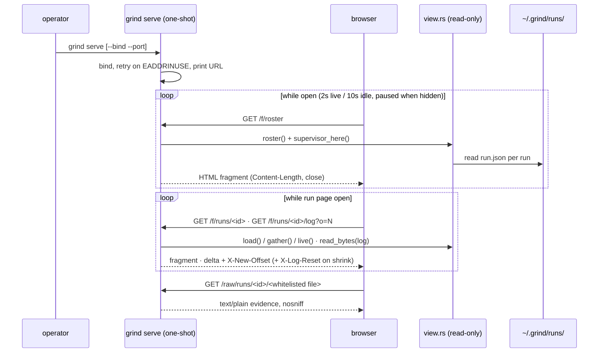

# grind serve — a read-only web dashboard for Runs

**Product Contract preservation:** the deciding documents are ADR-0013 (the UI owns nothing
and writes nothing) and ADR-0014 (served HTML, no build step). Their rulings are carried
unchanged; this plan adds HOW only.

## Summary

Add `grind serve [--bind <addr>] [--port <n>]`: a one-shot, operator-launched server that
serves the Runs on this host as a dashboard — a kanban roster and one Run page per Run —
reading the same `~/.grind/runs/` files `grind status` reads, through the same `view.rs`
projection. Hand-rolled HTTP on `std::net` inside a new `src/serve.rs`; server-rendered
HTML in a new `src/page.rs`; embedded CSS and JS constants in `src/style.rs` and
`src/script.rs`. Polling, never push; read-only by construction and by test. No new
dependency: serde stays the only one (ADR-0005).

---

## Problem Frame

Runs are supervised in the foreground and nothing shows their live state except a terminal
the operator is not sitting in front of: bare `grind status` answers once and exits, the
Handback exists only at the end, and the Job issue is updated only at terminal states. On
the target — a server host, reached over SSH — "what are my Runs doing right now, and what
did the one that stopped actually see?" currently means re-running status in a loop or
reading files by hand. Serves *unattended completion rate* (a Run that stops for a Blocker
is noticed in seconds, not in the morning) and *morning decisions per run* (the dashboard
carries the same facts as the Handback, continuously).

---

## Requirements

- **R1** — `grind serve` binds `127.0.0.1:7800` by default, prints one startup line naming
  the URL (`serving http://127.0.0.1:7800 — ctrl-c to stop`), and runs until the human
  ends it. `--bind` and `--port` override. An address already in use is retried for a few
  seconds, then refused in the could-not-answer register (exit 3) — never a health
  verdict. No route writes anything, ever.
- **R2** — The roster (`GET /`) is a **kanban board**: swimlanes group Runs by attention —
  *Needs you* (blocked; amber rail), *In flight* (green), *Stopped* (red), *Finished today*
  (gray) — and columns carry the recorded state inside each lane (`blocked` /
  `cleared · resumable`; `working` / `waiting`; `died` / `unobserved` / `uncorroborated`;
  `complete` / `exhausted`). Cards show run-id, Job title, state badge, liveness
  (live / stopped / unobservable), budget dots, spend, branch, issue link, and for live
  Runs a one-line last-words preview with transcript freshness (`⟟ 8s`) or quiet streak
  (`quiet 4m — asleep`). Above the board: a command bar (`GRIND ▪ this-host`, bind
  address, poll LED, UTC clock) and a telemetry strip (in flight / needs you / stopped /
  finished / spend today with sparkline / aggregate attempts meter / limit-reset countdown
  when a Run is rate-limited). Below: a status bar naming keybindings (`j/k` move, `↵`
  open, `esc` back, `s` sort, `/` filter). Server-side sort and filter via query
  parameters; auto-refresh 2 s while any Run is live, 10 s otherwise; paused when hidden;
  `updated Ns ago` stamp and Pause toggle.
- **R3** — The Run page (`GET /runs/<run-id>`) is a cockpit: header facts (state badge,
  liveness + transcript freshness, budget dots, spend, branch, issue link, fan-out
  spawned/returned counts, worktree path; PR link only where the record carries one); an
  **attempt waterfall** on a wall-clock axis — each Attempt a bar spanning its real
  duration colored by outcome, sleep gaps hatched, the live Attempt extending to a NOW
  marker; below it the Attempt list (index, start, duration, outcome, Waits, denials)
  with verbatim evidence links per dead Attempt (`prompt.txt`, `stdout.json`,
  `stderr.log`); the last-words block with the same three-line semantics as
  `render::run_view`; the clearance note rendered large when blocked; and the following
  `supervisor.log` pane (R4).
- **R4** — The `supervisor.log` pane follows by byte offset: the client requests
  `GET /f/runs/<run-id>/log?o=<offset>` and appends the delta; autoscroll only when pinned
  to the bottom (within 24 px); lines buffered while scrolled up, never dropped; a
  jump-to-bottom pill with the new-line count when unpinned; `End`/`Home` bound; a wrap
  toggle.
- **R5** — Raw evidence routes (`GET /raw/runs/<run-id>/<file>`) serve an exact whitelist
  of filenames only — `run.json`, `supervisor.log`, `resume.log`, and
  `attempt-N.prompt.txt|stdout.json|stderr.log` — as `text/plain; charset=utf-8` with
  `X-Content-Type-Options: nosniff`. Path traversal is impossible by construction:
  per-segment decoding after splitting, a strict run-id character allowlist, no route
  builds a path from unparsed input.
- **R6** — Read-only is enforced by test: `serve.rs` and `page.rs` never name the write
  side (`RunRecord`, `save`, `push_attempt`, `push_clearance`, `dispatch`), carried by a
  topology-style test beside the existing convention carriers.
- **R7** — The HTTP kernel meets the ADR-0014 checklist: always `Content-Length` +
  `Connection: close`; request-line validation (400 on malformed, tolerate one leading
  CRLF, accept 1.0/1.1); `Host` required exactly once for HTTP/1.1 (400); 405 with
  `Allow: GET` for known methods, 501 for unknown tokens; 404 for unknown run-id/asset
  that leaks nothing; request-line + headers bounded (≈8 KiB); read timeouts; one thread
  per connection.
- **R8** — Wording discipline crosses into HTML: every record-derived string passes
  through an escaping function, tested against a hostile payload; the quality-word bans
  apply to the page's prose (labels, hints, empty-states); state badges carry the state
  verbatim as the record spells it — data wearing color, not a verdict. Color never
  carries meaning alone (dot + word + title); numbers render `tabular-nums`; motion
  respects `prefers-reduced-motion`. Every CSS class is namespaced `g-` so page chrome
  and panel widgets can never collide.
- **R9** — Topology amended, not broken: `std::net` may be named in `src/serve.rs` only
  (carried by `tests/topology.rs` beside the fs/process/env rules); `std::fs`/`std::env`
  remain `world.rs`-only; every module stays a crate-root sibling.
- **R10** — `grind serve` is the eighth shape: `USAGE` gains the line, the shapes test is
  renamed and extended, and `grind list` remains refused.
- **R11** — `just verify` green; no existing test relaxed or weakened.

---

## Key Technical Decisions

1. **KTD1** *(ADR-0013)* — One-shot, operator-launched, owns nothing. Not a daemon, not a
   service-manager unit; its death costs nothing because it is responsible for nothing.
2. **KTD2** *(ADR-0013; #23)* — Strictly read-only. No action routes, no buttons that
   shell out. Every mutation stays a typed verb (`resume`, `cleared`); the supervisor
   stays the sole writer of `run.json`.
3. **KTD3** *(ADR-0014)* — `std::net` lives in `src/serve.rs` only, as a stated amendment
   to the topology beside ADR-0007's fs/process/env rule. The listener is serve's essence;
   wrapping `TcpListener` in `world` would drag stream I/O through ceremony without
   making anything testable — the request parser is pure and tested directly.
4. **KTD4** *(researched)* — Hand-rolled HTTP/1.1 kernel, GET-only. `Content-Length`
   always (bodies are known: rendered strings and file deltas), close after every
   response. `tiny_http` rejected: dormant (no release since 2022-10), four transitive
   crates, buys nothing this scope needs. `axum`+`tokio` rejected: ~49 crates and an async
   runtime for a read-only file server.
5. **KTD5** *(researched)* — Server-rendered HTML fragments + ~150 lines of vanilla JS.
   HTMX rejected on evidence, not taste: no built-in hidden-tab pause
   (`bigskysoftware/htmx#824`, open since 2022), and its wholesale-swap model fights a
   byte-offset log append. The JS budget is a ruling: growth past ~200 lines means the
   server stopped rendering — inspect, don't framework.
6. **KTD6** — Four flat module siblings: `serve` (kernel, router, lifecycle), `page` (pure
   HTML rendering), `style` + `script` (embedded string constants). No directories under
   `src/`; assets are Rust constants so the binary remains the only artifact and the
   string-matching topology tests stay simple.
7. **KTD7** — Fixed route table: `/` (roster page), `/f/roster` (roster fragment),
   `/runs/<id>` (run page), `/f/runs/<id>` (run fragment),
   `/f/runs/<id>/log?o=<offset>` (log delta), `/raw/runs/<id>/<file>` (whitelisted
   evidence), `/style.css`, `/script.js` (embedded assets, short `max-age`). Everything
   else 404; non-GET 405; malformed 400.
8. **KTD8** — Handlers call `view::roster()` / `view::load()` / `view::gather()` /
   `view::live()` per request, fresh every time. No cache, no event system: the disk is
   the event source (atomic rename makes concurrent reads safe; liveness is computed from
   pid + `lstart`).
9. **KTD9** — Log-tail protocol: the server computes and transmits the new byte offset
   explicitly (`X-New-Offset` header) — UTF-8 makes client-computed lengths wrong.
   `offset > len` (truncation) → serve the last 64 KiB with `X-Log-Reset: 1` so the client
   replaces rather than appends; each poll capped at 1 MiB. `world` gains a `read_bytes`
   primitive beside `read_to_string` (fs stays in `world`).
10. **KTD10** *(researched)* — Client cadence: 2 s while any Run is live, 10 s when all
    terminal (the fragment carries `data-live`), gated on `visibilitychange` with one
    immediate refresh on return; exponential backoff on fetch failure capped at 30 s,
    reset on success; `AbortController` per tick; swaps built before mutation,
    `table-layout: fixed` + `tabular-nums` so refreshes never reflow.
11. **KTD11** — Sort and filter are server-side query parameters. The server already owns
    rendering; client-side sort code would be a second renderer of the same rows, and
    query-param views are shareable URLs.
12. **KTD12** — Liveness renders the `Observed<bool>` honestly: live / stopped /
    **unobservable** — `ps` failing to answer is never rendered as "stopped"
    (`view::supervisor_here`'s tri-state is preserved, not flattened). Badges pair dot +
    word + title timestamp; the live dot may pulse at 2 s, disabled under
    `prefers-reduced-motion`.
13. **KTD13** — Bind loopback by default (ADR-0013's tunnel posture); `--bind`/`--port`
    opt into more. `std` sets no `SO_REUSEADDR` (`rust-lang/rust#15835`), so an
    `EADDRINUSE` on startup is retried for a few seconds before exiting 3.
14. **KTD14** — `view::RosterRow` gains `job_title`, `spend`, and `last_activity`
    (read-side-only struct, built in `roster()` — no `RunRecord` change, no serde parity
    impact). The roster shows the Job title; the PR link appears only where the record
    carries one.
15. **KTD15** *(session-settled: user-approved cockpit mockups)* — Information
    architecture: kanban roster (swimlanes = attention, columns = recorded state) and a
    cockpit Run page whose centerpiece is the attempt waterfall. Style: full-monospace
    instrumentation, hairline panels, restrained phosphor glow on state values, faint
    scanlines (off under `prefers-reduced-motion`), animated live-edge gradient,
    keyboard-cursor affordance. Canonical token sheet: bg `#0b0e14`, panel `#11151c`,
    panel2 `#151a22`, inset `#080b10`, hair `#1c232e`, edge `#2a3340`, text `#dbe4ee`,
    dim `#7d8590`, faint `#565e68`, live `#3fb950`, hold `#d29922`, dead `#f85149`,
    cyan `#79c0ff`. All class names `g-`-prefixed.

---

## High-Level Technical Design

Directional, not specification. The kernel is a pure parse → route → respond pipeline; the
accept loop is the only impure part and lives entirely in `serve`.

---

## Implementation Units

### U1. `world::read_bytes`

**Goal:** byte-accurate reads for the log-tail offset protocol.
**Requirements:** R7 (offset math in bytes); KTD9.
**Dependencies:** none.
**Files:** `src/world.rs`.
**Approach:** `pub fn read_bytes(path: &Path) -> Result<Vec<u8>, String>` beside
`read_to_string`, same error shape. No size helper yet — the delta endpoint derives length
from the read; add `metadata`-based size only if a test forces it.
**Patterns to follow:** `read_to_string` (world.rs:150).
**Test scenarios:** existing world tests' shape; missing path → `Err`.
**Verification:** targeted `cargo test`.

### U2. Roster projection extension

**Goal:** the roster carries what a dashboard row shows.
**Requirements:** R2; KTD14.
**Dependencies:** none.
**Files:** `src/view.rs`.
**Approach:** extend `RosterRow` with `job_title: String`, `spend: f64` (from
`RunView::total_spend()`), `last_activity: String` (latest of `created_at` and the newest
attempt's end timestamp present in the record — omit nothing, invent nothing: use what the
record carries). `roster()` fills them where it already builds rows.
**Patterns to follow:** existing `RosterRow` construction (view.rs:196-211).
**Test scenarios:** roster over the day-one fixture carries title/spend/last-activity;
unreadable runs still skipped.
**Verification:** targeted `cargo test`.

### U3. `page.rs` — pure HTML rendering

**Goal:** every byte of HTML the server sends, as testable pure functions.
**Requirements:** R2, R3, R8; KTD6, KTD7, KTD11, KTD12, KTD15.
**Dependencies:** U2 (consumes the extended `RosterRow`).
**Files:** `src/page.rs`.
**Approach:** *(design contract = the user-approved mockups; classes `g-`-prefixed per
KTD15)*
- `esc(s: &str) -> String` — `& < > " '` escaped; every record-derived string passes
  through it, no exceptions.
- Command-bar + telemetry-strip partials (`g-bar`, `g-tseg`) shared by both pages;
  telemetry derives from `roster()` rows (counts, spend sum, attempts burned, earliest
  active rate-limit reset when any Run carries one).
- `roster_page` / `roster_fragment` — four swimlanes (`g-rail hold|go|stop|done`), per-
  lane state columns, cards (`g-card` with `g|a|r|k` accent) carrying badge, budget dots
  (`g-f`/`g-e`), last-words preview (`g-prev`) and `data-epoch` freshness; empty columns
  render dashed slots; fragment root carries `data-live="true|false"` for client cadence;
  cards carry `data-gid` for keyboard cursor.
- `run_page` / `run_fragment` — header facts row; attempt waterfall (`g-track`: bars
  positioned by wall-clock percentages from Attempt timestamps, hatched band between an
  ended Attempt and its re-entry, live bar sweeping toward the NOW marker); Attempt list
  with verbatim evidence links; three-line last-words block; log pane shell (`g-log`);
  clearance note rendered large when present.
- `not_found() -> String` — leaks nothing.
- Prose strings obey the quality-word ban list; badges are exempt as data.
**Patterns to follow:** `render.rs`'s pure-String discipline and its ban tests
(render.rs:1761); the conditional-row idiom.
**Test scenarios:** hostile payload (`<script>` in job title / branch / note) survives
rendering inert — asserted escaped in output; ban-list words absent from prose strings;
card ids stable across two different records; fragment output contains no `<html>`;
badge label equals the record's state string exactly; unobservable liveness renders
*unobservable*, never *stopped*; waterfall bars' percentage positions are monotonic in
Attempt timestamps.
**Verification:** targeted `cargo test`.

### U4. `style.rs` and `script.rs` — embedded assets

**Goal:** the design system and the client behaviors, as constants.
**Requirements:** R2, R4, R8; KTD5, KTD10, KTD15.
**Dependencies:** none (the class-name contract is fixed by KTD15 + the mockups, not by
U3).
**Files:** `src/style.rs`, `src/script.rs`.
**Approach:**
- `pub const CSS: &str` — the mockups' token sheet verbatim (bg `#0b0e14`, panel
  `#11151c`, panel2 `#151a22`, inset `#080b10`, hair `#1c232e`, edge `#2a3340`, text
  `#dbe4ee`, dim `#7d8590`, faint `#565e68`; live `#3fb950`, hold `#d29922`,
  dead `#f85149`, cyan `#79c0ff`); scanline overlay; glow utilities; tinted badges;
  `ui-monospace` everywhere; `tabular-nums`; waterfall track/hatch/sweep styles;
  `prefers-reduced-motion` disables pulse/sweep/blink; every selector `g-`-prefixed;
  ~250 lines.
- `pub const JS: &str` — five small modules, ~150 lines total: **poller** (self-
  rescheduling `setTimeout`, `AbortController` per tick, backoff cap 30 s reset on
  success, `data-live` cadence 2 s/10 s, swap only on `r.ok`, build-before-mutate);
  **ticker** (one interval walks `[data-epoch]`, writes `textContent` only when changed);
  **log follower** (append from `X-New-Offset`, replace on `X-Log-Reset`, pinned
  detection `scrollHeight - scrollTop - clientHeight < 24`, buffer-while-up, jump pill,
  End/Home, wrap toggle); **keyboard** (delegated `j/k/enter/esc` over `[data-gid]`,
  `scrollIntoView({block:'nearest'})`, ignore in inputs); **pause/stamp**
  (visibilitychange gate + immediate refresh on return; Pause toggle; updated-Ns-ago).
**Patterns to follow:** none in repo — first frontend code; keep it readable plain ES,
no build.
**Test scenarios:** `the_client_pauses_when_hidden_and_cancels_in_flight` — string-
presence pins for `visibilitychange`, `AbortController`, `X-New-Offset` (these are
load-bearing behaviors with no other test surface, same spirit as the topology string
tests). CSS asserted to contain `prefers-reduced-motion` and `tabular-nums`; a guard
test asserts no class selector lacks the `g-` prefix.
**Verification:** targeted `cargo test`; visual pass in U8's smoke.

### U5. `serve.rs` — HTTP kernel

**Goal:** a boring, correct, bounded GET-only server.
**Requirements:** R1, R7; KTD3, KTD4, KTD13.
**Dependencies:** none.
**Files:** `src/serve.rs`.
**Approach:**
- `struct Request { method, segments: Vec<String>, query: Option<String> }` and
  `parse_request(bytes: &[u8]) -> Result<Request, Status>` — pure; tolerate one leading
  CRLF; validate request-line; enforce exactly one `Host` for HTTP/1.1; bound line+headers
  ≈8 KiB; split target on first `?`; split path on `/`; **percent-decode each segment
  after splitting**; run-id segments must match `[A-Za-z0-9._-]+` and never `.`/`..`;
  anything else → 404 (existence) or 400 (malformed), per R7's register.
- `respond(...)` — always `Content-Length`, `Connection: close`,
  `X-Content-Type-Options: nosniff`, `Date`; actual close after write. Extra-headers
  variant for `X-New-Offset`/`X-Log-Reset`/`Allow`.
- Router: pure `route(&Request, &home) -> Response` over KTD7's table; handlers land in
  U6.
- Accept loop: `TcpListener::bind` with a few seconds of `EADDRINUSE` retry → exit 3;
  read timeout on accepted streams; one `std::thread` per connection; startup line via
  `world::print_line`.
**Patterns to follow:** module doc register of `cli.rs` (exit codes report observability);
`world`'s error-as-String shape.
**Test scenarios (all over `parse_request`/`route`, no sockets):** valid GET; missing
Host → 400; duplicate Host → 400; `POST` → 405 with `Allow: GET`; `FOO` → 501; oversized
request → 400; `%2e%2e` segment → 404; `..` segment → 404; percent-encoded space in
run-id → 404 (charset); valid run-id decodes; unknown route → 404; response bytes carry
exact header set + correct `Content-Length`.
**Verification:** targeted `cargo test`.

### U6. Route handlers

**Goal:** the routes serve real view data.
**Requirements:** R2, R3, R4, R5; KTD8, KTD9.
**Dependencies:** U1, U2, U3, U5.
**Files:** `src/serve.rs` (handlers inside `route`).
**Approach:**
- `/` + `/f/roster`: `view::roster(home)` → `page::roster_*`; sort/filter params applied
  server-side (state/activity columns; unknown params ignored).
- `/runs/<id>`: `view::load` → `Lookup::Here` renders; `NotHere`/`Unreadable` →
  `page::not_found()` (404, no distinction leaked).
- `/f/runs/<id>`: same + `view::gather` + `view::live` for the fragment.
- `/f/runs/<id>/log?o=N`: read `supervisor.log` via `world::read_bytes`; `o ≤ len` →
  bytes `[o, min(o+1MiB, len))` + `X-New-Offset: <served end>`; `o > len` → last 64 KiB +
  `X-Log-Reset: 1` + new offset; missing log → empty 200 with current offset (a Run that
  has not narrated yet is not an error).
- `/raw/runs/<id>/<file>`: exact-name whitelist; `attempt-N.*` parsed as `attempt-` +
  digits + exact suffix; everything else 404; `text/plain; charset=utf-8`, nosniff,
  `no-store`.
**Patterns to follow:** `Lookup` handling in `cli::status_one` (unknown id is not an
error).
**Test scenarios:** offset semantics table (0, mid, ==len, >len, cap) against a tempdir
fixture log; whitelist accepts each real filename and rejects `run.json.bak`,
`attempt-x.stdout`, `../../etc/passwd`, encoded variants; roster fragment over the
day-one fixture contains the card id and title; run fragment over the day-one fixture
shows the timeline and omits clearance/fan-out rows when absent.
**Verification:** targeted `cargo test`.

### U7. The `serve` verb

**Goal:** the surface gains its eighth shape.
**Requirements:** R1, R10; KTD1, KTD13, KTD14.
**Dependencies:** U5, U6.
**Files:** `src/cli.rs`.
**Approach:** dispatch arm `["serve"]` plus `--bind`/`--port` flag parse in `cli`, keeping
`cli` a parser; `USAGE` line `grind serve [--bind <addr>] [--port <n>]` with a one-line
description; shapes test renamed `the_surface_is_eight_shapes_and_none_of_them_is_list`
and extended; `grind list` refusal assertions untouched; bind failure maps to exit 3
through `world::exit`.
**Patterns to follow:** existing verb arms (cli.rs:47-73); USAGE const (cli.rs:76).
**Test scenarios:** shapes test green with eight; `--port`/`--bind` parse; unknown flag
refuses incoherently (exit 2).
**Verification:** targeted `cargo test`.

### U8. Topology amendment, end-to-end pin, docs

**Goal:** the conventions carry the new rulings; the whole thing is verified on the real
surface.
**Requirements:** R6, R9, R10, R11.
**Files:** `tests/topology.rs`, `docs/provisioned-host.md` (note only).
**Approach:**
- Topology: `std::net` named in `serve.rs` only; `the_server_never_names_the_write_side`
  — `serve.rs`/`page.rs`/`style.rs`/`script.rs` contain no `RunRecord`, `push_attempt`,
  `push_clearance`, `::save`, `dispatch(`.
- `provisioned-host.md`: a one-line note under Lifetime that Serve is operator-launched
  and owes the host nothing — **no item**, no doctor mark.
- Manual smoke (the verification): `grind serve` → open roster in a browser; confirm
  board groups, refresh cadence, hidden-tab pause, j/k navigation; open a Run page,
  confirm waterfall and timeline; append a line to `supervisor.log` and watch it arrive;
  scroll up and confirm the jump pill; open a raw attempt file; kill the server, restart
  immediately, confirm the bind retry; Ctrl-C, confirm clean exit.
**Verification:** `just verify` + the smoke above.

---

## Non-goals (carried from ADR-0013/0014)

Actions from the browser; authentication; multi-host aggregation; a resident watcher; a
JSON API; SSE/WebSockets; themes beyond the one dark sheet; internationalization;
mobile-first layout.

## What to watch

- **JS budget creep** past ~200 lines — usually means the server stopped rendering.
- **Wording drift** — the dashboard's prose is held to the same bans as `render.rs`; a new
  label that wants the word "blocked" is a design smell, not a string.
- **The SSE tripwire** — a genuine want for sub-second push or notify-while-away reopens
  ADR-0013's residency carve-out; until measured, polling stands.
- **macOS re-bind** — if the EADDRINUSE retry window proves annoying in practice, that is
  the trigger to weigh socket options, not before.
